# MPC 基础设施系统详细设计文档

**版本**: v2.4
**文档类型**: 详细设计文档
**创建日期**: 2024-11-28
**基于**: MPC产品文档 + go-mpc-wallet项目代码 + MPCVault技术分析
**更新日期**: 2025-01-02
**状态**: 已根据实际代码实现全面更新

---

## 目录

[TOC]

---

## 1. 系统架构概述

### 1.1 产品定位与目标

MPC（Multi-Party Computation）基础设施是一个企业级的多方安全计算（MPC）密钥管理系统，基于阈值签名技术（TSS - Threshold Signature Scheme），为机构客户提供安全、可靠的数字资产托管和签名服务。

**核心价值主张**：
- 🔐 **零信任安全**：密钥永不完整存在，消除单点故障风险
- 🚀 **高性能**：毫秒级签名响应，支持高并发交易
- 🌐 **多链支持**：统一管理 Bitcoin、Ethereum 及所有主流区块链
- 🏢 **企业级**：完整的审计日志、策略控制和合规支持

**技术创新点**：
基于对 MPCVault 技术的深入分析，本方案创新性地整合了多项前沿技术：
1. **TSS (Threshold Signature Scheme)** - 阈值签名，支持密钥永不完整存在
2. **SSS (Shamir Secret Sharing)** - 密钥分片备份，支持内部控制
3. **TEE (Trusted Execution Environment)** - 硬件安全环境，提供多层防护
4. **Noise Protocol** - 端到端加密通信，确保传输安全
5. **Hardened Key Derivation** - 强化密钥派生，隔离不同链风险

### 1.2 架构设计原则

```
🏗️ 架构设计原则
├── 分布式架构：无单点故障，节点间对等通信
├── 模块化设计：清晰的组件划分，易于扩展
├── 安全优先：多层安全防护（软件→硬件→协议→加密）
├── 零信任架构：密钥永不完整存在，所有请求验证
├── 高可用：多节点部署，自动故障转移，99.9%可用性
├── 高性能：毫秒级签名响应，高并发处理，水平扩展
├── 企业级合规：完整审计日志，策略控制，合规支持
└── 易用性：友好的API设计，多语言SDK支持，标准化接口
```

**关键数据指标**：

| 指标 | 目标值 | 说明 |
|------|--------|------|
| **签名延迟** | < 200ms | 端到端签名响应时间 |
| **并发签名** | 1000+ 签名/秒 | 系统吞吐量 |
| **可用性** | 99.9% | 系统正常运行时间 |
| **密钥安全** | 密钥永不完整存在 | 核心安全特性 |
| **多链支持** | 10+ 条链 | 第一阶段支持 |

### 1.3 系统整体架构图

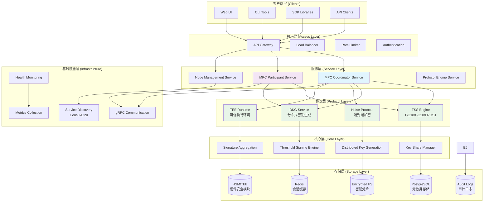
```mermaid
graph TB
    subgraph "客户端层 (Clients)"
        A1[Web UI]
        A2[CLI Tools]
        A3[SDK Libraries]
        A4[API Clients]
    end

    subgraph "接入层 (Access Layer)"
        B1[API Gateway]
        B2[Load Balancer]
        B3[Rate Limiter]
        B4[Authentication]
    end

    subgraph "服务层 (Service Layer)"
        C1[MPC Coordinator Service]
        C2[MPC Participant Service]
        C3[Node Management Service]
        C4[Protocol Engine Service]
    end

    subgraph "协议层 (Protocol Layer)"
        D1[TSS Engine<br/>GG18/GG20/FROST]
        D2[DKG Service<br/>分布式密钥生成]
        D3[Noise Protocol<br/>端到端加密]
        D4[TEE Runtime<br/>可信执行环境]
    end

    subgraph "核心层 (Core Layer)"
        E1[Key Share Manager]
        E2[Threshold Signing Engine]
        E3[Distributed Key Generation]
        E4[Signature Aggregation]
    end

    subgraph "存储层 (Storage Layer)"
        F1[(PostgreSQL<br/>元数据存储)]
        F2[(Redis<br/>会话缓存)]
        F3[(Encrypted FS<br/>密钥分片)]
        F4[(HSM/TEE<br/>硬件安全模块)]
        F5[(Audit Logs<br/>审计日志)]
    end

    subgraph "基础设施层 (Infrastructure)"
        G1[gRPC Communication]
        G2[Service Discovery<br/>Consul/Etcd]
        G3[Health Monitoring]
        G4[Metrics Collection]
    end

    A1 --> B1
    A2 --> B1
    A3 --> B1
    A4 --> B1

    B1 --> C1
    B1 --> C2
    B1 --> C3

    C1 --> D1
    C1 --> D2
    C1 --> D3
    C1 --> D4

    C2 --> D1
    C2 --> D2

    D1 --> E1
    D2 --> E2
    D3 --> E3
    D4 --> E4

    E1 --> F1
    E2 --> F2
    E3 --> F3
    E4 --> F4
    E5 --> F5

    C1 --> G1
    C2 --> G1
    C3 --> G2
    G3 --> G4

    style C1 fill:#e1f5fe
    style C2 fill:#f3e5f5
    style D1 fill:#e8f5e8
    style D2 fill:#e8f5e8
    style D3 fill:#e8f5e8
    style D4 fill:#e8f5e8
```

### 1.4 分层架构详细设计

#### 1.4.1 客户端层 (Client Layer)
**组件**：
- **Web UI**: 管理控制台，提供可视化操作界面
- **CLI Tools**: 命令行工具，用于运维和调试
- **SDK Libraries**: 多语言SDK（Go、Python、JavaScript、Java）
- **API Clients**: 直接调用REST/gRPC API的客户端

**职责**：
- 用户交互接口
- 请求构建和发送
- 响应解析和展示
- 错误处理和重试

#### 1.4.2 接入层 (Access Layer)
**组件**：
- **API Gateway**: 统一的API入口，支持RESTful和gRPC
- **Load Balancer**: 负载均衡，确保请求均匀分发
- **Rate Limiter**: 请求频率限制，防止滥用
- **Authentication**: 身份认证和授权

**职责**：
- 请求路由和转发
- 流量控制和安全防护
- 用户认证和权限检查
- 请求监控和日志记录

#### 1.4.3 服务层 (Service Layer)
**核心服务**：

```
服务层组件
├── MPC Coordinator Service (协调器服务)
│   ├── 签名会话管理
│   ├── 节点协调调度
│   ├── 协议引擎调用
│   └── 结果聚合处理
├── MPC Participant Service (参与者服务)
│   ├── 密钥分片存储
│   ├── 签名参与计算
│   ├── 协议消息处理
│   └── 节点间通信
├── Node Management Service (节点管理服务)
│   ├── 节点注册发现
│   ├── 健康状态监控
│   ├── 负载均衡调度
│   └── 故障检测恢复
└── Protocol Engine Service (协议引擎服务)
    ├── GG18/GG20协议实现
    ├── FROST协议实现
    ├── 协议状态管理
    └── 安全验证逻辑
```

#### 1.4.4 核心层 (Core Layer)
**核心功能**：

```
核心功能模块
├── Key Share Manager (密钥分片管理)
│   ├── 分片生成与验证
│   ├── 分片加密存储
│   ├── 分片分发传输
│   └── 分片恢复重组
├── Threshold Signing Engine (阈值签名引擎)
│   ├── 签名会话创建
│   ├── 多方签名协调
│   ├── 签名分片聚合
│   └── 最终签名生成
├── Distributed Key Generation (分布式密钥生成)
│   ├── DKG协议实现
│   ├── 密钥分片生成
│   ├── 一致性验证
│   └── 安全参数设置
└── Signature Aggregation (签名聚合)
    ├── 分片收集验证
    ├── 聚合计算逻辑
    ├── 结果验证检查
    └── 错误处理重试
```

#### 1.4.5 存储层 (Storage Layer)
**存储架构**：

```
存储层设计
├── PostgreSQL (元数据存储)
│   ├── keys表：密钥元数据
│   ├── nodes表：节点信息
│   ├── signing_sessions表：签名会话
│   ├── policies表：访问策略
│   └── audit_logs表：审计日志
├── Redis (会话缓存)
│   ├── 会话状态缓存
│   ├── 分布式锁
│   └── 临时数据存储
├── Encrypted File System (密钥分片存储)
│   ├── AES-256-GCM加密
│   ├── 分片文件存储
│   ├── 访问权限控制
│   └── 备份恢复机制
└── Audit Logs (审计日志)
    ├── 结构化日志存储
    ├── 不可篡改记录
    ├── 合规性支持
    └── 日志分析工具
```

#### 1.4.6 基础设施层 (Infrastructure Layer)
**基础设施组件**（实际实现）：
- **gRPC Communication**（[`internal/mpc/grpc/`](internal/mpc/grpc/)）：
  - 客户端：连接池管理，KeepAlive 10分钟，Timeout 10分钟
  - 服务端：MaxConnAge 2小时，KeepAlive 10分钟，支持TLS
  - 消息路由：支持广播消息（round=-1标记）
- **Service Discovery**（[`internal/mpc/discovery/consul.go`](internal/mpc/discovery/consul.go)）：
  - Consul集成：服务注册和发现
  - 节点发现：优先从数据库查询，不足时从Consul发现Participant节点
  - 优雅注销：忽略404错误，防止服务未注册时的注销失败
- **Node Management**（[`internal/mpc/node/`](internal/mpc/node/)）：
  - 节点注册：支持Coordinator和Participant节点注册
  - 节点发现：通过NodeDiscovery统一接口（数据库+Consul）
  - 健康检查：节点状态管理（active, inactive, offline）
- **Health Monitoring**: 健康检查和状态监控（通过Consul健康检查）
- **Metrics Collection**: 性能指标收集和告警（待实现）

### 1.5 部署架构模式

#### 1.5.1 协调者模式 (Coordinator Mode)

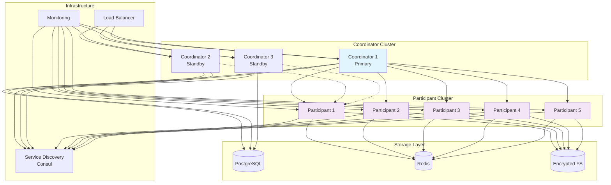
```mermaid
graph TD
    subgraph "Coordinator Cluster"
        CO1[Coordinator 1<br/>Primary]
        CO2[Coordinator 2<br/>Standby]
        CO3[Coordinator 3<br/>Standby]
    end

    subgraph "Participant Cluster"
        P1[Participant 1]
        P2[Participant 2]
        P3[Participant 3]
        P4[Participant 4]
        P5[Participant 5]
    end

    subgraph "Storage Layer"
        PG[(PostgreSQL)]
        RD[(Redis)]
        FS[(Encrypted FS)]
    end

    subgraph "Infrastructure"
        SD[Service Discovery<br/>Consul]
        LB[Load Balancer]
        MON[Monitoring]
    end

    CO1 --> P1
    CO1 --> P2
    CO1 --> P3
    CO1 --> P4
    CO1 --> P5

    CO2 -.-> P1
    CO3 -.-> P1

    CO1 --> PG
    CO2 --> PG
    CO3 --> PG

    P1 --> RD
    P2 --> RD
    P3 --> RD
    P4 --> RD
    P5 --> RD

    P1 --> FS
    P2 --> FS
    P3 --> FS
    P4 --> FS
    P5 --> FS

    CO1 --> SD
    CO2 --> SD
    CO3 --> SD
    P1 --> SD
    P2 --> SD
    P3 --> SD
    P4 --> SD
    P5 --> SD

    LB --> CO1
    LB --> CO2
    LB --> CO3

    MON --> CO1
    MON --> CO2
    MON --> CO3
    MON --> P1
    MON --> P2
    MON --> P3
    MON --> P4
    MON --> P5

    style CO1 fill:#e1f5fe
    style P1 fill:#f3e5f5
    style P2 fill:#f3e5f5
    style P3 fill:#f3e5f5
    style P4 fill:#f3e5f5
    style P5 fill:#f3e5f5
```

**特点**：
- 中心化协调，简化管理
- 高可用，支持多Coordinator
- 适合企业级部署
- 易于监控和运维

#### 1.5.2 P2P模式 (Peer-to-Peer Mode)

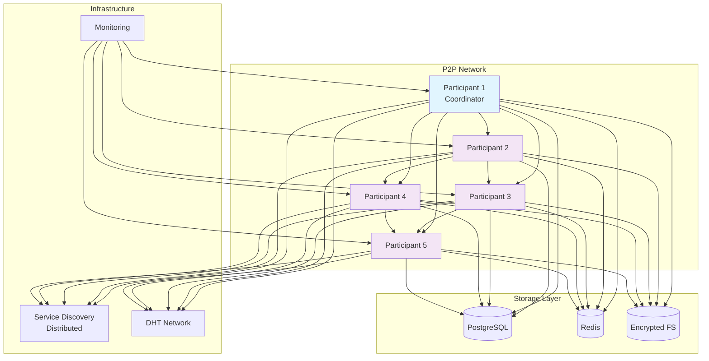
```mermaid
graph TD
    subgraph "P2P Network"
        P1[Participant 1<br/>Coordinator]
        P2[Participant 2]
        P3[Participant 3]
        P4[Participant 4]
        P5[Participant 5]
    end

    subgraph "Storage Layer"
        PG[(PostgreSQL)]
        RD[(Redis)]
        FS[(Encrypted FS)]
    end

    subgraph "Infrastructure"
        SD[Service Discovery<br/>Distributed]
        DHT[DHT Network]
        MON[Monitoring]
    end

    P1 --> P2
    P1 --> P3
    P1 --> P4
    P1 --> P5
    P2 --> P3
    P2 --> P4
    P3 --> P5
    P4 --> P5

    P1 --> PG
    P2 --> PG
    P3 --> PG
    P4 --> PG
    P5 --> PG

    P1 --> RD
    P2 --> RD
    P3 --> RD
    P4 --> RD
    P5 --> RD

    P1 --> FS
    P2 --> FS
    P3 --> FS
    P4 --> FS
    P5 --> FS

    P1 --> SD
    P2 --> SD
    P3 --> SD
    P4 --> SD
    P5 --> SD

    P1 --> DHT
    P2 --> DHT
    P3 --> DHT
    P4 --> DHT
    P5 --> DHT

    MON --> P1
    MON --> P2
    MON --> P3
    MON --> P4
    MON --> P5

    style P1 fill:#e1f5fe
    style P2 fill:#f3e5f5
    style P3 fill:#f3e5f5
    style P4 fill:#f3e5f5
    style P5 fill:#f3e5f5
```

**特点**：
- 完全去中心化
- 节点动态加入退出
- 高容错性
- 适合大规模分布式场景

---

## 2. 核心模块详细设计

### 2.1 MPC Coordinator Service (协调器服务)

#### 2.1.1 模块职责

**核心功能**：
- **DKG会话管理**：创建DKG会话，通知第一个Participant启动DKG协议
- **签名会话管理**：创建、监控、销毁签名会话
- **节点发现**：通过Consul和数据库发现可用Participant节点
- **协议协调**：轻量级协调，不接触私钥分片，不参与协议消息交换
- **会话完成**：接收Participant的CompleteKeygenSession调用，更新密钥元数据

#### 2.1.2 内部组件设计

```
Coordinator Service 内部架构（实际实现）
├── KeyService (密钥服务)
│   ├── CreatePlaceholderKey: 创建占位符密钥（满足外键约束）
│   └── CreateKeyWithExistingMetadata: 在占位符基础上执行DKG
├── SessionManager (会话管理器)
│   ├── CreateKeyGenSession: 创建DKG会话（使用keyID作为sessionID）
│   ├── CreateSession: 创建签名会话
│   ├── GetSession: 从Redis或PostgreSQL获取会话
│   ├── CompleteKeygenSession: 完成DKG会话，更新密钥状态为Active
│   └── StateStore: 会话状态持久化（PostgreSQL + Redis）
├── NodeDiscovery (节点发现)
│   ├── 优先从数据库查询节点
│   ├── 不足时从Consul发现Participant节点
│   └── 合并去重返回节点列表
├── ProtocolEngine (协议引擎接口)
│   └── 通过依赖注入获取，Coordinator不直接调用协议方法
└── GRPCClient (gRPC客户端)
    └── SendStartDKG: 异步通知第一个Participant启动DKG（5分钟超时）
```

#### 2.1.3 关键接口设计

```go
// SessionManager 会话管理接口
type SessionManager interface {
    CreateSession(ctx context.Context, req *CreateSessionRequest) (*SigningSession, error)
    GetSession(ctx context.Context, sessionID string) (*SigningSession, error)
    UpdateSessionStatus(ctx context.Context, sessionID string, status SessionStatus) error
    DeleteSession(ctx context.Context, sessionID string) error
    ListSessions(ctx context.Context, filter *SessionFilter) ([]*SigningSession, error)
}

// NodeSelector 节点选择接口
type NodeSelector interface {
    SelectNodes(ctx context.Context, keyID string, threshold int) ([]*Node, error)
    GetNodeHealth(ctx context.Context, nodeID string) (*NodeHealth, error)
    UpdateNodeLoad(ctx context.Context, nodeID string, load int) error
}

// ProtocolCoordinator 协议协调接口
type ProtocolCoordinator interface {
    StartSigning(ctx context.Context, sessionID string, nodes []*Node, message []byte) error
    GetSigningProgress(ctx context.Context, sessionID string) (*SigningProgress, error)
    CancelSigning(ctx context.Context, sessionID string) error
}
```

#### 2.1.4 签名会话管理流程

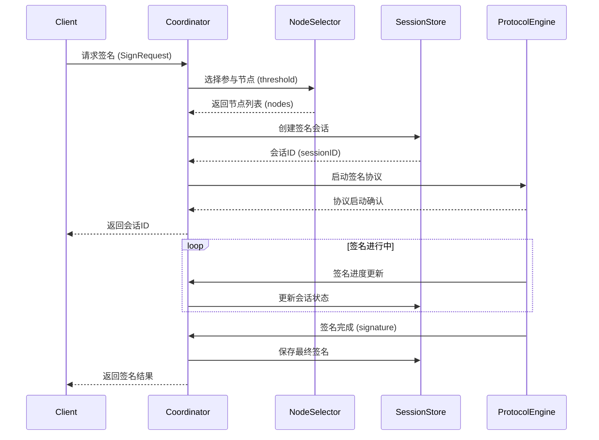
```mermaid
sequenceDiagram
    participant Client
    participant Coordinator
    participant NodeSelector
    participant SessionStore
    participant ProtocolEngine

    Client->>Coordinator: 请求签名 (SignRequest)
    Coordinator->>NodeSelector: 选择参与节点 (threshold)
    NodeSelector-->>Coordinator: 返回节点列表 (nodes)
    Coordinator->>SessionStore: 创建签名会话
    SessionStore-->>Coordinator: 会话ID (sessionID)
    Coordinator->>ProtocolEngine: 启动签名协议
    ProtocolEngine-->>Coordinator: 协议启动确认
    Coordinator-->>Client: 返回会话ID

    loop 签名进行中
        ProtocolEngine->>Coordinator: 签名进度更新
        Coordinator->>SessionStore: 更新会话状态
    end

    ProtocolEngine->>Coordinator: 签名完成 (signature)
    Coordinator->>SessionStore: 保存最终签名
    Coordinator-->>Client: 返回签名结果
```

#### 2.1.5 Session State Store（持久化 + WAL + 指标）

- `SessionManager` 现在内嵌 [`StateStore`](internal/mpc/session/store.go)，在 `CreateSession / UpdateSession` 之外额外提供 `SaveRoundProgress`、`LoadRoundProgress`、`AppendWAL`、`ReplayWAL`、`ObserveRoundMetric` 等高级接口，方便协议层记录实时状态。
- `StateStore` 通过 PG (`storage.MetadataStore`) + Redis (`storage.SessionStore`) 双写保证状态落盘；轮次更新时刷新 `CurrentRound/TotalRounds/ParticipatingNodes/DurationMs`，并缓存到 Redis，TTL 默认继承会话超时。
- WAL 目前以内存 map 形式实现（`walSequences` + `wal`），支持记录尚未持久化的 round event，后续可以扩展到 Kafka/Stream。`ReplayWAL` 在 Crash-Recovery 时用于重新驱动协议。
- 指标：通过 `prometheus` 直方图 `mpc_session_round_duration_seconds{protocol,round}` 记录每个轮次的耗时，便于在 Phase 1C 统一挂到 `/metrics` 暴露。

### 2.2 MPC Participant Service (参与者服务)

#### 2.2.1 模块职责

**核心功能**：
- **密钥分片存储**：安全存储和访问密钥分片
- **签名参与**：参与阈值签名协议计算
- **协议通信**：与其他Participant节点通信
- **状态同步**：维护协议执行状态

#### 2.2.2 内部组件设计

```
Participant Service 内部架构
├── KeyShareStorage (密钥分片存储)
│   ├── 分片加密存储
│   ├── 分片访问控制
│   ├── 分片完整性验证
│   └── 分片备份恢复
├── ProtocolParticipant (协议参与者)
│   ├── 协议消息处理
│   ├── 状态机管理
│   ├── 计算任务执行
│   └── 结果验证提交
├── P2PCommunicator (点对点通信器)
│   ├── 节点发现连接
│   ├── 消息发送接收
│   ├── 连接状态维护
│   └── 安全通信加密
└── HealthReporter (健康状态报告器)
    ├── 节点状态监控
    ├── 性能指标收集
    ├── 错误状态上报
    └── 自动恢复机制
```

#### 2.2.3 密钥分片存储设计

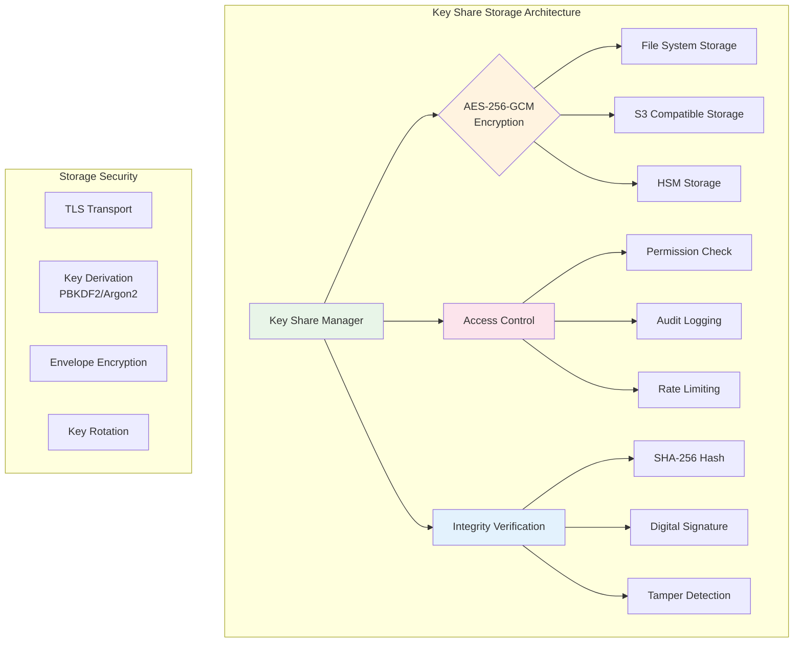
```mermaid
graph TD
    subgraph "Key Share Storage Architecture"
        A[Key Share Manager] --> B{AES-256-GCM<br/>Encryption}
        B --> C[File System Storage]
        B --> D[S3 Compatible Storage]
        B --> E[HSM Storage]

        F[Access Control] --> G[Permission Check]
        F --> H[Audit Logging]
        F --> I[Rate Limiting]

        J[Integrity Verification] --> K[SHA-256 Hash]
        J --> L[Digital Signature]
        J --> M[Tamper Detection]

        A --> F
        A --> J
    end

    subgraph "Storage Security"
        N[TLS Transport]
        O[Key Derivation<br/>PBKDF2/Argon2]
        P[Envelope Encryption]
        Q[Key Rotation]
    end

    style A fill:#e8f5e8
    style B fill:#fff3e0
    style F fill:#fce4ec
    style J fill:#e3f2fd
```

#### 2.2.4 签名参与流程

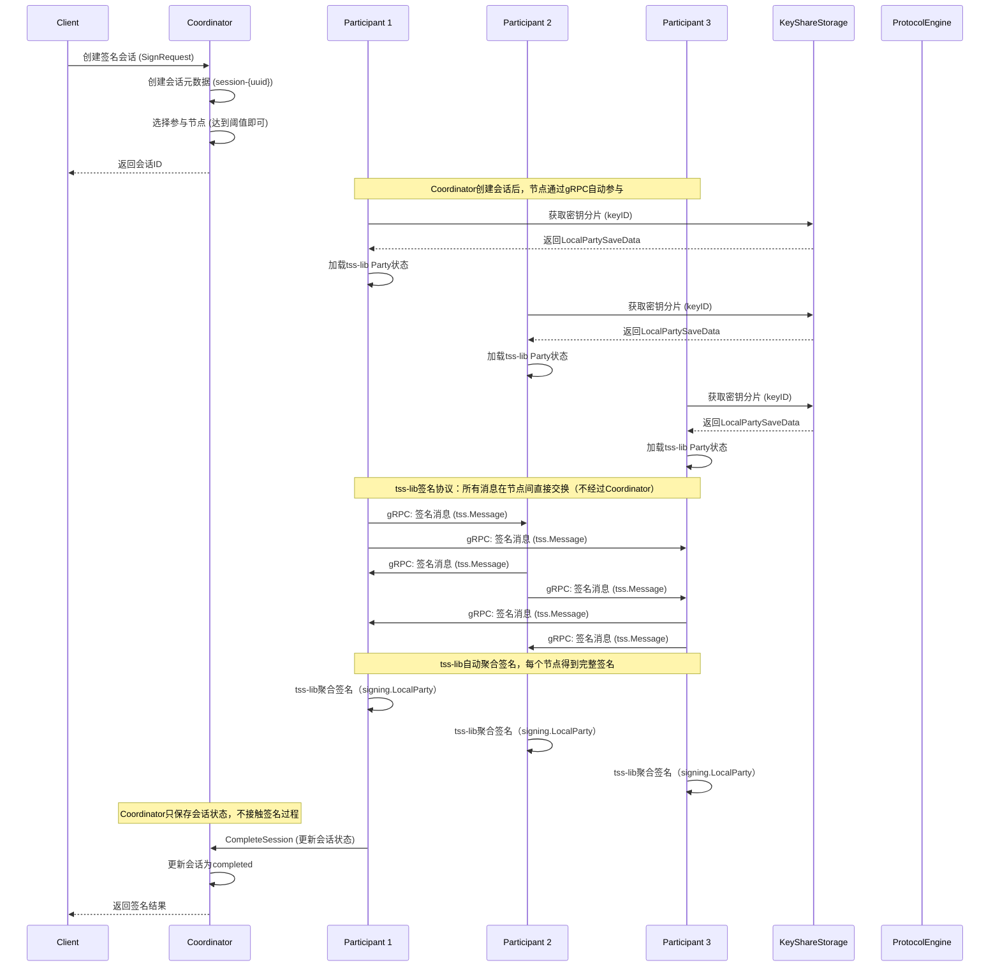
```mermaid
sequenceDiagram
    participant Client
    participant Coordinator
    participant P1 as Participant 1
    participant P2 as Participant 2
    participant P3 as Participant 3
    participant Storage as KeyShareStorage
    participant Protocol as ProtocolEngine

    Client->>Coordinator: 创建签名会话 (SignRequest)
    Coordinator->>Coordinator: 创建会话元数据 (session-{uuid})
    Coordinator->>Coordinator: 选择参与节点 (达到阈值即可)
    Coordinator-->>Client: 返回会话ID

    Note over P1,P3: Coordinator创建会话后，节点通过gRPC自动参与

    P1->>Storage: 获取密钥分片 (keyID)
    Storage-->>P1: 返回LocalPartySaveData
    P1->>P1: 加载tss-lib Party状态

    P2->>Storage: 获取密钥分片 (keyID)
    Storage-->>P2: 返回LocalPartySaveData
    P2->>P2: 加载tss-lib Party状态

    P3->>Storage: 获取密钥分片 (keyID)
    Storage-->>P3: 返回LocalPartySaveData
    P3->>P3: 加载tss-lib Party状态

    Note over P1,P3: tss-lib签名协议：所有消息在节点间直接交换（不经过Coordinator）

    P1->>P2: gRPC: 签名消息 (tss.Message)
    P1->>P3: gRPC: 签名消息 (tss.Message)
    P2->>P1: gRPC: 签名消息 (tss.Message)
    P2->>P3: gRPC: 签名消息 (tss.Message)
    P3->>P1: gRPC: 签名消息 (tss.Message)
    P3->>P2: gRPC: 签名消息 (tss.Message)

    Note over P1,P3: tss-lib自动聚合签名，每个节点得到完整签名

    P1->>P1: tss-lib聚合签名（signing.LocalParty）
    P2->>P2: tss-lib聚合签名（signing.LocalParty）
    P3->>P3: tss-lib聚合签名（signing.LocalParty）

    Note over Coordinator: Coordinator只保存会话状态，不接触签名过程

    P1->>Coordinator: CompleteSession (更新会话状态)
    Coordinator->>Coordinator: 更新会话为completed
    Coordinator-->>Client: 返回签名结果
```

### 2.3 Protocol Engine (协议引擎)

#### 2.3.1 支持的协议

**GG18/GG20 协议**（实际实现）：
- **GG18**: 基于`tss-lib/ecdsa/keygen`和`tss-lib/ecdsa/signing`，4轮通信的ECDSA阈值签名
- **GG20**: 继承GG18，单轮签名优化，支持可识别的中止（Identifiable Abort）
- **特点**: 使用生产级tss-lib库，经过生产验证
- **实现位置**: [`internal/mpc/protocol/gg18.go`](internal/mpc/protocol/gg18.go), [`internal/mpc/protocol/gg20.go`](internal/mpc/protocol/gg20.go)

**FROST 协议**（部分实现）：
- **IETF标准**: 两轮通信的Schnorr签名
- **实现**: 基于`tss-lib/eddsa/keygen`和`tss-lib/eddsa/signing`
- **状态**: 基础框架已实现，待完善
- **实现位置**: [`internal/mpc/protocol/frost.go`](internal/mpc/protocol/frost.go)

#### 2.3.2 协议引擎架构

```
Protocol Engine 架构（实际实现）
├── Engine Interface (协议引擎接口)
│   ├── GenerateKeyShare: 分布式密钥生成
│   ├── ThresholdSign: 阈值签名
│   ├── VerifySignature: 签名验证
│   ├── ProcessIncomingKeygenMessage: 处理DKG消息
│   └── ProcessIncomingSigningMessage: 处理签名消息
├── tssPartyManager (tss-lib适配层)
│   ├── activeKeygen: 活跃的DKG协议实例
│   ├── activeSigning: 活跃的签名协议实例
│   ├── nodeIDToPartyID: 节点ID到PartyID映射
│   ├── incomingKeygenMessages: DKG消息队列
│   └── incomingSigningMessages: 签名消息队列
├── GG18 Protocol (GG18协议实现)
│   ├── 基于tss-lib/ecdsa/keygen: DKG协议
│   ├── 基于tss-lib/ecdsa/signing: 签名协议
│   ├── 消息路由: 通过messageRouter发送到其他节点
│   └── 广播消息: 支持targetCount=0的广播消息
├── GG20 Protocol (GG20协议实现)
│   ├── 继承GG18Protocol: 复用DKG逻辑
│   ├── 单轮签名优化: 减少网络往返
│   └── 可识别中止: Identifiable Abort支持
├── FROST Protocol (FROST协议实现)
│   ├── 基于tss-lib/eddsa/keygen: EdDSA DKG
│   ├── 基于tss-lib/eddsa/signing: EdDSA签名
│   └── Schnorr签名: 两轮通信
└── Protocol Registry (协议注册表)
    ├── 协议注册: 支持多协议注册
    ├── 默认协议: GG20
    └── 协议切换: 通过协议名称选择
```

#### 2.3.3 GG20签名协议详细流程

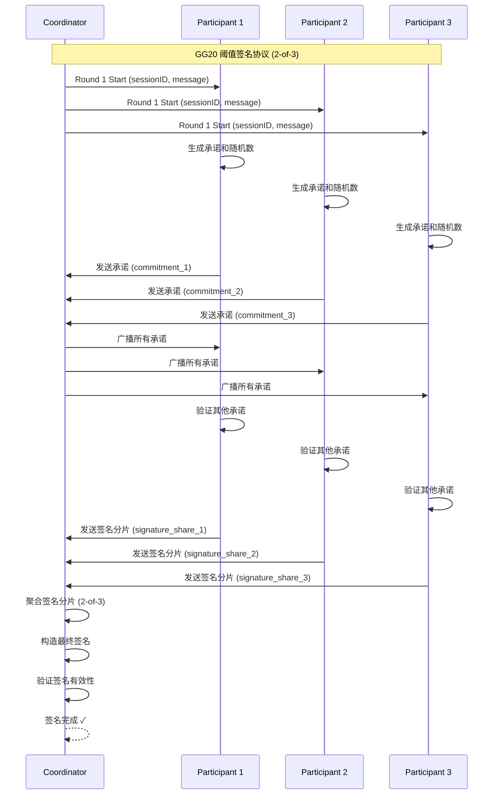
```mermaid
sequenceDiagram
    participant Coordinator
    participant P1 as Participant 1
    participant P2 as Participant 2
    participant P3 as Participant 3

    Note over Coordinator,P3: GG20 阈值签名协议 (2-of-3)

    Coordinator->>P1: Round 1 Start (sessionID, message)
    Coordinator->>P2: Round 1 Start (sessionID, message)
    Coordinator->>P3: Round 1 Start (sessionID, message)

    P1->>P1: 生成承诺和随机数
    P2->>P2: 生成承诺和随机数
    P3->>P3: 生成承诺和随机数

    P1->>Coordinator: 发送承诺 (commitment_1)
    P2->>Coordinator: 发送承诺 (commitment_2)
    P3->>Coordinator: 发送承诺 (commitment_3)

    Coordinator->>P1: 广播所有承诺
    Coordinator->>P2: 广播所有承诺
    Coordinator->>P3: 广播所有承诺

    P1->>P1: 验证其他承诺
    P2->>P2: 验证其他承诺
    P3->>P3: 验证其他承诺

    P1->>Coordinator: 发送签名分片 (signature_share_1)
    P2->>Coordinator: 发送签名分片 (signature_share_2)
    P3->>Coordinator: 发送签名分片 (signature_share_3)

    Coordinator->>Coordinator: 聚合签名分片 (2-of-3)
    Coordinator->>Coordinator: 构造最终签名
    Coordinator->>Coordinator: 验证签名有效性

    Coordinator-->>Coordinator: 签名完成 ✓
```

### 2.4 Key Share Manager (密钥分片管理)

#### 2.4.1 分片生命周期管理

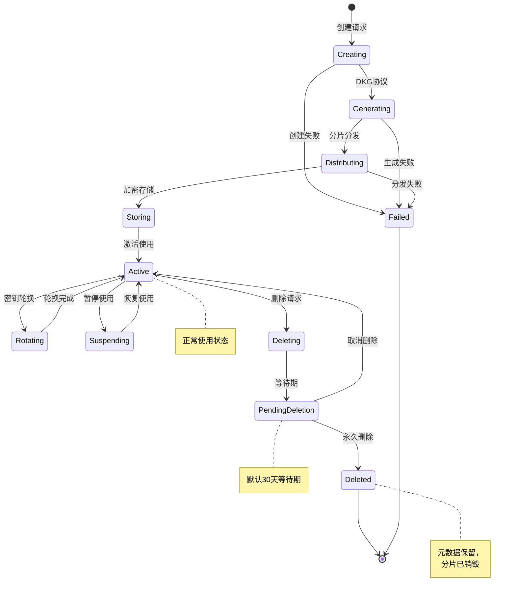
```mermaid
stateDiagram-v2
    [*] --> Creating: 创建请求
    Creating --> Generating: DKG协议
    Generating --> Distributing: 分片分发
    Distributing --> Storing: 加密存储
    Storing --> Active: 激活使用

    Active --> Rotating: 密钥轮换
    Rotating --> Active: 轮换完成

    Active --> Suspending: 暂停使用
    Suspending --> Active: 恢复使用

    Active --> Deleting: 删除请求
    Deleting --> PendingDeletion: 等待期
    PendingDeletion --> Deleted: 永久删除
    PendingDeletion --> Active: 取消删除

    Deleted --> [*]

    Creating --> Failed: 创建失败
    Generating --> Failed: 生成失败
    Distributing --> Failed: 分发失败
    Failed --> [*]

    note right of Active : 正常使用状态
    note right of PendingDeletion : 默认30天等待期
    note right of Deleted : 元数据保留，<br/>分片已销毁
```

#### 2.4.2 分片存储安全设计

```
密钥分片安全存储架构
├── 加密层 (Encryption Layer)
│   ├── 对称加密：AES-256-GCM
│   ├── 信封加密：数据密钥 + 主密钥
│   ├── 密钥派生：PBKDF2/Argon2
│   └── 密钥轮换：定期更换加密密钥
├── 访问控制层 (Access Control Layer)
│   ├── 节点认证：证书/TLS
│   ├── 权限检查：RBAC策略
│   ├── 审计日志：所有访问记录
│   └── 速率限制：防止滥用
├── 完整性保护层 (Integrity Protection Layer)
│   ├── 哈希校验：SHA-256
│   ├── 数字签名：RSA/ECDSA
│   ├── 篡改检测：HMAC
│   └── 备份验证：多副本校验
└── 物理安全层 (Physical Security Layer)
    ├── 加密文件系统
    ├── HSM存储选项
    ├── 安全删除：多重覆盖
    └── 地理分布：多区域备份
```

#### 2.4.3 分布式密钥生成 (DKG) 流程

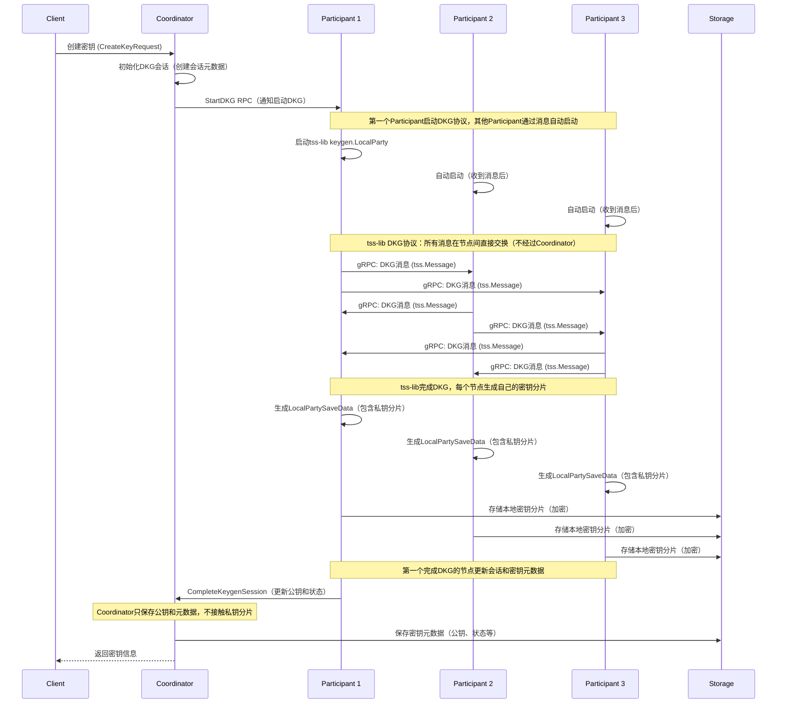
```mermaid
sequenceDiagram
    participant Client
    participant Coordinator
    participant P1 as Participant 1
    participant P2 as Participant 2
    participant P3 as Participant 3
    participant Storage

    Client->>Coordinator: 创建密钥 (CreateKeyRequest)
    Coordinator->>Coordinator: 初始化DKG会话（创建会话元数据）
    Coordinator->>P1: StartDKG RPC（通知启动DKG）
    
    Note over P1,P3: 第一个Participant启动DKG协议，其他Participant通过消息自动启动

    P1->>P1: 启动tss-lib keygen.LocalParty
    P2->>P2: 自动启动（收到消息后）
    P3->>P3: 自动启动（收到消息后）

    Note over P1,P3: tss-lib DKG协议：所有消息在节点间直接交换（不经过Coordinator）

    P1->>P2: gRPC: DKG消息 (tss.Message)
    P1->>P3: gRPC: DKG消息 (tss.Message)
    P2->>P1: gRPC: DKG消息 (tss.Message)
    P2->>P3: gRPC: DKG消息 (tss.Message)
    P3->>P1: gRPC: DKG消息 (tss.Message)
    P3->>P2: gRPC: DKG消息 (tss.Message)

    Note over P1,P3: tss-lib完成DKG，每个节点生成自己的密钥分片

    P1->>P1: 生成LocalPartySaveData（包含私钥分片）
    P2->>P2: 生成LocalPartySaveData（包含私钥分片）
    P3->>P3: 生成LocalPartySaveData（包含私钥分片）

    P1->>Storage: 存储本地密钥分片（加密）
    P2->>Storage: 存储本地密钥分片（加密）
    P3->>Storage: 存储本地密钥分片（加密）

    Note over P1,P3: 第一个完成DKG的节点更新会话和密钥元数据

    P1->>Coordinator: CompleteKeygenSession（更新公钥和状态）
    
    Note over Coordinator: Coordinator只保存公钥和元数据，不接触私钥分片

    Coordinator->>Storage: 保存密钥元数据（公钥、状态等）
    Coordinator-->>Client: 返回密钥信息
```

**tss-lib分布式签名架构要点**（详见 [`internal/mpc/protocol/tss_adapter.go`](internal/mpc/protocol/tss_adapter.go)）：
- **分布式密钥生成（DKG）**：使用tss-lib的`keygen.LocalParty`，每个Participant节点独立参与DKG协议，生成自己的`LocalPartySaveData`（包含私钥分片`Xi`），密钥分片永不离开节点。Coordinator只负责创建会话并通知第一个Participant启动，之后所有DKG协议消息在Participant节点间直接交换，不经过Coordinator。
- **消息路由**：通过gRPC实现Participant节点间直接消息交换，`messageRouter`函数将tss-lib的`tss.Message`序列化后直接发送到目标Participant节点，Coordinator不参与消息路由。
- **消息接收处理**：`ProcessIncomingKeygenMessage`和`ProcessIncomingSigningMessage`接收gRPC消息，解析后调用`party.UpdateFromBytes`更新Party状态。Participant节点在收到第一个DKG消息时自动启动DKG协议。
- **签名聚合**：tss-lib自动完成签名聚合，每个参与节点都能得到完整签名，无需Coordinator收集分片。
- **Coordinator角色**：简化为轻量级协调者，负责会话管理、节点发现和审计，不参与DKG协议消息交换，不接触私钥分片。
- **密钥分片存储**：每个Participant节点独立存储自己的`LocalPartySaveData`（加密存储），Coordinator只保存公钥和元数据。

---

## 3. 通信协议设计

### 3.0 分布式通信架构（tss-lib实现）

#### 3.0.1 gRPC通信层

**架构说明**（实际实现）：
- **gRPC客户端**（`internal/mpc/grpc/client.go`）：负责向其他节点发送tss-lib协议消息
  - `SendKeygenMessage`: 发送DKG消息，支持广播消息（round=-1标记）
  - `SendSigningMessage`: 发送签名消息
  - `SendStartDKG`: Coordinator通知Participant启动DKG
  - 连接池管理：KeepAlive 10分钟，Timeout 10分钟
- **gRPC服务端**（`internal/mpc/grpc/server.go`）：接收来自其他节点的消息
  - `SubmitSignatureShare`: 接收协议消息（DKG或签名）
  - `StartDKG`: Participant接收DKG启动请求
  - `handleProtocolMessage`: 处理协议消息，自动启动DKG（如果收到第一个消息）
  - 服务器配置：MaxConnAge 2小时，KeepAlive 10分钟
- **消息路由**：`messageRouter`函数（在`internal/api/providers.go`中定义）将`tss.Message`序列化后通过gRPC发送
  - 支持广播消息：`isBroadcast`参数，`round=-1`标记
  - 消息序列化：使用`msg.WireBytes()`
- **消息处理**：`ProcessIncomingKeygenMessage`和`ProcessIncomingSigningMessage`接收消息并更新Party状态
  - 自动启动DKG：Participant收到第一个DKG消息时自动启动协议
  - 广播消息处理：通过`round=-1`识别，调用`UpdateFromBytes`时传递`isBroadcast=true`

**通信流程**：
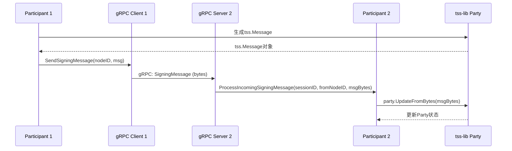
```mermaid
sequenceDiagram
    participant P1 as Participant 1
    participant GRPC1 as gRPC Client 1
    participant GRPC2 as gRPC Server 2
    participant P2 as Participant 2
    participant TSS as tss-lib Party

    P1->>TSS: 生成tss.Message
    TSS-->>P1: tss.Message对象
    P1->>GRPC1: SendSigningMessage(nodeID, msg)
    GRPC1->>GRPC2: gRPC: SigningMessage (bytes)
    GRPC2->>P2: ProcessIncomingSigningMessage(sessionID, fromNodeID, msgBytes)
    P2->>TSS: party.UpdateFromBytes(msgBytes)
    TSS-->>P2: 更新Party状态
```

**关键实现**（实际代码）：
- **消息序列化**：使用`msg.WireBytes()`将`tss.Message`序列化为字节数组
- **消息反序列化**：在`tss_adapter.go`中通过`party.UpdateFromBytes(msgBytes, isBroadcast)`更新Party状态
- **广播消息处理**：
  - 发送端：`targetCount=0`的消息标记为广播，设置`round=-1`
  - 接收端：通过`shareMsg.Round == -1`识别广播消息，传递给`UpdateFromBytes`时设置`isBroadcast=true`
- **会话管理**：
  - DKG会话：使用`keyID`作为`sessionID`
  - 签名会话：使用`session-{uuid}`格式
  - 会话存储：PostgreSQL（持久化）+ Redis（缓存，TTL=会话超时）
- **自动启动DKG**：
  - Participant收到第一个DKG消息时，检查会话是否存在
  - 如果会话存在但DKG未启动，自动调用`GenerateKeyShare`启动协议
  - 使用`sync.Once`确保每个会话只启动一次
- **错误处理**：
  - gRPC连接重试：指数退避
  - 会话保存重试：3次重试，指数退避
  - 超时控制：DKG 10分钟，签名5分钟

### 3.1 gRPC 接口设计

#### 3.1.1 核心服务接口

```protobuf
// mpc/v1/mpc.proto
service MPCService {
  // 密钥管理
  rpc CreateKey(CreateKeyRequest) returns (CreateKeyResponse);
  rpc GetKey(GetKeyRequest) returns (GetKeyResponse);
  rpc ListKeys(ListKeysRequest) returns (ListKeysResponse);
  rpc DeleteKey(DeleteKeyRequest) returns (DeleteKeyResponse);

  // 签名服务
  rpc Sign(SignRequest) returns (SignResponse);
  rpc BatchSign(BatchSignRequest) returns (BatchSignResponse);
  rpc Verify(VerifyRequest) returns (VerifyResponse);

  // 会话管理
  rpc CreateSigningSession(CreateSessionRequest) returns (CreateSessionResponse);
  rpc GetSigningSession(GetSessionRequest) returns (GetSessionResponse);
  rpc JoinSigningSession(JoinSessionRequest) returns (JoinSessionResponse);
  rpc CancelSigningSession(CancelSessionRequest) returns (CancelSessionResponse);
}

// 节点间通信
service NodeService {
  rpc Heartbeat(HeartbeatRequest) returns (HeartbeatResponse);
  rpc ParticipateSigning(ParticipateRequest) returns (ParticipateResponse);
  rpc ExchangeShares(ExchangeRequest) returns (ExchangeResponse);
  rpc ReportHealth(HealthReport) returns (HealthAck);
}
```

#### 3.1.2 消息定义

```protobuf
// 密钥相关消息
message CreateKeyRequest {
  string algorithm = 1;        // ECDSA, EdDSA
  string curve = 2;           // secp256k1, ed25519
  int32 threshold = 3;        // 阈值
  int32 total_nodes = 4;      // 总节点数
  string chain_type = 5;      // bitcoin, ethereum
  map<string, string> metadata = 6;
}

message CreateKeyResponse {
  string key_id = 1;
  string public_key = 2;
  string address = 3;
  int64 created_at = 4;
}

// 签名相关消息
message SignRequest {
  string key_id = 1;
  bytes message = 2;
  string message_type = 3;    // raw, hash, typed_data
  string chain_type = 4;
  map<string, string> metadata = 5;
}

message SignResponse {
  string signature = 1;
  string key_id = 2;
  string session_id = 3;
  int64 signed_at = 4;
}
```

### 3.2 REST API 设计

#### 3.2.1 API 路径设计

```
/api/v1/mpc
├── /keys                          # 密钥管理（实际实现）
│   ├── POST   /keys               # 创建密钥（触发DKG）
│   │   └── Handler: post_create_key.go
│   ├── GET    /keys               # 列出密钥
│   │   └── Handler: get_list_keys.go
│   ├── GET    /keys/{key_id}      # 获取密钥
│   │   └── Handler: get_key.go
│   ├── DELETE /keys/{key_id}      # 删除密钥
│   │   └── Handler: delete_key.go
│   └── POST   /keys/{key_id}/address # 生成地址
│       └── Handler: post_generate_address.go
├── /sign                          # 签名服务（实际实现）
│   ├── POST   /sign               # 单次签名
│   │   └── Handler: post_sign.go
│   ├── POST   /sign/batch         # 批量签名
│   │   └── Handler: post_batch_sign.go
│   └── POST   /verify             # 签名验证
│       └── Handler: post_verify.go
├── /sessions                      # 会话管理（实际实现）
│   ├── POST   /sessions           # 创建签名会话
│   │   └── Handler: post_create_session.go
│   ├── GET    /sessions/{session_id} # 获取会话
│   │   └── Handler: get_session.go
│   ├── POST   /sessions/{session_id}/join # 加入会话
│   │   └── Handler: post_join_session.go
│   └── POST   /sessions/{session_id}/cancel # 取消会话
│       └── Handler: post_cancel_session.go
└── /nodes                         # 节点管理（实际实现）
    ├── POST   /nodes              # 注册节点
    │   └── Handler: post_register_node.go
    ├── GET    /nodes              # 列出节点
    │   └── Handler: get_list_nodes.go
    ├── GET    /nodes/{node_id}    # 获取节点
    │   └── Handler: get_node.go
    └── GET    /nodes/{node_id}/health # 节点健康
        └── Handler: get_node_health.go
```

#### 3.2.2 API 响应格式

```json
{
  "success": true,
  "data": {
    "key_id": "key-1234567890abcdef",
    "public_key": "02abcdef...",
    "address": "1ABC...",
    "created_at": "2024-01-01T00:00:00Z"
  },
  "meta": {
    "request_id": "req-123",
    "timestamp": "2024-01-01T00:00:00Z"
  }
}
```

### 3.3 通信安全设计

#### 3.3.1 TLS 配置

```yaml
# TLS 配置
tls:
  enabled: true
  cert_file: "/etc/mpc/ssl/cert.pem"
  key_file: "/etc/mpc/ssl/key.pem"
  ca_file: "/etc/mpc/ssl/ca.pem"
  client_auth: "require_and_verify_client_cert"
  min_version: "TLS_1_2"
  cipher_suites:
    - "TLS_ECDHE_RSA_WITH_AES_256_GCM_SHA384"
    - "TLS_ECDHE_ECDSA_WITH_AES_256_GCM_SHA384"
```

#### 3.3.2 消息认证

```
消息认证机制
├── 请求签名：HMAC-SHA256
├── 时间戳验证：防止重放攻击
├── 请求ID：防止重复请求
├── 证书认证：双向TLS
└── API密钥：应用级认证
```

#### 2.4.4 协议引擎实现（基于 tss-lib）

**实际实现架构**（详见 [`internal/mpc/protocol/tss_adapter.go`](internal/mpc/protocol/tss_adapter.go)）：

- **tssPartyManager**：管理tss-lib的Party实例和消息路由
  - `activeKeygen`: 当前活跃的DKG协议实例（`keygen.LocalParty`）
  - `activeSigning`: 当前活跃的签名协议实例（`signing.LocalParty`）
  - `nodeIDToPartyID`: 节点ID到PartyID的映射（使用节点ID的SHA-256哈希作为唯一密钥）
  - `incomingKeygenMessages`: 接收到的DKG消息队列（按sessionID组织）
  - `incomingSigningMessages`: 接收到的签名消息队列

- **GG18协议实现**（[`internal/mpc/protocol/gg18.go`](internal/mpc/protocol/gg18.go)）：
  - 基于`tss-lib/ecdsa/keygen`和`tss-lib/ecdsa/signing`
  - `GenerateKeyShare`: 执行DKG协议，生成`LocalPartySaveData`（包含私钥分片`Xi`）
  - `ThresholdSign`: 执行阈值签名，使用`signing.LocalParty`
  - 消息路由：通过`messageRouter`函数发送到其他Participant节点
  - 广播消息：`targetCount=0`的消息自动广播到所有其他节点

- **GG20协议实现**（[`internal/mpc/protocol/gg20.go`](internal/mpc/protocol/gg20.go)）：
  - 继承`GG18Protocol`，复用DKG逻辑
  - `ThresholdSign`: 使用GG20的单轮签名优化
  - 支持可识别的中止（Identifiable Abort）

- **消息处理流程**：
  1. 接收gRPC消息：`SubmitSignatureShare` → `handleProtocolMessage`
  2. 识别协议类型：通过`session.Protocol`判断是DKG还是签名
  3. 自动启动DKG：如果收到第一个DKG消息且协议未启动，自动启动
  4. 更新Party状态：调用`party.UpdateFromBytes(msgBytes, isBroadcast)`
  5. 处理Party输出：从`outCh`接收消息，路由到其他节点

- **密钥分片存储**：
  - 每个Participant节点只存储自己的`LocalPartySaveData`
  - 加密存储：使用AES-256-GCM加密
  - 存储位置：`/var/lib/mpc/key-shares/{key_id}/{node_id}.enc`
  - Coordinator不存储密钥分片，只保存公钥和元数据

- **性能特性**：
  - DKG超时：10分钟（可配置）
  - 签名超时：5分钟（可配置）
  - 消息大小限制：10MB（gRPC配置）
  - 连接保持：KeepAlive 10分钟，MaxConnAge 2小时

---

## 4. 数据存储设计

### 4.1 数据库表结构

#### 4.1.1 Keys 表 (密钥元数据) - 实际实现

**表结构**（详见 [`migrations/`](migrations/) 和 [`internal/models/keys.go`](internal/models/keys.go)）：
```sql
CREATE TABLE keys (
    key_id VARCHAR(255) PRIMARY KEY,
    public_key TEXT NOT NULL,              -- DKG完成后更新为真实公钥，初始为"pending"
    algorithm VARCHAR(50) NOT NULL,       -- ECDSA, EdDSA
    curve VARCHAR(50) NOT NULL,           -- secp256k1, ed25519
    threshold INTEGER NOT NULL,           -- 阈值（如2-of-3）
    total_nodes INTEGER NOT NULL,         -- 总节点数
    chain_type VARCHAR(50) NOT NULL,       -- bitcoin, ethereum, evm
    address TEXT,                         -- 区块链地址（可选，可通过API生成）
    status VARCHAR(50) NOT NULL DEFAULT 'Pending', -- Pending, Active, Deleted
    description TEXT,
    tags JSONB,
    created_at TIMESTAMPTZ NOT NULL DEFAULT NOW(),
    updated_at TIMESTAMPTZ NOT NULL DEFAULT NOW(),
    deletion_date TIMESTAMPTZ             -- 软删除标记
);

-- 索引（实际创建）
CREATE INDEX idx_keys_chain_type ON keys(chain_type);
CREATE INDEX idx_keys_status ON keys(status);
CREATE INDEX idx_keys_created_at ON keys(created_at);
CREATE INDEX idx_keys_algorithm ON keys(algorithm);
```

**状态流转**（实际实现）：
- `Pending`: 创建占位符密钥时（DKG开始前）
- `Active`: DKG完成后，通过`CompleteKeygenSession`更新
- `Deleted`: 删除密钥时，设置`deletion_date`

**存储实现**（详见 [`internal/mpc/storage/postgresql.go`](internal/mpc/storage/postgresql.go)）：
- `SaveKeyMetadata`: 使用`INSERT ... ON CONFLICT DO UPDATE`实现upsert
- `GetKeyMetadata`: 查询密钥元数据，支持软删除检查
- `UpdateKeyMetadata`: 更新密钥元数据（包括状态、公钥等）
- `ListKeys`: 支持按`chain_type`、`status`、`tags`过滤

#### 4.1.2 Nodes 表 (节点信息)

```sql
CREATE TABLE nodes (
    node_id VARCHAR(255) PRIMARY KEY,
    node_type VARCHAR(50) NOT NULL, -- coordinator, participant
    endpoint VARCHAR(255) NOT NULL,
    public_key TEXT,
    status VARCHAR(50) NOT NULL DEFAULT 'active',
    capabilities JSONB, -- 支持的协议和算法
    metadata JSONB,
    registered_at TIMESTAMPTZ NOT NULL DEFAULT NOW(),
    last_heartbeat TIMESTAMPTZ,
    load_factor INTEGER DEFAULT 0 -- 负载因子 0-100
);

-- 索引
CREATE INDEX idx_nodes_type ON nodes(node_type);
CREATE INDEX idx_nodes_status ON nodes(status);
CREATE INDEX idx_nodes_endpoint ON nodes(endpoint);
CREATE INDEX idx_nodes_load ON nodes(load_factor);
```

#### 4.1.3 Signing Sessions 表 (签名会话) - 实际实现

**表结构**（详见 [`migrations/`](migrations/) 和 [`internal/models/signing_sessions.go`](internal/models/signing_sessions.go)）：
```sql
CREATE TABLE signing_sessions (
    session_id VARCHAR(255) PRIMARY KEY,
    key_id VARCHAR(255) NOT NULL,
    protocol VARCHAR(50) NOT NULL,         -- "keygen", "dkg", "gg18", "gg20", "frost"
    status VARCHAR(50) NOT NULL DEFAULT 'pending', -- pending, active, completed, cancelled, timeout
    threshold INTEGER NOT NULL,
    total_nodes INTEGER NOT NULL,
    participating_nodes JSONB,            -- 参与节点列表（数组）
    current_round INTEGER DEFAULT 0,     -- 当前协议轮次
    total_rounds INTEGER NOT NULL,        -- 总轮次数（GG18/GG20为4）
    signature TEXT,                       -- 签名结果（对于DKG，存储公钥）
    message_hash VARCHAR(128),            -- 待签名消息哈希（可选）
    created_at TIMESTAMPTZ NOT NULL DEFAULT NOW(),
    completed_at TIMESTAMPTZ,             -- 完成时间
    duration_ms INTEGER,                  -- 耗时（毫秒）
    error_message TEXT,                   -- 错误信息（可选）
    FOREIGN KEY (key_id) REFERENCES keys(key_id) ON DELETE CASCADE
);

-- 索引（实际创建）
CREATE INDEX idx_sessions_key_id ON signing_sessions(key_id);
CREATE INDEX idx_sessions_status ON signing_sessions(status);
CREATE INDEX idx_sessions_created_at ON signing_sessions(created_at);
CREATE INDEX idx_sessions_protocol ON signing_sessions(protocol);
```

**特殊用途**（实际实现）：
- **DKG会话**：使用`keyID`作为`sessionID`，`protocol`为"keygen"或"dkg"
- **签名会话**：使用`session-{uuid}`格式，`protocol`为"gg18"或"gg20"
- **状态管理**：
  - `pending`: 会话创建，等待节点加入
  - `active`: 协议执行中
  - `completed`: 协议完成（DKG生成公钥，签名生成签名）
  - `cancelled`: 会话取消
  - `timeout`: 会话超时

**存储实现**（详见 [`internal/mpc/session/manager.go`](internal/mpc/session/manager.go)）：
- `CreateKeyGenSession`: 创建DKG会话，使用`keyID`作为`sessionID`
- `CreateSession`: 创建签名会话，生成`session-{uuid}`
- `GetSession`: 先查Redis缓存，未命中再查PostgreSQL
- `UpdateSession`: 同时更新PostgreSQL和Redis
- `CompleteKeygenSession`: 完成DKG会话，更新密钥状态为`Active`
- 重试机制：会话保存失败时，最多重试3次（指数退避）

#### 4.1.4 Audit Logs 表 (审计日志)

```sql
CREATE TABLE audit_logs (
    id BIGSERIAL PRIMARY KEY,
    timestamp TIMESTAMPTZ NOT NULL DEFAULT NOW(),
    event_type VARCHAR(50) NOT NULL,
    user_id VARCHAR(255),
    key_id VARCHAR(255),
    node_id VARCHAR(255),
    session_id VARCHAR(255),
    operation VARCHAR(50) NOT NULL,
    result VARCHAR(50) NOT NULL,
    details JSONB,
    ip_address VARCHAR(50),
    user_agent TEXT,
    request_id VARCHAR(255)
);

-- 索引
CREATE INDEX idx_audit_timestamp ON audit_logs(timestamp);
CREATE INDEX idx_audit_event_type ON audit_logs(event_type);
CREATE INDEX idx_audit_key_id ON audit_logs(key_id);
CREATE INDEX idx_audit_user_id ON audit_logs(user_id);
CREATE INDEX idx_audit_node_id ON audit_logs(node_id);
CREATE INDEX idx_audit_session_id ON audit_logs(session_id);
CREATE INDEX idx_audit_request_id ON audit_logs(request_id);
```

### 4.2 Redis 数据结构

#### 4.2.1 会话缓存（实际实现）

**Redis Key 设计**（详见 [`internal/mpc/storage/redis.go`](internal/mpc/storage/redis.go)）：
```
Redis Key 设计
├── session:{session_id}          # 会话完整信息 (JSON, TTL=会话超时)
└── session:lock:{session_id}    # 会话分布式锁（可选）
```

**实际使用**：
- **会话缓存**：`SaveSession`和`GetSession`使用Redis缓存会话信息
- **TTL管理**：会话TTL = 会话超时时间（默认5分钟）
- **缓存策略**：先查Redis，未命中再查PostgreSQL
- **更新策略**：同时更新PostgreSQL和Redis（双写）
- **会话状态**：包含`SessionID`, `KeyID`, `Protocol`, `Status`, `Threshold`, `TotalNodes`, `ParticipatingNodes`, `CurrentRound`, `TotalRounds`, `Signature`, `CreatedAt`, `CompletedAt`, `DurationMs`

#### 4.2.2 节点状态

```
节点状态缓存
├── node:health:{node_id}        # 节点健康状态
├── node:load:{node_id}          # 节点负载信息
├── node:capabilities:{node_id}  # 节点能力信息
└── nodes:active                 # 活跃节点列表 (SET)
```

### 4.3 密钥分片存储

#### 4.3.1 文件系统存储结构（实际实现）

**存储路径**（详见 [`internal/mpc/storage/key_share_storage.go`](internal/mpc/storage/key_share_storage.go)）：
```
/var/lib/mpc/key-shares/
├── {key_id}/
│   └── {node_id}.enc          # 加密的LocalPartySaveData（AES-256-GCM）
└── archive/                   # 已删除分片归档（可选）
```

**实际实现**：
- **存储格式**：每个节点的密钥分片单独存储为`{node_id}.enc`文件
- **加密方式**：AES-256-GCM加密（使用配置的`MPC_KEY_SHARE_ENCRYPTION_KEY`）
- **数据结构**：存储`tss-lib`的`LocalPartySaveData`（包含私钥分片`Xi`、公钥参数等）
- **访问控制**：只有对应节点可以访问自己的分片文件
- **备份策略**：可选的备份目录，支持定期备份

#### 4.3.2 分片文件格式

```json
// metadata.json
{
  "key_id": "key-1234567890abcdef",
  "node_id": "node-abcdef123456",
  "share_index": 1,
  "threshold": 2,
  "total_shares": 3,
  "algorithm": "ECDSA",
  "curve": "secp256k1",
  "created_at": "2024-01-01T00:00:00Z",
  "encrypted": true,
  "encryption": {
    "algorithm": "AES-256-GCM",
    "key_id": "enc-key-123",
    "iv": "abcdef123456"
  },
  "integrity": {
    "hash_algorithm": "SHA-256",
    "hash": "abcdef123456...",
    "signature": "sig-abcdef..."
  }
}
```

---

## 5. 安全技术栈分析

### 5.1 TSS vs SSS 技术对比

#### 5.1.1 TSS (Threshold Signature Scheme)

**核心原理**：
- 多方协作签名，无需恢复完整私钥
- 密钥分片在内存中处理后立即清除
- 支持实时签名，性能优异

**数学基础**：
```
私钥 = share1 + share2 + share3 (有限域加法)
签名 = MPC_Protocol(share1, share2, share3, message)
```

**使用场景**：
- 日常交易签名
- 在线支付处理
- 实时身份验证

**优势**：
- 密钥永不完整存在
- 实时性能 (< 200ms)
- 高并发支持

#### 5.1.2 SSS (Shamir Secret Sharing)

**核心原理**：
- 多项式插值实现密钥分片
- 需要收集足够分片才能恢复私钥

**数学基础**：
```
f(x) = a₀ + a₁x + a₂x² + ... + aₖ₋₁xᵏ⁻¹
其中 a₀ = 私钥
分片 = (x₁, f(x₁)), (x₂, f(x₂)), ..., (xₙ, f(xₙ))
恢复：使用 k 个分片通过拉格朗日插值恢复 f(0) = a₀
```

**使用场景**：
- 密钥备份恢复
- 灾难恢复
- 内部访问控制

**优势**：
- 信息论安全
- 灵活的阈值配置
- 支持内部控制

#### 5.1.3 混合使用策略

```
热钱包（日常使用）：TSS
├── 3-of-3 MPC 配置
├── 实时签名服务
├── 密钥永不完整存在
└── 支持阈值容错

冷备份（灾难恢复）：TSS + SSS
├── TSS 分片用 Ed25519 公钥加密
├── 加密私钥用 SSS 分片管理
└── 实现 3-of-5 内部控制
```

### 5.2 TEE 安全环境

**技术实现**：
- **Intel SGX**：软件保护扩展，提供加密的执行环境
- **AMD SEV**：安全加密虚拟化，虚拟机级别的隔离
- **ARM TrustZone**：移动设备安全环境

**在 MPC 中的应用**：

1. **密钥分片保护**：
   ```
   内存数据 → TEE 加密 → 防止冷启动攻击
   ```

2. **协议执行安全**：
   ```
   MPC 计算 → TEE 环境 → 确保计算完整性
   ```

3. **远程认证**：
   ```
   TEE 证明 → 验证节点可信 → 建立信任关系
   ```

**安全优势**：
- 多层防护：物理 → 云 → TEE → MPC
- 正交安全：不同层面的攻击相互独立
- 硬件保证：软件无法绕过硬件安全

### 5.3 端到端加密通信

**Noise Protocol 应用**：

**握手模式**：IK (Interactive Key) 模式
```
客户端 ↔ 服务器
    ↓
公钥交换 → 建立共享密钥 → 加密通信
```

**技术参数**：
- **密钥交换**：X25519 (Curve25519)
- **加密算法**：ChaCha20-Poly1305 AEAD
- **哈希算法**：Blake2s
- **认证方式**：数字签名

**安全特性**：
- 前向保密性
- 抵抗中间人攻击
- 零信任架构

### 5.4 强化密钥派生

**Hardened Derivation 原理**：

```
根密钥 → HMAC-SHA512 → 派生密钥 + 链码
                     ↓
               隔离不同区块链风险
```

**安全优势**：
- **资产隔离**：子密钥泄露不影响主密钥
- **跨链安全**：防止签名重用攻击
- **权限控制**：支持精确的访问控制

---

## 6. 安全设计

### 6.1 密钥安全

#### 5.1.1 密钥分片安全

```
密钥分片安全措施
├── 生成安全
│   ├── 真随机数生成
│   ├── 密码学安全的PRNG
│   ├── 熵源多样化
│   └── 种子密钥管理
├── 存储安全
│   ├── AES-256-GCM加密
│   ├── 信封加密设计
│   ├── HSM存储选项
│   └── 安全删除机制
├── 传输安全
│   ├── TLS 1.3加密
│   ├── 完美前向保密
│   ├── 证书钉扎
│   └── 传输层认证
└── 访问控制
    ├── 最小权限原则
    ├── 多因子认证
    ├── 访问审计
    └── 自动密钥轮换
```

#### 5.1.2 密钥生命周期

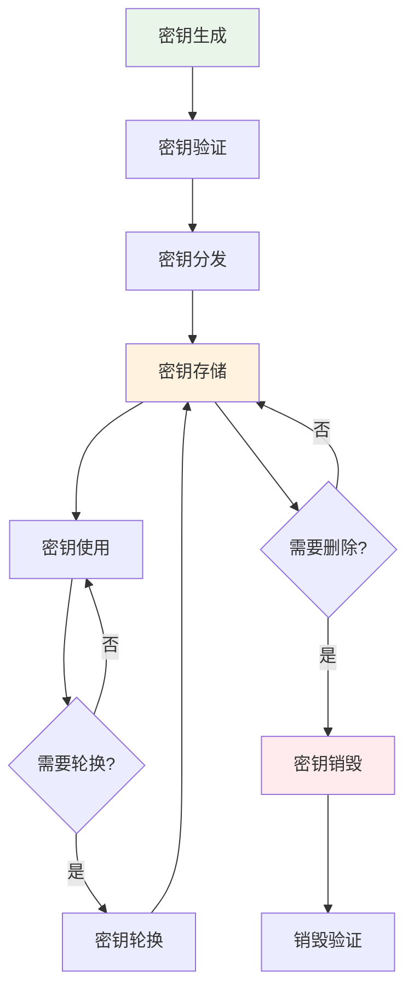
```mermaid
graph TD
    A[密钥生成] --> B[密钥验证]
    B --> C[密钥分发]
    C --> D[密钥存储]
    D --> E[密钥使用]
    E --> F{需要轮换?}
    F -->|是| G[密钥轮换]
    F -->|否| E
    G --> D
    D --> H{需要删除?}
    H -->|是| I[密钥销毁]
    H -->|否| D
    I --> J[销毁验证]

    style A fill:#e8f5e8
    style D fill:#fff3e0
    style I fill:#ffebee
```

### 6.2 通信安全

#### 5.2.1 TLS 配置

```go
// TLS 配置
tlsConfig := &tls.Config{
    MinVersion:               tls.VersionTLS12,
    MaxVersion:               tls.VersionTLS13,
    CipherSuites:             []uint16{
        tls.TLS_ECDHE_RSA_WITH_AES_256_GCM_SHA384,
        tls.TLS_ECDHE_ECDSA_WITH_AES_256_GCM_SHA384,
    },
    Certificates:             []tls.Certificate{cert},
    ClientCAs:                caCertPool,
    ClientAuth:               tls.RequireAndVerifyClientCert,
    InsecureSkipVerify:       false,
    PreferServerCipherSuites: true,
}
```

#### 5.2.2 消息认证

```
消息认证机制
├── 请求签名
│   ├── HMAC-SHA256
│   ├── API密钥
│   └── 时间戳
├── 证书认证
│   ├── 双向TLS
│   ├── 证书吊销检查
│   └── 证书轮换
└── 访问控制
    ├── JWT令牌
    ├── RBAC权限
    └── 速率限制
```

### 6.3 审计与监控

#### 5.3.1 审计日志设计

```go
// 审计事件类型
type AuditEvent struct {
    Timestamp   time.Time              `json:"timestamp"`
    EventType   string                 `json:"event_type"`   // KeyCreated, SignRequested, etc.
    UserID      string                 `json:"user_id,omitempty"`
    KeyID       string                 `json:"key_id,omitempty"`
    NodeID      string                 `json:"node_id,omitempty"`
    SessionID   string                 `json:"session_id,omitempty"`
    Operation   string                 `json:"operation"`
    Result      string                 `json:"result"`       // Success, Failed
    Details     map[string]interface{} `json:"details,omitempty"`
    IPAddress   string                 `json:"ip_address,omitempty"`
    UserAgent   string                 `json:"user_agent,omitempty"`
    RequestID   string                 `json:"request_id"`
}
```

#### 5.3.2 安全监控

```
安全监控体系
├── 实时监控
│   ├── 异常访问检测
│   ├── 签名失败率监控
│   ├── 密钥访问频率
│   └── 网络异常检测
├── 告警系统
│   ├── 安全事件告警
│   ├── 性能阈值告警
│   ├── 系统异常告警
│   └── 合规性检查
└── 响应机制
    ├── 自动隔离机制
    ├── 紧急密钥禁用
    ├── 安全事件响应
    └── 取证数据收集
```

---

## 7. 应用场景分析

### 7.1 企业数字资产管理

**典型场景**：
- 企业持有大量数字资产
- 需要安全可靠的签名服务
- 要求完整的审计和合规

**技术方案**：
```
企业钱包系统
├── TSS：日常交易签名
├── SSS：密钥备份恢复
├── TEE：硬件安全保障
└── 审计：完整操作日志
```

**业务价值**：
- ✅ 消除单点故障风险
- ✅ 满足监管合规要求
- ✅ 支持大规模资产管理

### 7.2 数字资产交易所

**典型场景**：
- 高频交易处理
- 大量用户提现操作
- 要求毫秒级响应

**技术方案**：
```
交易所 MPC 系统
├── 高并发 TSS 签名
├── 多节点分布式部署
├── TEE 硬件加速
└── 实时监控告警
```

**业务价值**：
- ✅ 毫秒级签名响应
- ✅ 支持高并发交易
- ✅ 零信任安全架构

### 7.3 DeFi 协议集成

**典型场景**：
- 与 DeFi 协议集成
- 支持复杂交易类型
- 需要多链支持

**技术方案**：
```
DeFi MPC 服务
├── 多链地址派生
├── 批量签名支持
├── 策略访问控制
└── API/SDK 集成
```

**业务价值**：
- ✅ 支持复杂 DeFi 操作
- ✅ 统一多链管理
- ✅ 灵活的集成方式

### 7.4 机构级钱包服务

**典型场景**：
- 银行、基金等机构客户
- 要求企业级安全和合规
- 需要定制化服务

**技术方案**：
```
机构钱包平台
├── 企业级策略引擎
├── 完整的审计追踪
├── 定制化部署选项
└── SLA 保证
```

**业务价值**：
- ✅ 满足金融级合规要求
- ✅ 支持定制化需求
- ✅ 企业级 SLA 保证

---

## 8. 客户端集成与使用场景详解

### 8.1 移动APP集成方案

#### 8.1.1 架构设计选择

基于 MPCVault 架构分析，移动APP（iOS/Android）集成MPC系统有三种主要方案：

**方案A：轻量级客户端模式（推荐）**

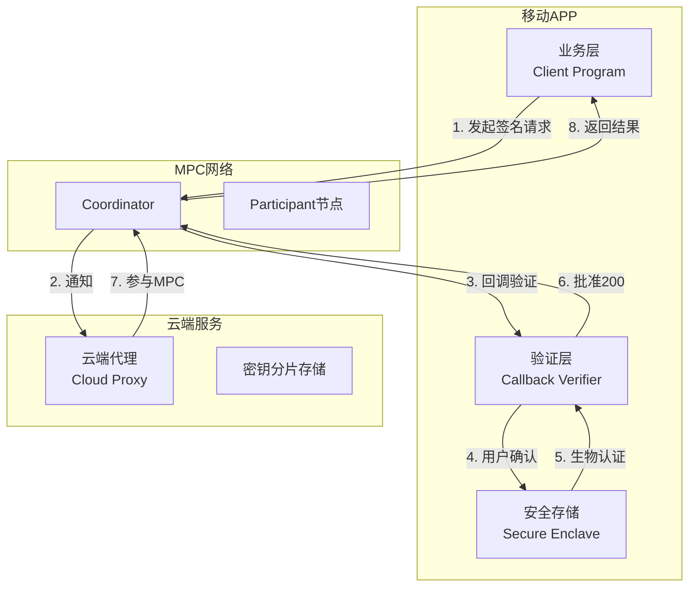
```mermaid
graph TB
    subgraph "移动APP"
        A[业务层<br/>Client Program]
        B[验证层<br/>Callback Verifier]
        C[安全存储<br/>Secure Enclave]
    end
    
    subgraph "云端服务"
        D[云端代理<br/>Cloud Proxy]
        E[密钥分片存储]
    end
    
    subgraph "MPC网络"
        F[Coordinator]
        G[Participant节点]
    end
    
    A -->|1. 发起签名请求| F
    F -->|2. 通知| D
    F -->|3. 回调验证| B
    B -->|4. 用户确认| C
    C -->|5. 生物认证| B
    B -->|6. 批准200| F
    D -->|7. 参与MPC| F
    F -->|8. 返回结果| A
```

**特点**：
- APP仅负责认证和批准，不直接参与MPC计算
- 云端代理持有密钥分片并参与MPC
- 支持后台执行和推送通知
- 用户体验好，适合大多数场景

**方案B：分离式架构（高安全场景）**

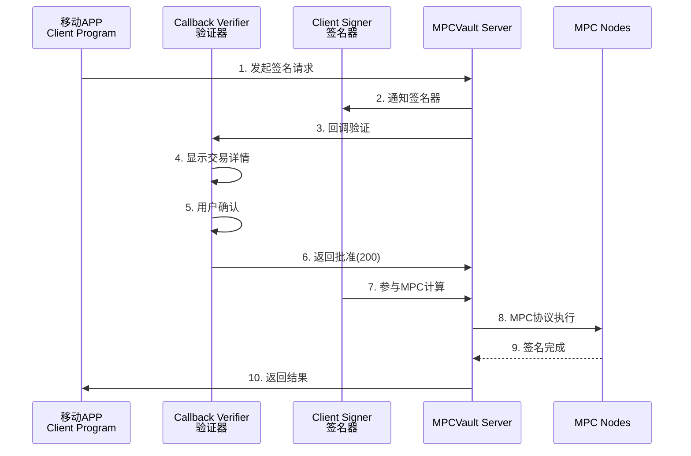
```mermaid
sequenceDiagram
    participant APP as 移动APP<br/>Client Program
    participant Verifier as Callback Verifier<br/>验证器
    participant Signer as Client Signer<br/>签名器
    participant Server as MPCVault Server
    participant Nodes as MPC Nodes

    APP->>Server: 1. 发起签名请求
    Server->>Signer: 2. 通知签名器
    Server->>Verifier: 3. 回调验证
    Verifier->>Verifier: 4. 显示交易详情
    Verifier->>Verifier: 5. 用户确认
    Verifier->>Server: 6. 返回批准(200)
    Signer->>Server: 7. 参与MPC计算
    Server->>Nodes: 8. MPC协议执行
    Nodes-->>Server: 9. 签名完成
    Server->>APP: 10. 返回结果
```

**特点**：
- 职责分离：业务层、验证层、签名层分离
- 安全性高：验证和签名分离，降低单点风险
- 移动端适配：充分利用系统安全能力（Secure Enclave/TrustZone）
- 支持单设备或多设备部署

**方案C：完全本地参与（企业内网）**

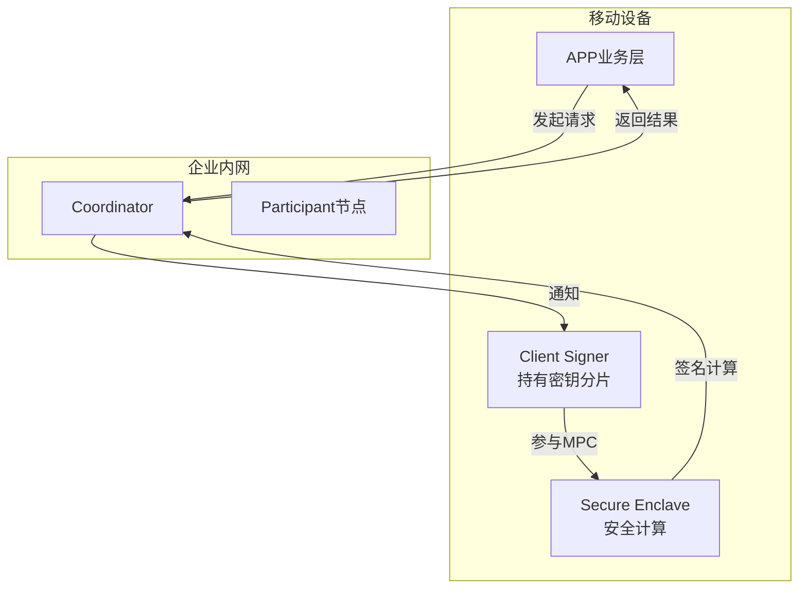
```mermaid
graph TB
    subgraph "移动设备"
        A[APP业务层]
        B[Client Signer<br/>持有密钥分片]
        C[Secure Enclave<br/>安全计算]
    end
    
    subgraph "企业内网"
        D[Coordinator]
        E[Participant节点]
    end
    
    A -->|发起请求| D
    D -->|通知| B
    B -->|参与MPC| C
    C -->|签名计算| D
    D -->|返回结果| A
```

**特点**：
- APP直接参与MPC计算
- 密钥分片存储在设备Secure Enclave中
- 适合企业内网环境
- 需要稳定的网络连接

#### 8.1.2 iOS实现示例

```swift
// iOS MPC Wallet实现
import Foundation
import Security
import LocalAuthentication

class MPCWalletApp {
    // 1. 业务层（Client Program）
    class BusinessLayer {
        private let apiClient: MPCVaultAPIClient
        
        func requestSigning(message: Data, keyID: String) async throws -> Signature {
            // 创建签名请求
            let request = SigningRequest(
                keyID: keyID,
                message: message,
                messageType: .raw
            )
            
            // 发送到服务器
            return try await apiClient.createSigningRequest(request)
        }
    }
    
    // 2. 验证层（Callback Verifier）
    class CallbackVerifier {
        private let biometricAuth = LAContext()
        
        func verifySigningRequest(_ request: SigningRequest) async -> Bool {
            // 显示交易详情
            let approved = await showTransactionDetails(request)
            
            if approved {
                // 生物认证
                return await authenticateWithBiometrics()
            }
            
            return false
        }
        
        private func showTransactionDetails(_ request: SigningRequest) async -> Bool {
            // 在主线程显示UI
            return await MainActor.run {
                // 显示交易确认界面
                return true // 用户确认
            }
        }
        
        private func authenticateWithBiometrics() async -> Bool {
            return await withCheckedContinuation { continuation in
                biometricAuth.evaluatePolicy(
                    .deviceOwnerAuthenticationWithBiometrics,
                    localizedReason: "请验证以批准交易"
                ) { success, error in
                    continuation.resume(returning: success)
                }
            }
        }
    }
    
    // 3. 签名层（Client Signer - 可选）
    class ClientSigner {
        private let keyShareStorage: KeyShareStorage
        private let protocolEngine: MPCProtocolEngine
        
        func participateInMPC(sessionID: String) async throws {
            // 从Keychain加载密钥分片
            let keyShare = try keyShareStorage.loadKeyShare()
            
            // 在Secure Enclave中执行MPC计算
            return try await SecureEnclave.executeMPC(
                keyShare: keyShare,
                sessionID: sessionID
            )
        }
    }
    
    // 4. 安全存储
    class KeyShareStorage {
        func storeKeyShare(_ share: KeyShare) throws {
            let query: [String: Any] = [
                kSecClass as String: kSecClassGenericPassword,
                kSecAttrAccount as String: "mpc_key_share",
                kSecValueData as String: share.encryptedData,
                kSecAttrAccessible as String: kSecAttrAccessibleWhenUnlockedThisDeviceOnly,
                kSecUseAuthenticationUI as String: kSecUseAuthenticationUIAllow
            ]
            
            SecItemAdd(query as CFDictionary, nil)
        }
        
        func loadKeyShare() throws -> KeyShare {
            let query: [String: Any] = [
                kSecClass as String: kSecClassGenericPassword,
                kSecAttrAccount as String: "mpc_key_share",
                kSecReturnData as String: true
            ]
            
            var result: AnyObject?
            let status = SecItemCopyMatching(query as CFDictionary, &result)
            
            guard status == errSecSuccess,
                  let data = result as? Data else {
                throw KeyShareError.notFound
            }
            
            return try KeyShare.fromEncryptedData(data)
        }
    }
}
```

#### 8.1.3 Android实现示例

```kotlin
// Android MPC Wallet实现
import android.content.Context
import androidx.biometric.BiometricPrompt
import androidx.security.crypto.EncryptedFile
import java.io.File

class MPCWalletApp(private val context: Context) {
    // 1. 业务层
    class BusinessLayer(private val apiClient: MPCVaultAPIClient) {
        suspend fun requestSigning(message: ByteArray, keyID: String): Signature {
            val request = SigningRequest(
                keyID = keyID,
                message = message,
                messageType = MessageType.RAW
            )
            
            return apiClient.createSigningRequest(request)
        }
    }
    
    // 2. 验证层
    class CallbackVerifier(private val context: Context) {
        private val biometricPrompt = BiometricPrompt(
            context as FragmentActivity,
            ContextCompat.getMainExecutor(context),
            BiometricPrompt.AuthenticationCallback()
        )
        
        suspend fun verifySigningRequest(request: SigningRequest): Boolean {
            // 显示交易详情
            val approved = showTransactionDetails(request)
            
            if (approved) {
                // 生物认证
                return authenticateWithBiometrics()
            }
            
            return false
        }
        
        private suspend fun authenticateWithBiometrics(): Boolean {
            return suspendCancellableCoroutine { continuation ->
                val promptInfo = BiometricPrompt.PromptInfo.Builder()
                    .setTitle("验证身份")
                    .setSubtitle("请使用指纹或面部识别")
                    .setNegativeButtonText("取消")
                    .build()
                
                biometricPrompt.authenticate(promptInfo)
                // 处理认证结果
            }
        }
    }
    
    // 3. 安全存储（使用Android Keystore）
    class KeyShareStorage(private val context: Context) {
        private val keyAlias = "mpc_key_share"
        
        fun storeKeyShare(share: KeyShare) {
            val keyStore = KeyStore.getInstance("AndroidKeyStore")
            keyStore.load(null)
            
            val keyGenerator = KeyGenerator.getInstance(
                KeyProperties.KEY_ALGORITHM_AES,
                "AndroidKeyStore"
            )
            
            val keyGenParameterSpec = KeyGenParameterSpec.Builder(
                keyAlias,
                KeyProperties.PURPOSE_ENCRYPT or KeyProperties.PURPOSE_DECRYPT
            )
                .setBlockModes(KeyProperties.BLOCK_MODE_GCM)
                .setEncryptionPaddings(KeyProperties.ENCRYPTION_PADDING_NONE)
                .setUserAuthenticationRequired(true)
                .build()
            
            keyGenerator.init(keyGenParameterSpec)
            keyGenerator.generateKey()
            
            // 加密并存储密钥分片
            val encryptedData = encryptKeyShare(share)
            // 存储到EncryptedFile
        }
    }
}
```

#### 8.1.4 网络通信优化

```swift
// WebSocket长连接管理
class MPCNetworkManager {
    private var websocket: URLSessionWebSocketTask?
    private var reconnectTimer: Timer?
    
    func connect() {
        let url = URL(string: "wss://mpc.example.com/ws")!
        websocket = URLSession.shared.webSocketTask(with: url)
        websocket?.resume()
        
        receiveMessage()
    }
    
    func receiveMessage() {
        websocket?.receive { [weak self] result in
            switch result {
            case .success(let message):
                self?.handleMPCMessage(message)
                self?.receiveMessage() // 继续监听
            case .failure(let error):
                self?.handleError(error)
                self?.reconnect()
            }
        }
    }
    
    // 后台任务管理
    func registerBackgroundTask() {
        BGTaskScheduler.shared.register(
            forTaskWithIdentifier: "com.mpc.signing",
            using: nil
        ) { task in
            self.handleSigningTask(task: task as! BGProcessingTask)
        }
    }
}
```

### 8.2 Client Signer部署策略

#### 8.2.1 部署模式选择

**问题：团队签名时，是否每个参与方都需要部署Client Signer？**

**答案：不是必须的，取决于使用场景。**

#### 8.2.2 场景分析

**场景1：纯手动批准（不需要Client Signer）**

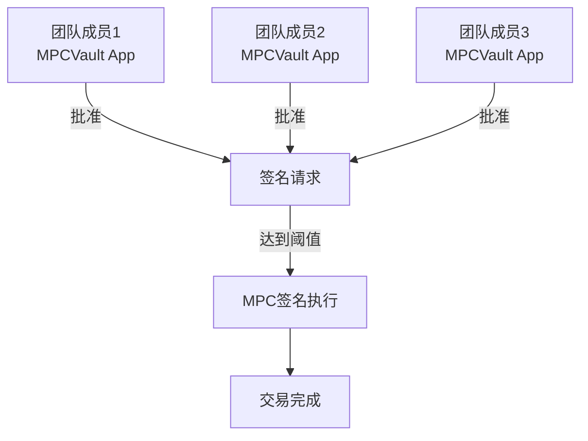
```mermaid
graph TB
    A[团队成员1<br/>MPCVault App] -->|批准| C[签名请求]
    B[团队成员2<br/>MPCVault App] -->|批准| C
    D[团队成员3<br/>MPCVault App] -->|批准| C
    C -->|达到阈值| E[MPC签名执行]
    E --> F[交易完成]
```

**特点**：
- 团队成员通过MPCVault App（iOS/Android）批准
- 不需要部署Client Signer
- 适合人工审核场景
- 简单易用，适合小团队

**部署配置**：
```yaml
team_configuration:
  team_size: "3-10人"
  approval_method: "MPCVault App"
  client_signer_required: false
  use_cases:
    - "日常交易审批"
    - "小额交易"
    - "需要人工审核的场景"
```

**场景2：混合模式（推荐用于企业）**

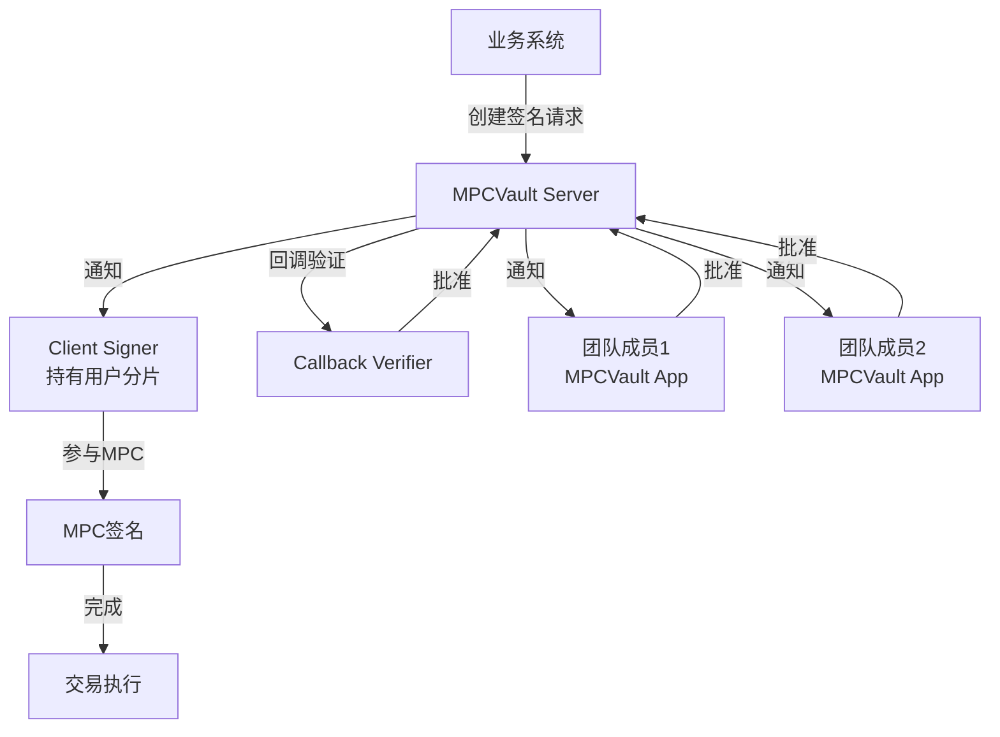
```mermaid
graph TB
    A[业务系统] -->|创建签名请求| B[MPCVault Server]
    B -->|通知| C[Client Signer<br/>持有用户分片]
    B -->|回调验证| D[Callback Verifier]
    D -->|批准| B
    C -->|参与MPC| E[MPC签名]
    B -->|通知| F[团队成员1<br/>MPCVault App]
    F -->|批准| B
    B -->|通知| G[团队成员2<br/>MPCVault App]
    G -->|批准| B
    E -->|完成| H[交易执行]
```

**特点**：
- 业务系统部署Client Signer（程序化创建交易）
- 团队成员通过App批准
- 适合企业级集成
- 支持批量处理

**部署配置**：
```yaml
enterprise_configuration:
  business_system:
    client_signer: true
    location: "生产环境服务器"
    purpose: "自动创建和签名交易"
  
  team_members:
    - name: "财务经理"
      role: "Manager"
      approval_method: "MPCVault App"
      client_signer: false
    
    - name: "技术负责人"
      role: "Manager"
      approval_method: "MPCVault App"
      client_signer: false
  
  use_cases:
    - "批量工资发放"
    - "空投处理"
    - "自动化交易"
```

**场景3：完全程序化（高级场景）**

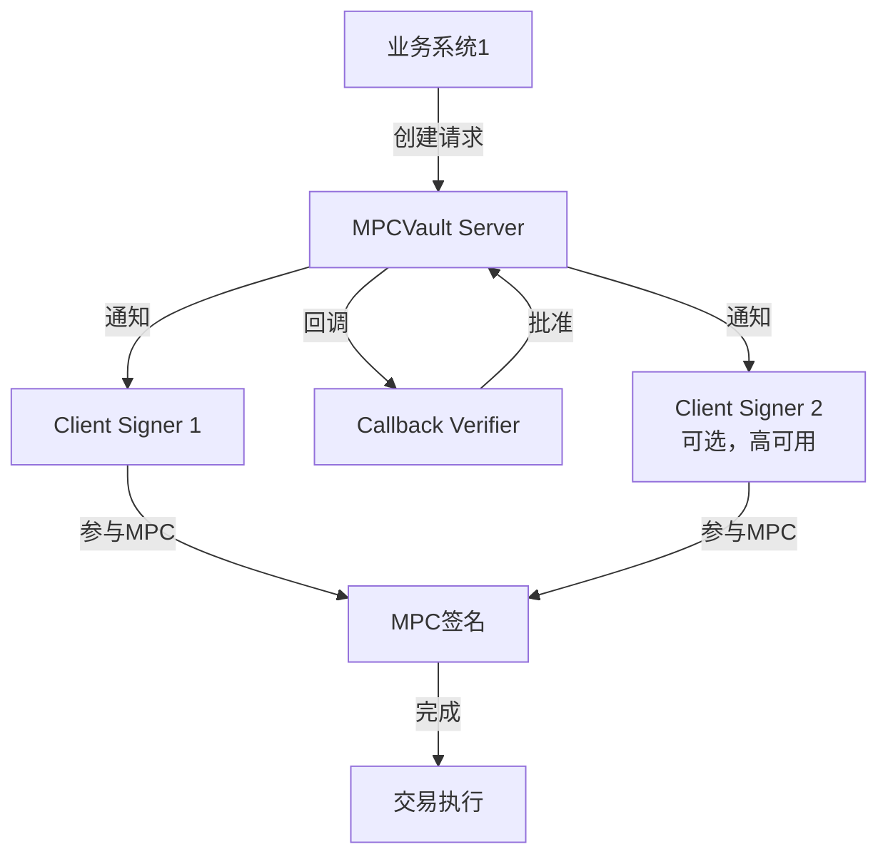
```mermaid
graph TB
    A[业务系统1] -->|创建请求| B[MPCVault Server]
    B -->|通知| C[Client Signer 1]
    B -->|回调| D[Callback Verifier]
    D -->|批准| B
    C -->|参与MPC| E[MPC签名]
    B -->|通知| F[Client Signer 2<br/>可选，高可用]
    F -->|参与MPC| E
    E -->|完成| G[交易执行]
```

**特点**：
- 部署多个Client Signer实现高可用
- 完全自动化流程
- 适合高频交易场景
- 需要7x24小时服务

**部署配置**：
```yaml
advanced_configuration:
  client_signers:
    - name: "Primary Signer"
      location: "主数据中心"
      purpose: "主要签名服务"
      high_availability: true
    
    - name: "Backup Signer"
      location: "备用数据中心"
      purpose: "故障转移"
      high_availability: true
  
  callback_verifier:
    location: "独立验证服务"
    auto_approval_rules:
      - max_amount: 1000
        time_window: "1 hour"
  
  use_cases:
    - "高频交易"
    - "7x24小时服务"
    - "完全自动化流程"
```

#### 8.2.3 Client Signer部署步骤

**步骤1：生成Ed25519密钥对**

```bash
# 生成密钥对
ssh-keygen -t ed25519 -C "client_signer_production"
# 不要设置密码
# 保存私钥到安全位置
```

**步骤2：创建Client Signer**

```go
// Client Signer配置
type ClientSignerConfig struct {
    Name       string   // 唯一标识
    PublicKey  string   // Ed25519公钥
    IPWhitelist []string // IP白名单（最多3个）
    VaultID    string   // 所属Vault
}
```

**步骤3：配置密钥访问**

```yaml
# 密钥访问配置
key_access:
  client_signer_id: "cs-123456"
  key_shares:
    - key_id: "key-abc123"
      access_level: "read_write"
    - key_id: "key-def456"
      access_level: "read_only"
  
  approval_required: true
  auto_approval:
    enabled: false
    max_amount: 0
```

**步骤4：部署Client Signer服务**

```go
// Client Signer服务实现
package main

import (
    "context"
    "crypto/ed25519"
    "encoding/hex"
    "log"
    "os"
    
    "github.com/your-org/mpc-wallet/internal/mpc/client"
)

func main() {
    // 1. 加载私钥
    privateKeyBytes, err := os.ReadFile("client_signer_private_key")
    if err != nil {
        log.Fatal(err)
    }
    
    privateKey := ed25519.PrivateKey(privateKeyBytes)
    
    // 2. 初始化Client Signer
    signer, err := client.NewClientSigner(
        client.WithPrivateKey(privateKey),
        client.WithServerURL("https://mpc.example.com"),
        client.WithVaultID("vault-123"),
    )
    if err != nil {
        log.Fatal(err)
    }
    
    // 3. 启动服务
    ctx := context.Background()
    if err := signer.Start(ctx); err != nil {
        log.Fatal(err)
    }
    
    // 4. 处理签名请求
    signer.HandleSigningRequests(func(req *SigningRequest) error {
        // 验证请求
        if err := validateRequest(req); err != nil {
            return err
        }
        
        // 参与MPC签名
        return signer.ParticipateInMPC(req.SessionID)
    })
}
```

### 8.3 个人使用场景

#### 8.3.1 场景描述

个人用户使用MPC钱包进行日常数字资产管理，包括：
- 个人资产存储和转账
- DeFi协议交互
- NFT交易
- 多链资产管理

#### 8.3.2 架构设计

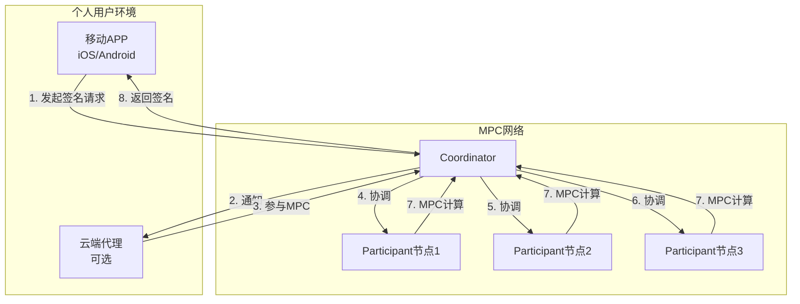
```mermaid
graph TB
    subgraph "个人用户环境"
        A[移动APP<br/>iOS/Android]
        B[云端代理<br/>可选]
    end
    
    subgraph "MPC网络"
        C[Coordinator]
        D[Participant节点1]
        E[Participant节点2]
        F[Participant节点3]
    end
    
    A -->|1. 发起签名请求| C
    C -->|2. 通知| B
    B -->|3. 参与MPC| C
    C -->|4. 协调| D
    C -->|5. 协调| E
    C -->|6. 协调| F
    D -->|7. MPC计算| C
    E -->|7. MPC计算| C
    F -->|7. MPC计算| C
    C -->|8. 返回签名| A
```

#### 8.3.3 密钥分片分配

**个人用户模式（3-of-3）**：

```
密钥分片分配：
├── 用户设备：持有1个分片
│   ├── 存储在Secure Enclave/TrustZone
│   ├── 生物认证保护
│   └── 设备绑定
├── 云端代理1：持有1个分片
│   ├── 加密存储
│   ├── 多区域备份
│   └── TEE保护
└── 云端代理2：持有1个分片
    ├── 加密存储
    ├── 多区域备份
    └── TEE保护
```

#### 8.3.4 使用流程

**流程1：创建钱包**

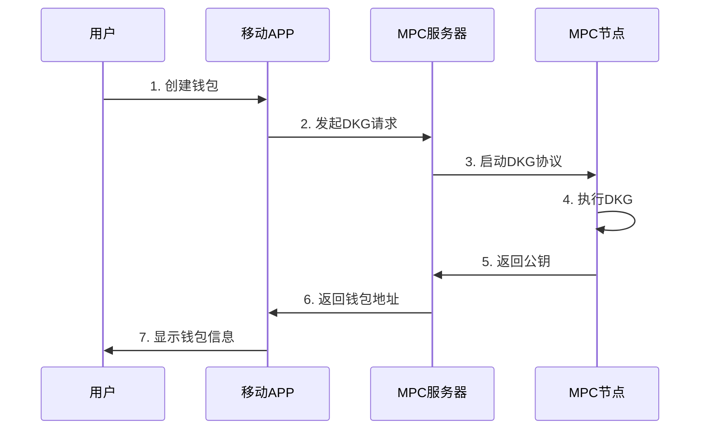
```mermaid
sequenceDiagram
    participant User as 用户
    participant APP as 移动APP
    participant Server as MPC服务器
    participant Nodes as MPC节点

    User->>APP: 1. 创建钱包
    APP->>Server: 2. 发起DKG请求
    Server->>Nodes: 3. 启动DKG协议
    Nodes->>Nodes: 4. 执行DKG
    Nodes->>Server: 5. 返回公钥
    Server->>APP: 6. 返回钱包地址
    APP->>User: 7. 显示钱包信息
```

**流程2：发起转账**

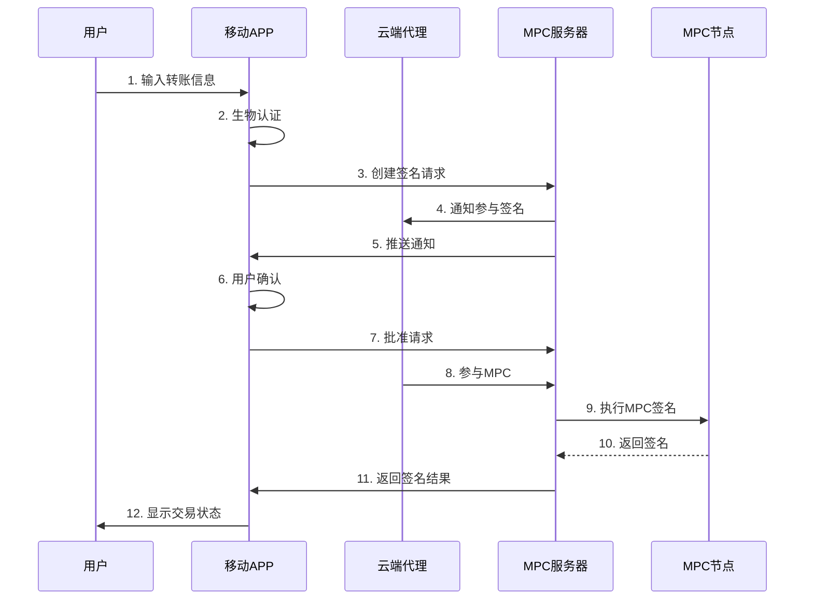
```mermaid
sequenceDiagram
    participant User as 用户
    participant APP as 移动APP
    participant Proxy as 云端代理
    participant Server as MPC服务器
    participant Nodes as MPC节点

    User->>APP: 1. 输入转账信息
    APP->>APP: 2. 生物认证
    APP->>Server: 3. 创建签名请求
    Server->>Proxy: 4. 通知参与签名
    Server->>APP: 5. 推送通知
    APP->>APP: 6. 用户确认
    APP->>Server: 7. 批准请求
    Proxy->>Server: 8. 参与MPC
    Server->>Nodes: 9. 执行MPC签名
    Nodes-->>Server: 10. 返回签名
    Server->>APP: 11. 返回签名结果
    APP->>User: 12. 显示交易状态
```

#### 8.3.5 安全特性

**个人用户安全措施**：

```yaml
personal_user_security:
  device_protection:
    - "Secure Enclave/TrustZone存储"
    - "生物认证（FaceID/TouchID/指纹）"
    - "设备绑定"
    - "PIN码保护"
  
  cloud_proxy_protection:
    - "TEE环境运行"
    - "端到端加密"
    - "多区域备份"
    - "访问审计"
  
  network_protection:
    - "TLS 1.3加密"
    - "证书钉扎"
    - "防重放攻击"
    - "请求签名"
```

#### 8.3.6 备份恢复

**个人用户备份方案**：

```mermaid
graph TB
    A[用户设备分片] -->|Ed25519公钥加密| B[备份包1]
    C[云端代理分片1] -->|Ed25519公钥加密| B
    D[云端代理分片2] -->|Ed25519公钥加密| B
    
    B -->|SSS分片| E[备份分片1]
    B -->|SSS分片| F[备份分片2]
    B -->|SSS分片| G[备份分片3]
    
    E -->|存储| H[安全位置1]
    F -->|存储| I[安全位置2]
    G -->|存储| J[安全位置3]
```

**恢复流程**：

```go
// 个人用户恢复示例
func RecoverPersonalWallet(backupShares []BackupShare, privateKeys []ed25519.PrivateKey) (*Wallet, error) {
    // 1. 使用SSS恢复加密备份包
    encryptedBackup := shamir.Combine(backupShares)
    
    // 2. 使用Ed25519私钥解密
    decryptedShares := make([]KeyShare, 0)
    for i, encryptedShare := range encryptedBackup.Shares {
        share, err := decryptWithPrivateKey(encryptedShare, privateKeys[i])
        if err != nil {
            return nil, err
        }
        decryptedShares = append(decryptedShares, share)
    }
    
    // 3. 恢复钱包
    return restoreWallet(decryptedShares)
}
```

### 8.4 团队使用场景

#### 8.4.1 场景描述

团队使用MPC钱包进行企业级数字资产管理，包括：
- 企业资金管理
- 多签审批流程
- 批量操作（工资发放、空投）
- 合规审计

#### 8.4.2 架构设计

```mermaid
graph TB
    subgraph "业务系统"
        A[业务应用]
        B[Client Signer<br/>可选]
    end
    
    subgraph "团队管理"
        C[团队成员1<br/>Manager]
        D[团队成员2<br/>Manager]
        E[团队成员3<br/>Member]
    end
    
    subgraph "MPC网络"
        F[Coordinator]
        G[Participant节点]
    end
    
    A -->|创建签名请求| F
    B -->|参与MPC| F
    F -->|通知批准| C
    F -->|通知批准| D
    C -->|批准| F
    D -->|批准| F
    F -->|执行MPC| G
    G -->|返回签名| F
    F -->|返回结果| A
```

#### 8.4.3 多签策略配置

**策略类型**：

```yaml
multisig_policies:
  # 简单模式：统一审批要求
  simple_mode:
    approvers_required: 2
    applies_to: "all_transactions"
  
  # 高级模式：基于条件的策略
  advanced_mode:
    policies:
      # 基于金额的策略
      - name: "小额交易"
        condition:
          amount: "< 1000"
          currency: "USDT"
        approvers_required: 1
        
      - name: "大额交易"
        condition:
          amount: ">= 10000"
          currency: "USDT"
        approvers_required: 3
        
      # 基于地址的策略
      - name: "白名单地址"
        condition:
          destination: "whitelist"
        approvers_required: 1
        
      # 基于类型的策略
      - name: "消息签名"
        condition:
          type: "message_signing"
        approvers_required: 2
        
      - name: "未知金额"
        condition:
          type: "unknown_amount"
        approvers_required: 2
```

#### 8.4.4 团队角色管理

**角色定义**：

```go
// 团队角色
type TeamRole string

const (
    RoleOwner   TeamRole = "owner"   // 所有者：完全控制
    RoleManager TeamRole = "manager" // 管理者：可以批准交易和管理成员
    RoleMember  TeamRole = "member"  // 成员：可以创建交易请求
)

// 权限矩阵
var PermissionMatrix = map[TeamRole][]Permission{
    RoleOwner: {
        PermissionCreateTransaction,
        PermissionApproveTransaction,
        PermissionManageMembers,
        PermissionManagePolicies,
        PermissionManageClientSigners,
        PermissionExportBackup,
    },
    RoleManager: {
        PermissionCreateTransaction,
        PermissionApproveTransaction,
        PermissionManageMembers, // 有限权限
    },
    RoleMember: {
        PermissionCreateTransaction,
    },
}
```

#### 8.4.5 审批流程

**审批流程示例**：

```mermaid
sequenceDiagram
    participant Member as 团队成员<br/>创建请求
    participant Server as MPC服务器
    participant M1 as Manager 1
    participant M2 as Manager 2
    participant Signer as Client Signer

    Member->>Server: 1. 创建签名请求<br/>转账1000 USDT
    Server->>Server: 2. 评估策略<br/>需要2个Manager批准
    Server->>M1: 3. 推送通知
    Server->>M2: 4. 推送通知
    M1->>Server: 5. 批准请求
    M2->>Server: 6. 批准请求
    Server->>Server: 7. 达到阈值<br/>启动MPC签名
    Server->>Signer: 8. 通知参与签名
    Signer->>Server: 9. 参与MPC计算
    Server->>Server: 10. 完成签名
    Server->>Member: 11. 返回交易结果
```

#### 8.4.6 批量操作支持

**批量工资发放示例**：

```go
// 批量操作
type BatchOperation struct {
    OperationID string
    Type        BatchType // PAYROLL, AIRDROP, etc.
    Items       []BatchItem
    Policy      *MultisigPolicy
}

type BatchItem struct {
    Address string
    Amount  *big.Int
    Token   string
    Memo    string
}

// 批量处理流程
func ProcessBatchOperation(ctx context.Context, batch *BatchOperation) error {
    // 1. 创建批量签名请求
    signingRequests := make([]*SigningRequest, 0)
    for _, item := range batch.Items {
        req := &SigningRequest{
            KeyID:      batch.KeyID,
            Message:    buildTransaction(item),
            MessageType: MessageTypeTransaction,
        }
        signingRequests = append(signingRequests, req)
    }
    
    // 2. 批量提交（需要团队批准）
    for _, req := range signingRequests {
        if err := submitSigningRequest(ctx, req); err != nil {
            return err
        }
    }
    
    // 3. 等待审批
    // 4. 批量执行签名
    return executeBatchSigning(ctx, signingRequests)
}
```

### 8.5 混合使用场景

#### 8.5.1 场景描述

混合场景结合个人和团队使用，包括：
- 个人钱包 + 团队钱包
- 跨钱包转账
- 共享账户管理
- 权限继承

#### 8.5.2 架构设计

```mermaid
graph TB
    subgraph "个人钱包"
        A[个人APP]
        B[个人云端代理]
    end
    
    subgraph "团队钱包"
        C[业务系统]
        D[Client Signer]
        E[团队成员]
    end
    
    subgraph "MPC网络"
        F[Coordinator]
        G[Participant节点]
    end
    
    A -->|个人交易| F
    B -->|参与MPC| F
    C -->|团队交易| F
    D -->|参与MPC| F
    E -->|批准| F
    F -->|协调| G
```

#### 8.5.3 跨钱包操作

**个人钱包向团队钱包转账**：

```go
// 跨钱包转账
func TransferFromPersonalToTeam(
    ctx context.Context,
    personalWallet *PersonalWallet,
    teamWallet *TeamWallet,
    amount *big.Int,
) error {
    // 1. 从个人钱包创建转账交易
    tx, err := personalWallet.CreateTransaction(ctx, &TransactionRequest{
        To:    teamWallet.Address,
        Amount: amount,
        Token: "USDT",
    })
    if err != nil {
        return err
    }
    
    // 2. 个人钱包签名（需要个人批准）
    signature, err := personalWallet.Sign(ctx, tx)
    if err != nil {
        return err
    }
    
    // 3. 提交到区块链
    return submitTransaction(ctx, tx, signature)
}
```

### 8.6 部署建议总结

#### 8.6.1 个人用户部署建议

| 场景 | 推荐方案 | Client Signer | 云端代理 | 说明 |
|------|---------|---------------|----------|------|
| **日常使用** | 轻量级客户端 | ❌ 不需要 | ✅ 必需 | APP仅负责认证和批准 |
| **高安全需求** | 分离式架构 | ✅ 可选 | ✅ 必需 | 验证和签名分离 |
| **企业内网** | 完全本地参与 | ✅ 必需 | ❌ 不需要 | 设备直接参与MPC |

#### 8.6.2 团队用户部署建议

| 场景 | 推荐方案 | Client Signer | 团队成员 | 说明 |
|------|---------|---------------|----------|------|
| **小团队（<10人）** | 纯手动批准 | ❌ 不需要 | ✅ App批准 | 简单易用 |
| **企业级（推荐）** | 混合模式 | ✅ 业务系统部署 | ✅ App批准 | 自动化+人工审核 |
| **高频交易** | 完全程序化 | ✅ 多个部署 | ✅ 可选 | 7x24小时服务 |

#### 8.6.3 实施优先级

**Phase 1（MVP）**：
1. ✅ 轻量级客户端模式（个人用户）
2. ✅ 纯手动批准（小团队）
3. ✅ 基础多签策略

**Phase 2（增强）**：
1. ⚠️ 分离式架构（高安全场景）
2. ⚠️ Client Signer部署（企业级）
3. ⚠️ 高级多签策略

**Phase 3（高级）**：
1. ⏳ 完全程序化（高频交易）
2. ⏳ 跨钱包操作
3. ⏳ 权限继承

---

## 9. 性能优化设计

### 8.1 签名性能优化

#### 6.1.1 并发签名处理

```mermaid
graph TD
    subgraph "Concurrent Signing Architecture"
        A[签名请求] --> B{负载均衡}
        B --> C[Worker Pool 1]
        B --> D[Worker Pool 2]
        B --> E[Worker Pool N]

        C --> F[节点选择]
        D --> G[节点选择]
        E --> H[节点选择]

        F --> I[协议执行]
        G --> J[协议执行]
        H --> K[协议执行]

        I --> L[结果聚合]
        J --> L
        K --> L

        L --> M[响应返回]
    end

    subgraph "Worker Pool Management"
        N[动态扩缩容] --> O[负载监控]
        O --> P[队列长度]
        P --> Q[处理延迟]
        Q --> R[CPU使用率]
    end

    style A fill:#e8f5e8
    style L fill:#fff3e0
    style N fill:#e3f2fd
```

#### 6.1.2 批量签名优化

```
批量签名优化策略
├── 请求合并
│   ├── 相同密钥的请求合并
│   ├── 批量协议执行
│   └── 结果批量返回
├── 预处理优化
│   ├── 密钥预加载
│   ├── 节点预热
│   └── 连接池复用
├── 缓存优化
│   ├── 密钥元数据缓存
│   ├── 节点状态缓存
│   └── 签名结果缓存
└── 算法优化
    ├── 并行计算
    ├── SIMD指令优化
    └── 内存池管理
```

### 8.2 存储性能优化

#### 6.2.1 数据库优化

```sql
-- 复合索引优化
CREATE INDEX CONCURRENTLY idx_keys_composite 
ON keys(chain_type, status, created_at DESC);

-- 分区表优化
CREATE TABLE audit_logs_y2024m01 PARTITION OF audit_logs
    FOR VALUES FROM ('2024-01-01') TO ('2024-02-01');

-- 连接池配置
max_connections = 200
shared_preload_libraries = 'pg_stat_statements'
track_activity_query_size = 4096
```

#### 6.2.2 Redis 集群优化

```yaml
# Redis Cluster 配置
redis:
  cluster:
    enabled: true
    nodes:
      - "redis-1:6379"
      - "redis-2:6379"
      - "redis-3:6379"
  pool:
    max_active: 100
    max_idle: 20
    idle_timeout: 300s
  sentinel:
    master_name: "mymaster"
    addresses:
      - "sentinel-1:26379"
      - "sentinel-2:26379"
      - "sentinel-3:26379"
```

### 8.3 网络优化

#### 6.3.1 连接池管理

```go
// gRPC 连接池配置
connPool := &grpcpool.Pool{
    Dial: func(ctx context.Context) (*grpc.ClientConn, error) {
        return grpc.DialContext(ctx, target, grpc.WithTransportCredentials(creds))
    },
    MaxIdle:     10,
    MaxActive:   50,
    IdleTimeout: 5 * time.Minute,
    Wait:        true,
}
```

#### 6.3.2 消息压缩

```go
// gRPC 压缩配置
server := grpc.NewServer(
    grpc.RPCCompressor(grpc.NewGZIPCompressor()),
    grpc.RPCDecompressor(grpc.NewGZIPDecompressor()),
    grpc.MaxRecvMsgSize(4*1024*1024), // 4MB
    grpc.MaxSendMsgSize(4*1024*1024), // 4MB
)
```

---

## 9. 部署架构设计

### 9.1 Kubernetes 部署架构

#### 7.1.1 微服务部署

```yaml
# Coordinator Deployment
apiVersion: apps/v1
kind: Deployment
metadata:
  name: mpc-coordinator
spec:
  replicas: 3
  selector:
    matchLabels:
      app: mpc-coordinator
  template:
    metadata:
      labels:
        app: mpc-coordinator
    spec:
      containers:
      - name: coordinator
        image: mpc/coordinator:v1.0.0
        ports:
        - containerPort: 8080
        - containerPort: 9090
        env:
        - name: NODE_TYPE
          value: "coordinator"
        - name: CONSUL_ADDR
          value: "consul:8500"
        resources:
          requests:
            memory: "512Mi"
            cpu: "500m"
          limits:
            memory: "1Gi"
            cpu: "1000m"
        livenessProbe:
          httpGet:
            path: /health/live
            port: 8080
          initialDelaySeconds: 30
          periodSeconds: 10
        readinessProbe:
          httpGet:
            path: /health/ready
            port: 8080
          initialDelaySeconds: 5
          periodSeconds: 5
```

#### 7.1.2 服务网格配置

```yaml
# Istio Service Mesh 配置
apiVersion: networking.istio.io/v1beta1
kind: VirtualService
metadata:
  name: mpc-api-gateway
spec:
  http:
  - match:
    - uri:
        prefix: "/api/v1"
    route:
    - destination:
        host: mpc-coordinator
    timeout: 30s
    retries:
      attempts: 3
      perTryTimeout: 10s
  - match:
    - uri:
        prefix: "/grpc"
    route:
    - destination:
        host: mpc-coordinator
        port:
          number: 9090
```

### 9.2 高可用架构

#### 7.2.1 多区域部署

```mermaid
graph TD
    subgraph "Region 1 (Primary)"
        subgraph "AZ 1"
            CO1[Coordinator 1<br/>Leader]
            P11[Participant 1-1]
            P12[Participant 1-2]
        end
        subgraph "AZ 2"
            CO2[Coordinator 2<br/>Follower]
            P21[Participant 2-1]
            P22[Participant 2-2]
        end
        subgraph "AZ 3"
            CO3[Coordinator 3<br/>Follower]
            P31[Participant 3-1]
            P32[Participant 3-2]
        end
    end

    subgraph "Region 2 (DR)"
        subgraph "AZ 1"
            CO4[Coordinator 4<br/>Standby]
            P41[Participant 4-1]
            P42[Participant 4-2]
        end
        subgraph "AZ 2"
            CO5[Coordinator 5<br/>Standby]
            P51[Participant 5-1]
            P52[Participant 5-2]
        end
    end

    CO1 --> CO2
    CO1 --> CO3
    CO4 -.-> CO1
    CO5 -.-> CO1

    P11 --> P12
    P21 --> P22
    P31 --> P32
    P41 -.-> P11
    P42 -.-> P12

    style CO1 fill:#e1f5fe
    style CO4 fill:#fff3e0
    style CO5 fill:#fff3e0
```

#### 7.2.2 故障转移机制

```
故障转移策略
├── 领导者选举
│   ├── Raft共识算法
│   ├── 心跳检测
│   ├── 自动故障转移
│   └── 脑裂防护
├── 负载均衡
│   ├── DNS负载均衡
│   ├── L4负载均衡
│   ├── L7负载均衡
│   └── 地理负载均衡
├── 数据同步
│   ├── 多主复制
│   ├── 异步复制
│   └── 冲突解决
└── 监控告警
    ├── 健康检查
    ├── 性能监控
    ├── 日志聚合
    └── 告警通知
```

### 9.3 监控和可观测性

#### 7.3.1 指标收集

```
监控指标体系
├── 应用指标
│   ├── 签名请求数 (counter)
│   ├── 签名延迟 (histogram)
│   ├── 错误率 (gauge)
│   └── 活跃会话数 (gauge)
├── 系统指标
│   ├── CPU使用率
│   ├── 内存使用率
│   ├── 磁盘I/O
│   └── 网络流量
├── 业务指标
│   ├── 密钥创建数
│   ├── 节点健康状态
│   ├── 会话完成率
│   └── 审计事件数
└── 安全指标
    ├── 认证失败数
    ├── 访问拒绝数
    ├── 异常访问检测
    └── 加密操作数
```

#### 7.3.2 日志聚合

```yaml
# Fluent Bit 配置
apiVersion: v1
kind: ConfigMap
metadata:
  name: fluent-bit-config
data:
  fluent-bit.conf: |
    [SERVICE]
        Flush         5
        Log_Level     info
        Daemon        off

    [INPUT]
        Name              tail
        Path              /var/log/containers/*mpc*.log
        Parser            docker
        Tag               kube.*
        Refresh_Interval  5

    [FILTER]
        Name                kubernetes
        Match               kube.*
        Kube_URL            https://kubernetes.default.svc:443
        Kube_CA_File        /var/run/secrets/kubernetes.io/serviceaccount/ca.crt
        Kube_Token_File     /var/run/secrets/kubernetes.io/serviceaccount/token

    [OUTPUT]
        Name  es
        Match *
        Host  elasticsearch
        Port  9200
        Index mpc-logs
```

---

## 10. 实施路线图与风险评估

### 10.1 实施路线图

#### 10.1.1 Phase 1: 基础架构 (2-3 个月)

**目标**：实现核心功能，支持基本使用场景

**里程碑**：
- ✅ 分布式密钥生成 (DKG)
- ✅ 阈值签名服务 (GG18/GG20)
- ✅ 密钥分片加密存储
- ✅ Bitcoin/Ethereum 支持
- ✅ 基础 API 接口
- ✅ 审计日志系统

**验收标准**：
- 支持 2-of-3 阈值签名
- 签名延迟 < 200ms
- 支持 Bitcoin 和 Ethereum

#### 10.1.2 Phase 2: 安全增强 (2-3 个月)

**目标**：提升安全性和用户体验

**里程碑**：
- ⚠️ 密钥分片刷新 (Key Refresh)
- ⚠️ 强化密钥派生 (Hardened Derivation)
- ⚠️ 端到端加密 (Noise Protocol)
- ⚠️ 多链支持扩展 (5+ 条链)
- ⚠️ 批量签名优化
- ⚠️ 策略引擎增强

**验收标准**：
- 密钥分片定期刷新
- 支持 5+ 条区块链
- 批量签名性能提升 50%

#### 10.1.3 Phase 3: 企业级功能 (3-4 个月)

**目标**：完善企业级功能

**里程碑**：
- ⏳ 密钥备份与恢复 (SSS 集成)
- ⏳ 个人密钥证书 (Ed25519)
- ⏳ 交易历史追踪
- ⏳ 高级策略引擎
- ⏳ 多级权限管理
- ⏳ 监控和告警系统

**验收标准**：
- 支持密钥备份恢复
- 完整的权限管理体系
- 实时监控和告警

#### 10.1.4 实施优先级

**高优先级 (必须)**：
1. 分布式密钥生成和签名
2. 密钥分片加密存储
3. Bitcoin/Ethereum 支持
4. 基础审计日志

**中优先级 (重要)**：
1. 密钥分片刷新
2. 强化密钥派生
3. 端到端加密
4. 多链支持扩展

**低优先级 (可选)**：
1. 密钥备份恢复
2. 个人密钥证书
3. 高级策略引擎
4. 监控告警系统

### 10.2 风险评估与应对

#### 10.2.1 技术风险

| 风险 | 影响 | 概率 | 应对措施 |
|------|------|------|----------|
| **MPC 协议实现复杂** | 高 | 中 | 使用成熟开源库，充分测试 |
| **TEE 兼容性问题** | 中 | 低 | 多 TEE 支持，渐进式迁移 |
| **性能达不到要求** | 中 | 中 | 提前性能测试，优化关键路径 |
| **安全漏洞** | 高 | 低 | 安全审计，代码审查，渗透测试 |

#### 10.2.2 业务风险

| 风险 | 影响 | 概率 | 应对措施 |
|------|------|------|----------|
| **市场需求不足** | 高 | 低 | MVP 验证，市场调研 |
| **竞品技术领先** | 中 | 中 | 差异化定位，技术优势 |
| **合规要求变化** | 中 | 中 | 灵活架构，跟进监管动态 |
| **实施周期过长** | 中 | 中 | 分阶段实施，控制范围 |

#### 10.2.3 运营风险

| 风险 | 影响 | 概率 | 应对措施 |
|------|------|------|----------|
| **团队技术能力不足** | 高 | 中 | 技术培训，外部咨询 |
| **基础设施成本高** | 中 | 中 | 云成本优化，选择性使用 TEE |
| **系统可用性问题** | 高 | 低 | 高可用架构，故障恢复机制 |

---

## 11. 总结

### 11.1 设计亮点

1. **技术领先**：
   - 整合 TSS、SSS、TEE、Noise Protocol 等前沿技术
   - 基于 MPCVault 经验，提供生产级解决方案

2. **安全可靠**：
   - 多层安全防护：软件 → 硬件 → 协议 → 加密
   - 零信任架构，密钥永不完整存在

3. **高性能**：
   - 毫秒级签名响应
   - 支持高并发场景
   - 企业级可用性保证

4. **灵活扩展**：
   - 支持 10+ 条区块链
   - API/SDK 友好集成
   - 定制化部署选项

### 11.2 技术选型合理

**协议选择**：
- **GG20**：主用协议，单轮签名，性能优异
- **GG18**：备用协议，多轮但更成熟
- **FROST**：未来扩展，基于 Schnorr 签名

**TEE 选择**：
- 优先选择 AMD SEV（更广泛支持）
- Intel SGX 作为备选（性能更好）
- 支持混合部署

**存储架构**：
- 三层存储策略：元数据层 + 缓存层 + 安全层
- AES-256-GCM 加密，TEE 内存保护

### 11.3 实施建议

**分阶段实施**：
- Phase 1：构建坚实基础
- Phase 2：增强安全能力
- Phase 3：完善企业功能

**技术策略**：
- 使用成熟开源组件
- 充分测试和验证
- 渐进式功能上线

**团队建设**：
- 组建跨学科团队
- 持续技术学习
- 与社区保持互动

---

**文档版本**: v2.4
**最后更新**: 2025-01-02
**维护团队**: MPC 开发团队
**文档状态**: 详细设计完成，已根据实际代码实现更新

---

## 更新日志

### 2025-01-02 - 根据实际代码实现更新设计文档

**核心更新**：
- ✅ 更新DKG流程：反映Coordinator只通知第一个Participant启动，其他自动启动的实现
- ✅ 更新协议引擎：详细说明tss-lib实现、广播消息处理（round=-1）、自动启动机制
- ✅ 更新存储层：反映PostgreSQL和Redis的实际使用（双写策略、TTL管理、重试机制）
- ✅ 更新通信协议：说明gRPC实现细节（KeepAlive、超时、消息路由、广播消息）
- ✅ 更新API接口：列出实际实现的handlers和文件路径
- ✅ 更新架构图：签名流程反映节点间直接通信，Coordinator不参与协议消息交换

**技术细节更新**：
- ✅ Coordinator服务：更新为实际实现（CreatePlaceholderKey、CreateKeyGenSession、NotifyParticipantsForDKG）
- ✅ 会话管理：说明DKG会话使用keyID作为sessionID，签名会话使用session-{uuid}
- ✅ 节点发现：优先从数据库查询，不足时从Consul发现
- ✅ 密钥分片存储：说明实际存储格式（{node_id}.enc）和加密方式（AES-256-GCM）
- ✅ 协议实现：基于tss-lib的GG18/GG20实现，支持广播消息和自动启动DKG

**数据库更新**：
- ✅ Keys表：说明状态流转（Pending → Active → Deleted）和占位符密钥机制
- ✅ Signing Sessions表：说明DKG会话和签名会话的特殊用途
- ✅ 索引和约束：反映实际创建的索引

### 2025-01-02 - 客户端集成与使用场景详解

**新增内容**：
- ✅ 添加移动APP集成方案：轻量级客户端、分离式架构、完全本地参与三种模式
- ✅ 添加iOS/Android实现示例代码
- ✅ 添加Client Signer部署策略：纯手动批准、混合模式、完全程序化三种场景
- ✅ 添加个人使用场景：个人钱包创建、转账流程、备份恢复
- ✅ 添加团队使用场景：多签策略配置、角色管理、审批流程、批量操作
- ✅ 添加混合使用场景：跨钱包操作、权限继承
- ✅ 添加详细的部署建议和实施优先级

**关键问题解答**：
- ✅ 明确回答"团队签名是否需要每个参与方部署Client Signer"：不是必须的，取决于场景
- ✅ 详细说明移动APP在MPC架构中的角色和集成方案
- ✅ 提供个人用户和团队用户的不同部署策略

**技术细节**：
- ✅ 提供完整的代码示例（Swift、Kotlin、Go）
- ✅ 详细的架构图和流程图
- ✅ 配置示例和部署指南

### 2025-01-02 - 技术方案文档集成更新

**架构更新**：
- ✅ 集成 MPCVault 技术分析，更新核心价值主张
- ✅ 添加 TEE 和 Noise Protocol 到系统架构图
- ✅ 新增 TSS vs SSS 技术对比章节
- ✅ 添加 TEE 安全环境和端到端加密通信章节
- ✅ 新增强化密钥派生技术说明

**功能增强**：
- ✅ 添加应用场景分析：企业数字资产管理、数字资产交易所、DeFi 协议集成、机构级钱包服务
- ✅ 更新实施路线图：Phase 1-3 详细规划和验收标准
- ✅ 添加风险评估与应对：技术风险、业务风险、运营风险分析

**文档优化**：
- ✅ 重新组织章节结构，提高文档可读性
- ✅ 更新技术选型理由和实施建议
- ✅ 完善总结章节，突出核心优势

---

[回到顶部](#目录)
