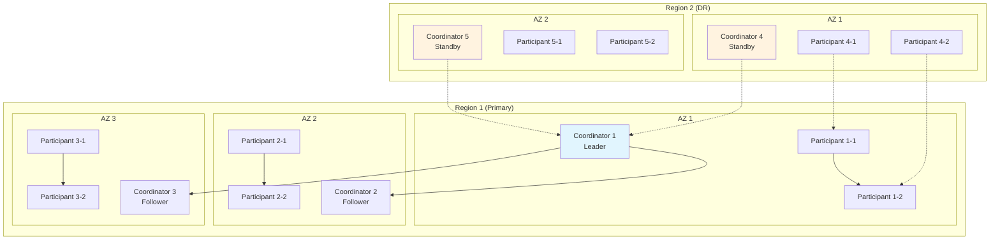

# MPC 基础设施系统详细设计文档

**版本**: v2.0
**文档类型**: 详细设计文档
**创建日期**: 2024-11-28
**基于**: MPC产品文档 + go-mpc-wallet项目代码

---

## 目录

[TOC]

---

## 1. 系统架构概述

### 1.1 产品定位与目标

MPC（Multi-Party Computation）基础设施是一个去中心化的密钥管理平台，基于阈值签名技术（TSS - Threshold Signature Scheme），为2B和2C产品提供安全、可靠的密钥管理和签名服务。

**核心价值主张**：
- **去中心化安全**：密钥分片分布式存储，无单点故障
- **阈值容错**：支持M-of-N阈值配置，只要达到阈值即可签名
- **多链支持**：Bitcoin、Ethereum、EVM链、Cosmos等
- **高性能**：低延迟签名（<200ms目标），高吞吐量（1000+签名/秒）

### 1.2 架构设计原则

```
🏗️ 架构设计原则
├── 分布式架构：无单点故障，节点间对等通信
├── 模块化设计：清晰的组件划分，易于扩展
├── 安全优先：密钥分片安全，协议安全，通信安全
├── 高可用：多节点部署，自动故障转移
├── 高性能：低延迟签名，高吞吐量，水平扩展
└── 易用性：友好的API设计，多语言SDK支持
```

### 1.3 系统整体架构图

```mermaid
graph TB
    subgraph "客户端层 (Clients)"
        A1[Web UI]
        A2[CLI Tools]
        A3[SDK Libraries]
        A4[API Clients]
    end

    subgraph "接入层 (Access Layer)"
        B1[API Gateway]
        B2[Load Balancer]
        B3[Rate Limiter]
        B4[Authentication]
    end

    subgraph "服务层 (Service Layer)"
        C1[MPC Coordinator Service]
        C2[MPC Participant Service]
        C3[Node Management Service]
        C4[Protocol Engine Service]
    end

    subgraph "核心层 (Core Layer)"
        D1[Key Share Manager]
        D2[Threshold Signing Engine]
        D3[Distributed Key Generation]
        D4[Signature Aggregation]
    end

    subgraph "存储层 (Storage Layer)"
        E1[(PostgreSQL<br/>元数据存储)]
        E2[(Redis<br/>会话缓存)]
        E3[(Encrypted FS<br/>密钥分片)]
        E4[(Audit Logs<br/>审计日志)]
    end

    subgraph "基础设施层 (Infrastructure)"
        F1[gRPC Communication]
        F2[Service Discovery<br/>Consul/Etcd]
        F3[Health Monitoring]
        F4[Metrics Collection]
    end

    A1 --> B1
    A2 --> B1
    A3 --> B1
    A4 --> B1

    B1 --> C1
    B1 --> C2
    B1 --> C3

    C1 --> D1
    C1 --> D2
    C1 --> D3
    C1 --> D4

    C2 --> D1
    C2 --> D2

    D1 --> E1
    D2 --> E2
    D3 --> E3
    D4 --> E4

    C1 --> F1
    C2 --> F1
    C3 --> F2
    F3 --> F4

    style C1 fill:#e1f5fe
    style C2 fill:#f3e5f5
    style D1 fill:#e8f5e8
    style D2 fill:#e8f5e8
    style D3 fill:#e8f5e8
    style D4 fill:#e8f5e8
```



### 1.4 分层架构详细设计

#### 1.4.1 客户端层 (Client Layer)
**组件**：
- **Web UI**: 管理控制台，提供可视化操作界面
- **CLI Tools**: 命令行工具，用于运维和调试
- **SDK Libraries**: 多语言SDK（Go、Python、JavaScript、Java）
- **API Clients**: 直接调用REST/gRPC API的客户端

**职责**：
- 用户交互接口
- 请求构建和发送
- 响应解析和展示
- 错误处理和重试

#### 1.4.2 接入层 (Access Layer)
**组件**：
- **API Gateway**: 统一的API入口，支持RESTful和gRPC
- **Load Balancer**: 负载均衡，确保请求均匀分发
- **Rate Limiter**: 请求频率限制，防止滥用
- **Authentication**: 身份认证和授权

**职责**：
- 请求路由和转发
- 流量控制和安全防护
- 用户认证和权限检查
- 请求监控和日志记录

#### 1.4.3 服务层 (Service Layer)
**核心服务**：

```
服务层组件
├── MPC Coordinator Service (协调器服务)
│   ├── 签名会话管理
│   ├── 节点协调调度
│   ├── 协议引擎调用
│   └── 结果聚合处理
├── MPC Participant Service (参与者服务)
│   ├── 密钥分片存储
│   ├── 签名参与计算
│   ├── 协议消息处理
│   └── 节点间通信
├── Node Management Service (节点管理服务)
│   ├── 节点注册发现
│   ├── 健康状态监控
│   ├── 负载均衡调度
│   └── 故障检测恢复
└── Protocol Engine Service (协议引擎服务)
    ├── GG18/GG20协议实现
    ├── FROST协议实现
    ├── 协议状态管理
    └── 安全验证逻辑
```

#### 1.4.4 核心层 (Core Layer)
**核心功能**：

```
核心功能模块
├── Key Share Manager (密钥分片管理)
│   ├── 分片生成与验证
│   ├── 分片加密存储
│   ├── 分片分发传输
│   └── 分片恢复重组
├── Threshold Signing Engine (阈值签名引擎)
│   ├── 签名会话创建
│   ├── 多方签名协调
│   ├── 签名分片聚合
│   └── 最终签名生成
├── Distributed Key Generation (分布式密钥生成)
│   ├── DKG协议实现
│   ├── 密钥分片生成
│   ├── 一致性验证
│   └── 安全参数设置
└── Signature Aggregation (签名聚合)
    ├── 分片收集验证
    ├── 聚合计算逻辑
    ├── 结果验证检查
    └── 错误处理重试
```

#### 1.4.5 存储层 (Storage Layer)
**存储架构**：

```
存储层设计
├── PostgreSQL (元数据存储)
│   ├── keys表：密钥元数据
│   ├── nodes表：节点信息
│   ├── signing_sessions表：签名会话
│   ├── policies表：访问策略
│   └── audit_logs表：审计日志
├── Redis (会话缓存)
│   ├── 会话状态缓存
│   ├── 分布式锁
│   └── 临时数据存储
├── Encrypted File System (密钥分片存储)
│   ├── AES-256-GCM加密
│   ├── 分片文件存储
│   ├── 访问权限控制
│   └── 备份恢复机制
└── Audit Logs (审计日志)
    ├── 结构化日志存储
    ├── 不可篡改记录
    ├── 合规性支持
    └── 日志分析工具
```

#### 1.4.6 基础设施层 (Infrastructure Layer)
**基础设施组件**：
- **gRPC Communication**: 高效的节点间通信
- **Service Discovery**: 自动服务发现和注册
- **Health Monitoring**: 健康检查和状态监控
- **Metrics Collection**: 性能指标收集和告警

### 1.5 部署架构模式

#### 1.5.1 协调者模式 (Coordinator Mode)


**特点**：
- 中心化协调，简化管理
- 高可用，支持多Coordinator
- 适合企业级部署
- 易于监控和运维

#### 1.5.2 P2P模式 (Peer-to-Peer Mode)


**特点**：
- 完全去中心化
- 节点动态加入退出
- 高容错性
- 适合大规模分布式场景

---

## 2. 核心模块详细设计

### 2.1 MPC Coordinator Service (协调器服务)

#### 2.1.1 模块职责

**核心功能**：
- **签名会话管理**：创建、监控、销毁签名会话
- **节点调度**：选择合适的Participant节点参与签名
- **协议协调**：调用协议引擎执行MPC协议
- **结果聚合**：收集和聚合签名分片

#### 2.1.2 内部组件设计

```
Coordinator Service 内部架构
├── Session Manager (会话管理器)
│   ├── 会话创建和初始化
│   ├── 会话状态跟踪
│   ├── 会话超时处理
│   └── 会话清理回收
├── Node Selector (节点选择器)
│   ├── 可用节点发现
│   ├── 负载均衡算法
│   ├── 节点健康检查
│   └── 故障节点排除
├── Protocol Coordinator (协议协调器)
│   ├── 协议引擎调用
│   ├── 消息路由转发
│   ├── 进度状态同步
│   └── 错误处理重试
└── Result Aggregator (结果聚合器)
    ├── 分片收集验证
    ├── 聚合计算逻辑
    ├── 最终结果生成
    └── 结果验证检查
```

#### 2.1.3 关键接口设计

```go
// SessionManager 会话管理接口
type SessionManager interface {
    CreateSession(ctx context.Context, req *CreateSessionRequest) (*SigningSession, error)
    GetSession(ctx context.Context, sessionID string) (*SigningSession, error)
    UpdateSessionStatus(ctx context.Context, sessionID string, status SessionStatus) error
    DeleteSession(ctx context.Context, sessionID string) error
    ListSessions(ctx context.Context, filter *SessionFilter) ([]*SigningSession, error)
}

// NodeSelector 节点选择接口
type NodeSelector interface {
    SelectNodes(ctx context.Context, keyID string, threshold int) ([]*Node, error)
    GetNodeHealth(ctx context.Context, nodeID string) (*NodeHealth, error)
    UpdateNodeLoad(ctx context.Context, nodeID string, load int) error
}

// ProtocolCoordinator 协议协调接口
type ProtocolCoordinator interface {
    StartSigning(ctx context.Context, sessionID string, nodes []*Node, message []byte) error
    GetSigningProgress(ctx context.Context, sessionID string) (*SigningProgress, error)
    CancelSigning(ctx context.Context, sessionID string) error
}
```

#### 2.1.4 签名会话管理流程



### 2.2 MPC Participant Service (参与者服务)

#### 2.2.1 模块职责

**核心功能**：
- **密钥分片存储**：安全存储和访问密钥分片
- **签名参与**：参与阈值签名协议计算
- **协议通信**：与其他Participant节点通信
- **状态同步**：维护协议执行状态

#### 2.2.2 内部组件设计

```
Participant Service 内部架构
├── KeyShareStorage (密钥分片存储)
│   ├── 分片加密存储
│   ├── 分片访问控制
│   ├── 分片完整性验证
│   └── 分片备份恢复
├── ProtocolParticipant (协议参与者)
│   ├── 协议消息处理
│   ├── 状态机管理
│   ├── 计算任务执行
│   └── 结果验证提交
├── P2PCommunicator (点对点通信器)
│   ├── 节点发现连接
│   ├── 消息发送接收
│   ├── 连接状态维护
│   └── 安全通信加密
└── HealthReporter (健康状态报告器)
    ├── 节点状态监控
    ├── 性能指标收集
    ├── 错误状态上报
    └── 自动恢复机制
```

#### 2.2.3 密钥分片存储设计


#### 2.2.4 签名参与流程

```mermaid
sequenceDiagram
    participant Coordinator
    participant Participant
    participant KeyShareStorage
    participant ProtocolEngine

    Coordinator->>Participant: 签名请求 (sessionID, message)
    Participant->>KeyShareStorage: 获取密钥分片
    KeyShareStorage-->>Participant: 返回分片 (encrypted)
    Participant->>Participant: 解密分片
    Participant->>ProtocolEngine: 执行签名计算
    ProtocolEngine-->>Participant: 返回签名分片
    Participant->>Coordinator: 发送签名分片

    Note over Coordinator,Participant: 重复此过程直到收集足够的分片
```

### 2.3 Protocol Engine (协议引擎)

#### 2.3.1 支持的协议

**GG18/GG20 协议**：
- **GG18**: 4轮通信的ECDSA阈值签名
- **GG20**: 改进版，1轮通信，更高效
- **特点**: 成熟稳定，经过生产验证

**FROST 协议**：
- **IETF标准**: 两轮通信的Schnorr签名
- **优势**: 更灵活的阈值配置，性能更好
- **适用**: 未来扩展

#### 2.3.2 协议引擎架构

```
Protocol Engine 架构
├── Protocol Registry (协议注册器)
│   ├── 协议注册管理
│   ├── 协议版本控制
│   ├── 协议配置管理
│   └── 协议切换逻辑
├── GG18 Protocol (GG18协议实现)
│   ├── Round 1: 承诺生成
│   ├── Round 2: 承诺交换验证
│   ├── Round 3: 签名分片计算
│   └── Round 4: 签名聚合
├── GG20 Protocol (GG20协议实现)
│   ├── Round 1: 统一承诺和签名
│   ├── 签名分片生成
│   ├── 分片聚合验证
│   └── 最终签名构造
├── FROST Protocol (FROST协议实现)
│   ├── Round 1: 承诺生成
│   ├── Round 2: 签名聚合
│   ├── 挑战响应机制
│   └── Schnorr签名构造
└── Protocol State Manager (协议状态管理)
    ├── 状态机管理
    ├── 进度跟踪
    ├── 错误处理
    └── 状态持久化
```

#### 2.3.3 GG20签名协议详细流程



### 2.4 Key Share Manager (密钥分片管理)

#### 2.4.1 分片生命周期管理



#### 2.4.2 分片存储安全设计

```
密钥分片安全存储架构
├── 加密层 (Encryption Layer)
│   ├── 对称加密：AES-256-GCM
│   ├── 信封加密：数据密钥 + 主密钥
│   ├── 密钥派生：PBKDF2/Argon2
│   └── 密钥轮换：定期更换加密密钥
├── 访问控制层 (Access Control Layer)
│   ├── 节点认证：证书/TLS
│   ├── 权限检查：RBAC策略
│   ├── 审计日志：所有访问记录
│   └── 速率限制：防止滥用
├── 完整性保护层 (Integrity Protection Layer)
│   ├── 哈希校验：SHA-256
│   ├── 数字签名：RSA/ECDSA
│   ├── 篡改检测：HMAC
│   └── 备份验证：多副本校验
└── 物理安全层 (Physical Security Layer)
    ├── 加密文件系统
    ├── HSM存储选项
    ├── 安全删除：多重覆盖
    └── 地理分布：多区域备份
```

#### 2.4.3 分布式密钥生成 (DKG) 流程

```mermaid
sequenceDiagram
    participant Client
    participant Coordinator
    participant P1 as Participant 1
    participant P2 as Participant 2
    participant P3 as Participant 3
    participant Storage

    Client->>Coordinator: 创建密钥 (CreateKeyRequest)
    Coordinator->>Coordinator: 初始化DKG会话

    Coordinator->>P1: 启动DKG参与
    Coordinator->>P2: 启动DKG参与
    Coordinator->>P3: 启动DKG参与

    P1->>P1: 生成多项式份额
    P2->>P2: 生成多项式份额
    P3->>P3: 生成多项式份额

    P1->>Coordinator: 发送份额承诺
    P2->>Coordinator: 发送份额承诺
    P3->>Coordinator: 发送份额承诺

    Coordinator->>P1: 广播所有承诺
    Coordinator->>P2: 广播所有承诺
    Coordinator->>P3: 广播所有承诺

    P1->>P1: 验证承诺并计算份额
    P2->>P2: 验证承诺并计算份额
    P3->>P3: 验证承诺并计算份额

    P1->>Coordinator: 发送份额验证
    P2->>Coordinator: 发送份额验证
    P3->>Coordinator: 发送份额验证

    Coordinator->>Coordinator: 验证所有份额
    Coordinator->>Coordinator: 计算公钥

    Coordinator->>P1: 分发加密份额
    Coordinator->>P2: 分发加密份额
    Coordinator->>P3: 分发加密份额

    P1->>Storage: 存储加密份额
    P2->>Storage: 存储加密份额
    P3->>Storage: 存储加密份额

    Coordinator->>Storage: 保存密钥元数据
    Coordinator-->>Client: 返回密钥信息
```



---

## 3. 通信协议设计

### 3.1 gRPC 接口设计

#### 3.1.1 核心服务接口

```protobuf
// mpc/v1/mpc.proto
service MPCService {
  // 密钥管理
  rpc CreateKey(CreateKeyRequest) returns (CreateKeyResponse);
  rpc GetKey(GetKeyRequest) returns (GetKeyResponse);
  rpc ListKeys(ListKeysRequest) returns (ListKeysResponse);
  rpc DeleteKey(DeleteKeyRequest) returns (DeleteKeyResponse);

  // 签名服务
  rpc Sign(SignRequest) returns (SignResponse);
  rpc BatchSign(BatchSignRequest) returns (BatchSignResponse);
  rpc Verify(VerifyRequest) returns (VerifyResponse);

  // 会话管理
  rpc CreateSigningSession(CreateSessionRequest) returns (CreateSessionResponse);
  rpc GetSigningSession(GetSessionRequest) returns (GetSessionResponse);
  rpc JoinSigningSession(JoinSessionRequest) returns (JoinSessionResponse);
  rpc CancelSigningSession(CancelSessionRequest) returns (CancelSessionResponse);
}

// 节点间通信
service NodeService {
  rpc Heartbeat(HeartbeatRequest) returns (HeartbeatResponse);
  rpc ParticipateSigning(ParticipateRequest) returns (ParticipateResponse);
  rpc ExchangeShares(ExchangeRequest) returns (ExchangeResponse);
  rpc ReportHealth(HealthReport) returns (HealthAck);
}
```

#### 3.1.2 消息定义

```protobuf
// 密钥相关消息
message CreateKeyRequest {
  string algorithm = 1;        // ECDSA, EdDSA
  string curve = 2;           // secp256k1, ed25519
  int32 threshold = 3;        // 阈值
  int32 total_nodes = 4;      // 总节点数
  string chain_type = 5;      // bitcoin, ethereum
  map<string, string> metadata = 6;
}

message CreateKeyResponse {
  string key_id = 1;
  string public_key = 2;
  string address = 3;
  int64 created_at = 4;
}

// 签名相关消息
message SignRequest {
  string key_id = 1;
  bytes message = 2;
  string message_type = 3;    // raw, hash, typed_data
  string chain_type = 4;
  map<string, string> metadata = 5;
}

message SignResponse {
  string signature = 1;
  string key_id = 2;
  string session_id = 3;
  int64 signed_at = 4;
}
```

### 3.2 REST API 设计

#### 3.2.1 API 路径设计

```
/api/v1
├── /keys                          # 密钥管理
│   ├── POST   /keys               # 创建密钥
│   ├── GET    /keys               # 列出密钥
│   ├── GET    /keys/{key_id}      # 获取密钥
│   ├── PUT    /keys/{key_id}      # 更新密钥
│   ├── DELETE /keys/{key_id}      # 删除密钥
│   └── POST   /keys/{key_id}/rotate # 轮换密钥
├── /sign                          # 签名服务
│   ├── POST   /sign               # 单次签名
│   ├── POST   /sign/batch         # 批量签名
│   └── POST   /verify             # 签名验证
├── /sessions                      # 会话管理
│   ├── POST   /sessions           # 创建会话
│   ├── GET    /sessions/{session_id} # 获取会话
│   ├── POST   /sessions/{session_id}/join # 加入会话
│   └── POST   /sessions/{session_id}/cancel # 取消会话
└── /nodes                         # 节点管理
    ├── POST   /nodes              # 注册节点
    ├── GET    /nodes              # 列出节点
    ├── GET    /nodes/{node_id}    # 获取节点
    ├── GET    /nodes/{node_id}/health # 节点健康
    └── DELETE /nodes/{node_id}    # 注销节点
```

#### 3.2.2 API 响应格式

```json
{
  "success": true,
  "data": {
    "key_id": "key-1234567890abcdef",
    "public_key": "02abcdef...",
    "address": "1ABC...",
    "created_at": "2024-01-01T00:00:00Z"
  },
  "meta": {
    "request_id": "req-123",
    "timestamp": "2024-01-01T00:00:00Z"
  }
}
```

### 3.3 通信安全设计

#### 3.3.1 TLS 配置

```yaml
# TLS 配置
tls:
  enabled: true
  cert_file: "/etc/mpc/ssl/cert.pem"
  key_file: "/etc/mpc/ssl/key.pem"
  ca_file: "/etc/mpc/ssl/ca.pem"
  client_auth: "require_and_verify_client_cert"
  min_version: "TLS_1_2"
  cipher_suites:
    - "TLS_ECDHE_RSA_WITH_AES_256_GCM_SHA384"
    - "TLS_ECDHE_ECDSA_WITH_AES_256_GCM_SHA384"
```

#### 3.3.2 消息认证

```
消息认证机制
├── 请求签名：HMAC-SHA256
├── 时间戳验证：防止重放攻击
├── 请求ID：防止重复请求
├── 证书认证：双向TLS
└── API密钥：应用级认证
```

---

## 4. 数据存储设计

### 4.1 数据库表结构

#### 4.1.1 Keys 表 (密钥元数据)

```sql
CREATE TABLE keys (
    key_id VARCHAR(255) PRIMARY KEY,
    public_key TEXT NOT NULL,
    algorithm VARCHAR(50) NOT NULL,
    curve VARCHAR(50) NOT NULL,
    threshold INTEGER NOT NULL,
    total_nodes INTEGER NOT NULL,
    chain_type VARCHAR(50) NOT NULL,
    address TEXT,
    status VARCHAR(50) NOT NULL DEFAULT 'Active',
    description TEXT,
    tags JSONB,
    created_at TIMESTAMPTZ NOT NULL DEFAULT NOW(),
    updated_at TIMESTAMPTZ NOT NULL DEFAULT NOW(),
    deletion_date TIMESTAMPTZ
);

-- 索引
CREATE INDEX idx_keys_chain_type ON keys(chain_type);
CREATE INDEX idx_keys_status ON keys(status);
CREATE INDEX idx_keys_created_at ON keys(created_at);
CREATE INDEX idx_keys_algorithm ON keys(algorithm);
```

#### 4.1.2 Nodes 表 (节点信息)

```sql
CREATE TABLE nodes (
    node_id VARCHAR(255) PRIMARY KEY,
    node_type VARCHAR(50) NOT NULL, -- coordinator, participant
    endpoint VARCHAR(255) NOT NULL,
    public_key TEXT,
    status VARCHAR(50) NOT NULL DEFAULT 'active',
    capabilities JSONB, -- 支持的协议和算法
    metadata JSONB,
    registered_at TIMESTAMPTZ NOT NULL DEFAULT NOW(),
    last_heartbeat TIMESTAMPTZ,
    load_factor INTEGER DEFAULT 0 -- 负载因子 0-100
);

-- 索引
CREATE INDEX idx_nodes_type ON nodes(node_type);
CREATE INDEX idx_nodes_status ON nodes(status);
CREATE INDEX idx_nodes_endpoint ON nodes(endpoint);
CREATE INDEX idx_nodes_load ON nodes(load_factor);
```

#### 4.1.3 Signing Sessions 表 (签名会话)

```sql
CREATE TABLE signing_sessions (
    session_id VARCHAR(255) PRIMARY KEY,
    key_id VARCHAR(255) NOT NULL,
    protocol VARCHAR(50) NOT NULL,
    status VARCHAR(50) NOT NULL DEFAULT 'pending',
    threshold INTEGER NOT NULL,
    total_nodes INTEGER NOT NULL,
    participating_nodes JSONB,
    current_round INTEGER DEFAULT 0,
    total_rounds INTEGER NOT NULL,
    signature TEXT,
    message_hash VARCHAR(128),
    created_at TIMESTAMPTZ NOT NULL DEFAULT NOW(),
    completed_at TIMESTAMPTZ,
    duration_ms INTEGER,
    error_message TEXT,
    FOREIGN KEY (key_id) REFERENCES keys(key_id) ON DELETE CASCADE
);

-- 索引
CREATE INDEX idx_sessions_key_id ON sessions(key_id);
CREATE INDEX idx_sessions_status ON sessions(status);
CREATE INDEX idx_sessions_created_at ON sessions(created_at);
CREATE INDEX idx_sessions_protocol ON sessions(protocol);
```

#### 4.1.4 Audit Logs 表 (审计日志)

```sql
CREATE TABLE audit_logs (
    id BIGSERIAL PRIMARY KEY,
    timestamp TIMESTAMPTZ NOT NULL DEFAULT NOW(),
    event_type VARCHAR(50) NOT NULL,
    user_id VARCHAR(255),
    key_id VARCHAR(255),
    node_id VARCHAR(255),
    session_id VARCHAR(255),
    operation VARCHAR(50) NOT NULL,
    result VARCHAR(50) NOT NULL,
    details JSONB,
    ip_address VARCHAR(50),
    user_agent TEXT,
    request_id VARCHAR(255)
);

-- 索引
CREATE INDEX idx_audit_timestamp ON audit_logs(timestamp);
CREATE INDEX idx_audit_event_type ON audit_logs(event_type);
CREATE INDEX idx_audit_key_id ON audit_logs(key_id);
CREATE INDEX idx_audit_user_id ON audit_logs(user_id);
CREATE INDEX idx_audit_node_id ON audit_logs(node_id);
CREATE INDEX idx_audit_session_id ON audit_logs(session_id);
CREATE INDEX idx_audit_request_id ON audit_logs(request_id);
```

### 4.2 Redis 数据结构

#### 4.2.1 会话缓存

```
Redis Key 设计
├── session:{session_id}          # 会话完整信息 (JSON)
├── session:progress:{session_id} # 会话进度 (HASH)
├── session:shares:{session_id}   # 签名分片收集 (SET)
├── session:timeout:{session_id}  # 会话超时 (TTL)
└── session:lock:{session_id}     # 会话分布式锁
```

#### 4.2.2 节点状态

```
节点状态缓存
├── node:health:{node_id}        # 节点健康状态
├── node:load:{node_id}          # 节点负载信息
├── node:capabilities:{node_id}  # 节点能力信息
└── nodes:active                 # 活跃节点列表 (SET)
```

### 4.3 密钥分片存储

#### 4.3.1 文件系统存储结构

```
/var/lib/mpc/key-shares/
├── {key_id}/
│   ├── metadata.json          # 分片元数据
│   ├── share.enc              # 加密分片数据
│   ├── share.sig              # 分片签名验证
│   ├── backup/                # 备份目录
│   └── temp/                  # 临时文件
└── archive/                   # 已删除分片归档
```

#### 4.3.2 分片文件格式

```json
// metadata.json
{
  "key_id": "key-1234567890abcdef",
  "node_id": "node-abcdef123456",
  "share_index": 1,
  "threshold": 2,
  "total_shares": 3,
  "algorithm": "ECDSA",
  "curve": "secp256k1",
  "created_at": "2024-01-01T00:00:00Z",
  "encrypted": true,
  "encryption": {
    "algorithm": "AES-256-GCM",
    "key_id": "enc-key-123",
    "iv": "abcdef123456"
  },
  "integrity": {
    "hash_algorithm": "SHA-256",
    "hash": "abcdef123456...",
    "signature": "sig-abcdef..."
  }
}
```

---

## 5. 安全设计

### 5.1 密钥安全

#### 5.1.1 密钥分片安全

```
密钥分片安全措施
├── 生成安全
│   ├── 真随机数生成
│   ├── 密码学安全的PRNG
│   ├── 熵源多样化
│   └── 种子密钥管理
├── 存储安全
│   ├── AES-256-GCM加密
│   ├── 信封加密设计
│   ├── HSM存储选项
│   └── 安全删除机制
├── 传输安全
│   ├── TLS 1.3加密
│   ├── 完美前向保密
│   ├── 证书钉扎
│   └── 传输层认证
└── 访问控制
    ├── 最小权限原则
    ├── 多因子认证
    ├── 访问审计
    └── 自动密钥轮换
```

#### 5.1.2 密钥生命周期



### 5.2 通信安全

#### 5.2.1 TLS 配置

```go
// TLS 配置
tlsConfig := &tls.Config{
    MinVersion:               tls.VersionTLS12,
    MaxVersion:               tls.VersionTLS13,
    CipherSuites:             []uint16{
        tls.TLS_ECDHE_RSA_WITH_AES_256_GCM_SHA384,
        tls.TLS_ECDHE_ECDSA_WITH_AES_256_GCM_SHA384,
    },
    Certificates:             []tls.Certificate{cert},
    ClientCAs:                caCertPool,
    ClientAuth:               tls.RequireAndVerifyClientCert,
    InsecureSkipVerify:       false,
    PreferServerCipherSuites: true,
}
```

#### 5.2.2 消息认证

```
消息认证机制
├── 请求签名
│   ├── HMAC-SHA256
│   ├── API密钥
│   └── 时间戳
├── 证书认证
│   ├── 双向TLS
│   ├── 证书吊销检查
│   └── 证书轮换
└── 访问控制
    ├── JWT令牌
    ├── RBAC权限
    └── 速率限制
```

### 5.3 审计与监控

#### 5.3.1 审计日志设计

```go
// 审计事件类型
type AuditEvent struct {
    Timestamp   time.Time              `json:"timestamp"`
    EventType   string                 `json:"event_type"`   // KeyCreated, SignRequested, etc.
    UserID      string                 `json:"user_id,omitempty"`
    KeyID       string                 `json:"key_id,omitempty"`
    NodeID      string                 `json:"node_id,omitempty"`
    SessionID   string                 `json:"session_id,omitempty"`
    Operation   string                 `json:"operation"`
    Result      string                 `json:"result"`       // Success, Failed
    Details     map[string]interface{} `json:"details,omitempty"`
    IPAddress   string                 `json:"ip_address,omitempty"`
    UserAgent   string                 `json:"user_agent,omitempty"`
    RequestID   string                 `json:"request_id"`
}
```

#### 5.3.2 安全监控

```
安全监控体系
├── 实时监控
│   ├── 异常访问检测
│   ├── 签名失败率监控
│   ├── 密钥访问频率
│   └── 网络异常检测
├── 告警系统
│   ├── 安全事件告警
│   ├── 性能阈值告警
│   ├── 系统异常告警
│   └── 合规性检查
└── 响应机制
    ├── 自动隔离机制
    ├── 紧急密钥禁用
    ├── 安全事件响应
    └── 取证数据收集
```

---

## 6. 性能优化设计

### 6.1 签名性能优化

#### 6.1.1 并发签名处理

```mermaid
graph TD
    subgraph "Concurrent Signing Architecture"
        A[签名请求] --> B{负载均衡}
        B --> C[Worker Pool 1]
        B --> D[Worker Pool 2]
        B --> E[Worker Pool N]

        C --> F[节点选择]
        D --> G[节点选择]
        E --> H[节点选择]

        F --> I[协议执行]
        G --> J[协议执行]
        H --> K[协议执行]

        I --> L[结果聚合]
        J --> L
        K --> L

        L --> M[响应返回]
    end

    subgraph "Worker Pool Management"
        N[动态扩缩容] --> O[负载监控]
        O --> P[队列长度]
        P --> Q[处理延迟]
        Q --> R[CPU使用率]
    end

    style A fill:#e8f5e8
    style L fill:#fff3e0
    style N fill:#e3f2fd
```



#### 6.1.2 批量签名优化

```
批量签名优化策略
├── 请求合并
│   ├── 相同密钥的请求合并
│   ├── 批量协议执行
│   └── 结果批量返回
├── 预处理优化
│   ├── 密钥预加载
│   ├── 节点预热
│   └── 连接池复用
├── 缓存优化
│   ├── 密钥元数据缓存
│   ├── 节点状态缓存
│   └── 签名结果缓存
└── 算法优化
    ├── 并行计算
    ├── SIMD指令优化
    └── 内存池管理
```

### 6.2 存储性能优化

#### 6.2.1 数据库优化

```sql
-- 复合索引优化
CREATE INDEX CONCURRENTLY idx_keys_composite 
ON keys(chain_type, status, created_at DESC);

-- 分区表优化
CREATE TABLE audit_logs_y2024m01 PARTITION OF audit_logs
    FOR VALUES FROM ('2024-01-01') TO ('2024-02-01');

-- 连接池配置
max_connections = 200
shared_preload_libraries = 'pg_stat_statements'
track_activity_query_size = 4096
```

#### 6.2.2 Redis 集群优化

```yaml
# Redis Cluster 配置
redis:
  cluster:
    enabled: true
    nodes:
      - "redis-1:6379"
      - "redis-2:6379"
      - "redis-3:6379"
  pool:
    max_active: 100
    max_idle: 20
    idle_timeout: 300s
  sentinel:
    master_name: "mymaster"
    addresses:
      - "sentinel-1:26379"
      - "sentinel-2:26379"
      - "sentinel-3:26379"
```

### 6.3 网络优化

#### 6.3.1 连接池管理

```go
// gRPC 连接池配置
connPool := &grpcpool.Pool{
    Dial: func(ctx context.Context) (*grpc.ClientConn, error) {
        return grpc.DialContext(ctx, target, grpc.WithTransportCredentials(creds))
    },
    MaxIdle:     10,
    MaxActive:   50,
    IdleTimeout: 5 * time.Minute,
    Wait:        true,
}
```

#### 6.3.2 消息压缩

```go
// gRPC 压缩配置
server := grpc.NewServer(
    grpc.RPCCompressor(grpc.NewGZIPCompressor()),
    grpc.RPCDecompressor(grpc.NewGZIPDecompressor()),
    grpc.MaxRecvMsgSize(4*1024*1024), // 4MB
    grpc.MaxSendMsgSize(4*1024*1024), // 4MB
)
```

---

## 7. 部署架构设计

### 7.1 Kubernetes 部署架构

#### 7.1.1 微服务部署

```yaml
# Coordinator Deployment
apiVersion: apps/v1
kind: Deployment
metadata:
  name: mpc-coordinator
spec:
  replicas: 3
  selector:
    matchLabels:
      app: mpc-coordinator
  template:
    metadata:
      labels:
        app: mpc-coordinator
    spec:
      containers:
      - name: coordinator
        image: mpc/coordinator:v1.0.0
        ports:
        - containerPort: 8080
        - containerPort: 9090
        env:
        - name: NODE_TYPE
          value: "coordinator"
        - name: CONSUL_ADDR
          value: "consul:8500"
        resources:
          requests:
            memory: "512Mi"
            cpu: "500m"
          limits:
            memory: "1Gi"
            cpu: "1000m"
        livenessProbe:
          httpGet:
            path: /health/live
            port: 8080
          initialDelaySeconds: 30
          periodSeconds: 10
        readinessProbe:
          httpGet:
            path: /health/ready
            port: 8080
          initialDelaySeconds: 5
          periodSeconds: 5
```

#### 7.1.2 服务网格配置

```yaml
# Istio Service Mesh 配置
apiVersion: networking.istio.io/v1beta1
kind: VirtualService
metadata:
  name: mpc-api-gateway
spec:
  http:
  - match:
    - uri:
        prefix: "/api/v1"
    route:
    - destination:
        host: mpc-coordinator
    timeout: 30s
    retries:
      attempts: 3
      perTryTimeout: 10s
  - match:
    - uri:
        prefix: "/grpc"
    route:
    - destination:
        host: mpc-coordinator
        port:
          number: 9090
```

### 7.2 高可用架构

#### 7.2.1 多区域部署



#### 7.2.2 故障转移机制

```
故障转移策略
├── 领导者选举
│   ├── Raft共识算法
│   ├── 心跳检测
│   ├── 自动故障转移
│   └── 脑裂防护
├── 负载均衡
│   ├── DNS负载均衡
│   ├── L4负载均衡
│   ├── L7负载均衡
│   └── 地理负载均衡
├── 数据同步
│   ├── 多主复制
│   ├── 异步复制
│   └── 冲突解决
└── 监控告警
    ├── 健康检查
    ├── 性能监控
    ├── 日志聚合
    └── 告警通知
```

### 7.3 监控和可观测性

#### 7.3.1 指标收集

```
监控指标体系
├── 应用指标
│   ├── 签名请求数 (counter)
│   ├── 签名延迟 (histogram)
│   ├── 错误率 (gauge)
│   └── 活跃会话数 (gauge)
├── 系统指标
│   ├── CPU使用率
│   ├── 内存使用率
│   ├── 磁盘I/O
│   └── 网络流量
├── 业务指标
│   ├── 密钥创建数
│   ├── 节点健康状态
│   ├── 会话完成率
│   └── 审计事件数
└── 安全指标
    ├── 认证失败数
    ├── 访问拒绝数
    ├── 异常访问检测
    └── 加密操作数
```

#### 7.3.2 日志聚合

```yaml
# Fluent Bit 配置
apiVersion: v1
kind: ConfigMap
metadata:
  name: fluent-bit-config
data:
  fluent-bit.conf: |
    [SERVICE]
        Flush         5
        Log_Level     info
        Daemon        off

    [INPUT]
        Name              tail
        Path              /var/log/containers/*mpc*.log
        Parser            docker
        Tag               kube.*
        Refresh_Interval  5

    [FILTER]
        Name                kubernetes
        Match               kube.*
        Kube_URL            https://kubernetes.default.svc:443
        Kube_CA_File        /var/run/secrets/kubernetes.io/serviceaccount/ca.crt
        Kube_Token_File     /var/run/secrets/kubernetes.io/serviceaccount/token

    [OUTPUT]
        Name  es
        Match *
        Host  elasticsearch
        Port  9200
        Index mpc-logs
```

---

## 8. 总结

### 8.1 设计亮点

1. **分层架构清晰**: 严格遵循分层设计原则，每层职责明确
2. **分布式安全**: 密钥分片分布式存储，无单点故障
3. **协议完整**: 支持多种成熟的MPC协议
4. **高可用设计**: 多节点部署，自动故障转移
5. **可扩展架构**: 模块化设计，易于扩展新功能
6. **安全优先**: 多层次安全防护，完整审计体系
7. **性能优化**: 并发处理，缓存优化，网络优化

### 8.2 技术选型合理

- **协议库**: tss-lib，成熟稳定
- **通信**: gRPC + HTTP，高效可靠
- **存储**: PostgreSQL + Redis，性能优良
- **部署**: Kubernetes + Docker，现代化
- **监控**: Prometheus + ELK，行业标准

### 8.3 实施建议

1. **分阶段实施**: 先实现MVP，再逐步扩展
2. **测试驱动**: 单元测试 + 集成测试 + 压力测试
3. **安全审计**: 定期进行安全评估和渗透测试
4. **性能监控**: 建立完整的监控和告警体系
5. **文档同步**: 代码和文档同步更新维护

---

**文档版本**: v2.0
**最后更新**: 2024-11-28
**维护团队**: MPC 开发团队
**文档状态**: 详细设计完成，等待开发实施

---

[回到顶部](#目录)
