# MPC 钱包使用场景产品文档

**版本**: v1.0  
**文档类型**: 产品使用场景文档  
**目标读者**: 产品经理、业务人员、最终用户  
**创建日期**: 2025-01-02  
**基于**: MPCVault 架构分析 + 项目设计

---

## 目录

- [1. 产品概述](#1-产品概述)
- [2. 核心价值](#2-核心价值)
- [3. 个人用户使用场景](#3-个人用户使用场景)
- [4. 团队用户使用场景](#4-团队用户使用场景)
- [5. 混合使用场景](#5-混合使用场景)
- [6. 常见问题解答](#6-常见问题解答)
- [7. 最佳实践](#7-最佳实践)

---

## 1. 产品概述

### 1.1 什么是 MPC 钱包？

MPC（多方安全计算）钱包是一种创新的数字资产管理方案，通过将私钥分成多个分片，分别存储在不同的安全环境中，确保：

- **密钥永不完整存在**：任何单一环境都无法单独控制您的资产
- **零信任安全**：即使某个环境被攻击，资产仍然安全
- **去中心化保护**：消除单点故障风险

#### 1.1.1 个人用户的密钥分片分配

对于个人用户，采用 **3-of-3 模式**，密钥分片分配如下：

```
密钥分片分配（3个分片）：
├── 用户设备：持有 1 个分片
│   ├── 存储在您手机的 Secure Enclave/TrustZone 中
│   ├── 通过生物认证（FaceID/TouchID/指纹）保护
│   └── 与设备绑定，无法导出
├── 云端代理1：持有 1 个分片
│   ├── 加密存储在云端安全环境
│   ├── 多区域备份，确保可用性
│   └── TEE（可信执行环境）保护
└── 云端代理2：持有 1 个分片
    ├── 加密存储在另一个云端安全环境
    ├── 多区域备份，确保可用性
    └── TEE（可信执行环境）保护
```

**重要说明**：
- ✅ **您完全掌控**：您的设备持有 1 个分片，这是您对资产的控制权
- ✅ **双重保护**：即使手机丢失，您可以通过备份恢复；即使云端被攻击，攻击者也无法获得完整密钥
- ✅ **需要三方协作**：只有三个分片同时参与才能完成签名，任何一方都无法单独控制资产

### 1.2 产品定位

MPC 钱包基础设施为企业机构和个人用户提供：

- 🔐 **企业级安全**：多层安全防护，满足金融级合规要求
- 🚀 **高性能服务**：毫秒级签名响应，支持高并发交易
- 🌐 **多链支持**：统一管理 Bitcoin、Ethereum 及所有主流区块链
- 🏢 **灵活部署**：支持个人使用、团队协作、企业级集成

### 1.3 适用对象

**个人用户**：
- 数字资产持有者
- DeFi 协议用户
- NFT 收藏者
- 多链资产管理需求

**团队用户**：
- 企业财务部门
- 数字资产交易所
- DeFi 协议团队
- 投资机构

---

## 2. 核心价值

### 2.1 安全价值

**传统钱包 vs MPC 钱包**：

| 特性 | 传统钱包 | MPC 钱包 |
|------|---------|---------|
| **私钥存储** | 完整存储在单一位置 | 分片存储，永不完整存在 |
| **单点故障** | 存在风险 | 完全消除 |
| **攻击面** | 集中式，风险高 | 分布式，风险低 |
| **合规性** | 难以满足 | 满足金融级要求 |

### 2.2 业务价值

**对于个人用户**：
- ✅ 资产安全：即使设备丢失，资产仍然安全
- ✅ 便捷使用：支持移动APP，随时随地管理资产
- ✅ 多链统一：一个钱包管理所有区块链资产

**对于团队用户**：
- ✅ 多签审批：灵活的审批流程，满足内控要求
- ✅ 批量操作：支持批量转账、工资发放、空投等
- ✅ 审计追踪：完整的操作记录，满足合规要求
- ✅ 权限管理：细粒度的角色和权限控制

### 2.3 技术优势

- **零信任架构**：不信任任何单一环境
- **多层防护**：软件、硬件、协议、加密多层保护
- **高可用性**：99.9% 可用性保证
- **高性能**：毫秒级响应，支持高并发

---

## 3. 个人用户使用场景

### 3.1 场景一：创建个人钱包

#### 3.1.1 使用流程

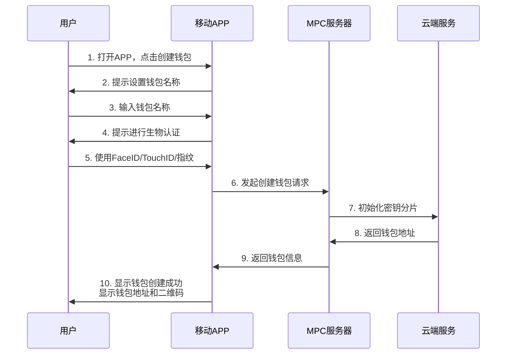

#### 3.1.2 详细步骤说明

**步骤 1-2：启动创建流程**
- 用户打开移动APP
- 点击"创建钱包"按钮
- APP显示创建向导

**步骤 3：设置钱包信息**
- 输入钱包名称（可选，用于标识）
- 选择支持的区块链（Bitcoin、Ethereum等）
- 确认创建

**步骤 4-5：安全验证**
- APP提示进行生物认证
- iOS用户：FaceID 或 TouchID
- Android用户：指纹识别或面部识别
- 认证成功后继续

**步骤 6-9：后台处理**
- APP自动与服务器通信
- 服务器在后台创建密钥分片（3个分片）
- **重要**：其中 1 个分片会自动存储在您的手机 Secure Enclave/TrustZone 中
- 另外 2 个分片存储在云端安全环境
- 用户无需等待，过程自动化

**步骤 10：完成创建**
- APP显示钱包创建成功
- 显示钱包地址和二维码
- 提示用户备份助记词（可选）
- **安全提示**：您的设备已安全存储 1 个密钥分片，这是您对资产的控制权

#### 3.1.3 用户体验要点

- **简单快捷**：3步完成，无需复杂操作
- **安全可靠**：生物认证保护，密钥分片自动创建
- **即时可用**：创建后立即可以使用
- **友好提示**：清晰的引导和状态提示

### 3.2 场景二：发起转账

#### 3.2.1 使用流程

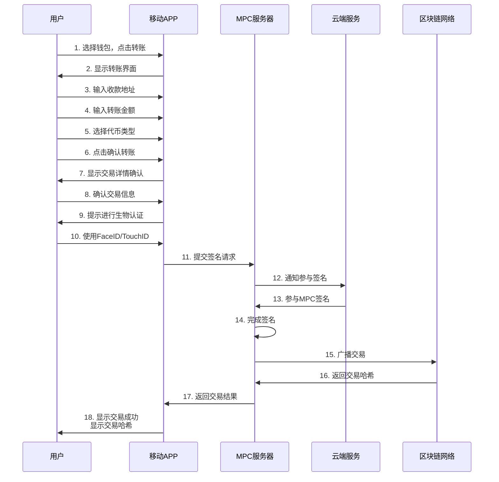

#### 3.2.2 详细步骤说明

**步骤 1-5：输入转账信息**
- 选择要使用的钱包
- 输入或扫描收款地址
- 输入转账金额
- 选择代币类型（USDT、ETH等）
- 可选：添加备注信息

**步骤 6-8：确认交易**
- 点击"确认转账"
- APP显示交易详情摘要：
  - 收款地址
  - 转账金额
  - 手续费估算
  - 预计到账时间
- 用户仔细核对信息

**步骤 9-10：安全验证**
- APP提示进行生物认证
- 用户使用FaceID/TouchID/指纹
- 认证成功后提交

**步骤 11-14：后台签名**
- APP自动提交签名请求
- 服务器协调多方完成签名
- 用户无需等待，过程自动化
- 通常耗时 < 200ms

**步骤 15-18：完成交易**
- 交易自动广播到区块链
- APP显示交易成功
- 显示交易哈希，可点击查看详情
- 提供交易状态追踪链接

#### 3.2.3 用户体验要点

- **操作简单**：5步完成转账，界面清晰
- **安全确认**：交易详情确认 + 生物认证双重保护
- **即时反馈**：实时显示交易状态
- **透明可查**：提供交易哈希和区块链浏览器链接

### 3.3 场景三：接收资产

#### 3.3.1 使用流程

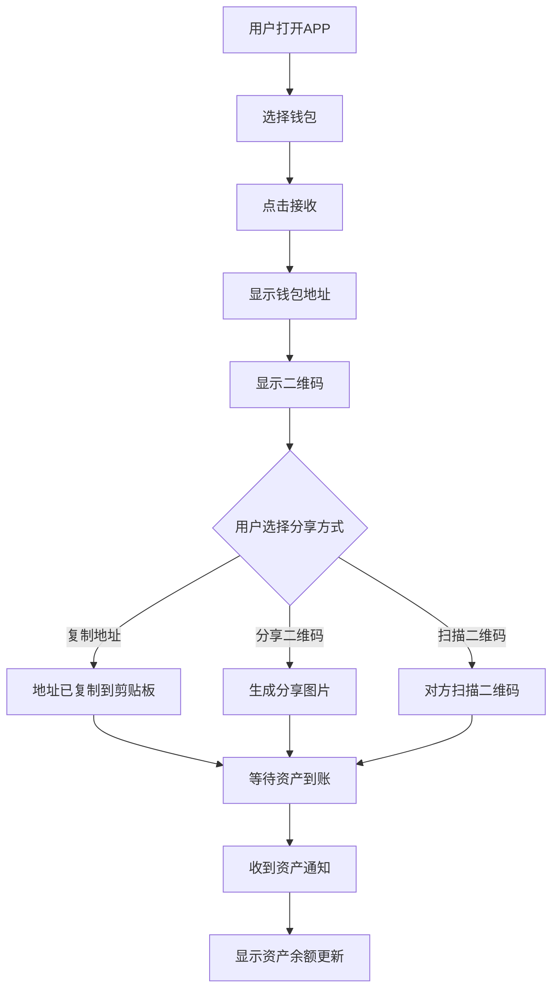

#### 3.3.2 详细步骤说明

**步骤 1-3：打开接收界面**
- 用户打开APP，选择钱包
- 点击"接收"按钮
- APP显示接收界面

**步骤 4-5：显示接收信息**
- 显示钱包地址（可复制）
- 显示二维码（可扫描）
- 显示支持的代币类型

**步骤 6-9：分享地址**
- **方式一**：复制地址，粘贴发送给对方
- **方式二**：分享二维码图片
- **方式三**：对方直接扫描二维码

**步骤 10-12：等待到账**
- 用户等待资产到账
- APP自动检测区块链交易
- 收到资产后推送通知
- 显示资产余额更新

#### 3.3.3 用户体验要点

- **多种分享方式**：地址、二维码、图片分享
- **自动检测**：无需手动刷新，自动检测到账
- **及时通知**：到账后立即推送通知
- **清晰展示**：地址和二维码清晰易读

### 3.4 场景四：备份与恢复

#### 3.4.1 备份流程

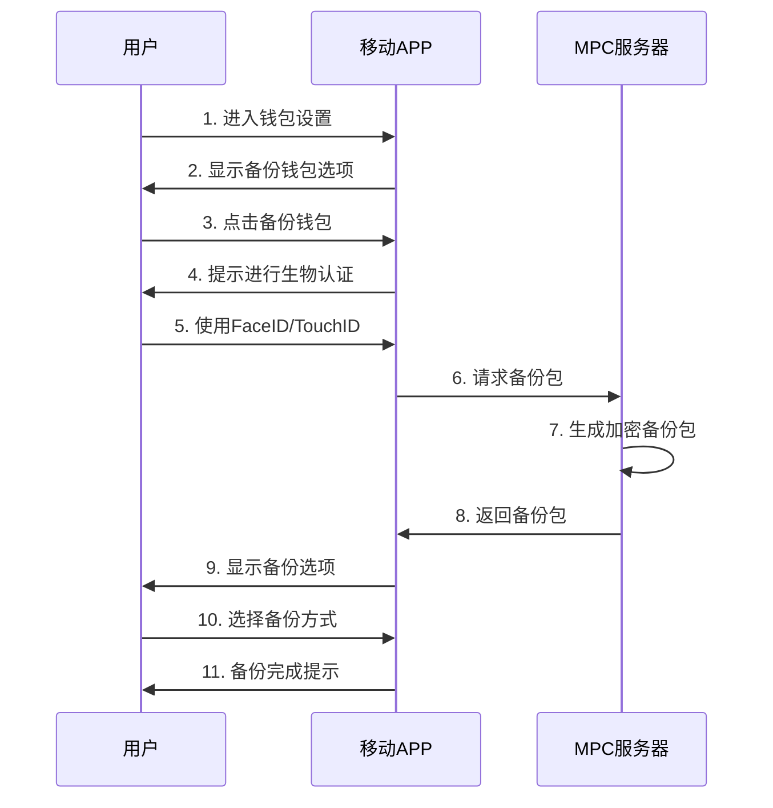

#### 3.4.2 恢复流程

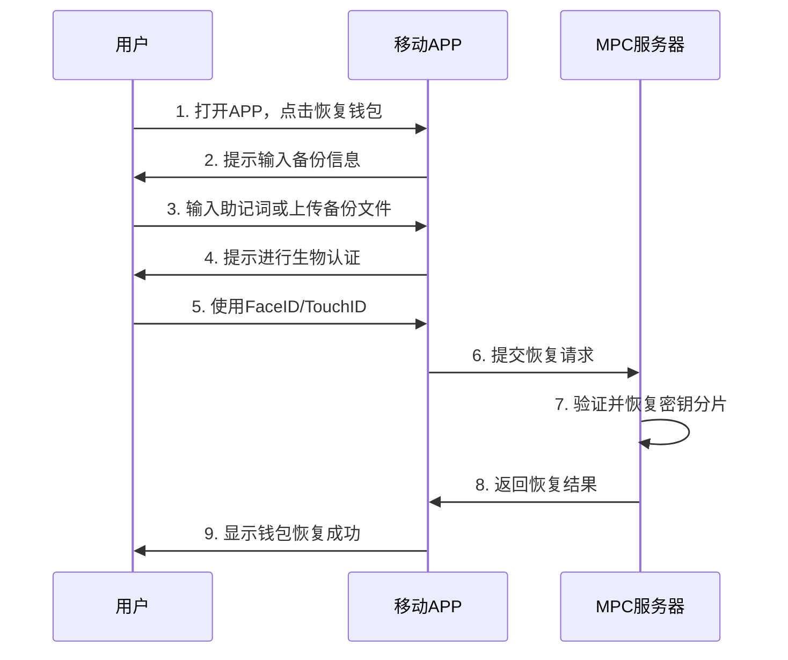

#### 3.4.3 备份方式说明

**方式一：助记词备份**
- 系统生成12或24个助记词
- 用户抄写在安全位置
- 恢复时输入助记词即可

**方式二：备份文件**
- 系统生成加密备份文件
- 用户保存到安全位置（云盘、硬件设备等）
- 恢复时上传备份文件

**方式三：多设备同步**
- 通过云端安全同步
- 在新设备上登录即可恢复
- 需要身份验证

#### 3.4.4 安全建议

- ✅ **多重备份**：建议使用多种方式备份
- ✅ **安全存储**：备份文件存储在安全位置
- ✅ **定期更新**：定期更新备份
- ⚠️ **保密原则**：不要将备份信息分享给他人

---

## 4. 团队用户使用场景

### 4.1 场景一：创建团队钱包

#### 4.1.1 使用流程

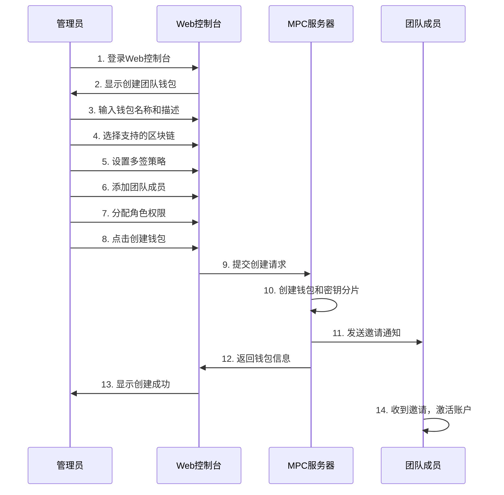

#### 4.1.2 详细步骤说明

**步骤 1-4：基本信息设置**
- 管理员登录Web控制台
- 点击"创建团队钱包"
- 输入钱包名称（如"公司主钱包"）
- 输入描述信息（可选）
- 选择支持的区块链（Bitcoin、Ethereum等）

**步骤 5：设置多签策略**
- **简单模式**：统一审批要求
  - 例如：所有交易需要2个管理员批准
- **高级模式**：基于条件的策略
  - 小额交易（< 1000 USDT）：1个管理员批准
  - 大额交易（≥ 10000 USDT）：3个管理员批准
  - 白名单地址：自动批准
  - 未知金额交易：2个管理员批准

**步骤 6-7：添加团队成员**
- 添加团队成员邮箱或用户名
- 分配角色：
  - **Owner（所有者）**：完全控制权限
  - **Manager（管理者）**：可以批准交易和管理成员
  - **Member（成员）**：可以创建交易请求
- 设置每个成员的审批权限

**步骤 8-13：完成创建**
- 确认所有设置
- 点击"创建钱包"
- 系统自动创建钱包
- 显示钱包地址和二维码
- 发送邀请通知给团队成员

#### 4.1.3 多签策略示例

**示例一：简单统一策略**
```
所有交易需要 2 个 Manager 批准
适用场景：小团队，交易频率低
```

**示例二：基于金额的策略**
```
- 小额交易（< 1,000 USDT）：1 个 Manager 批准
- 中等交易（1,000 - 10,000 USDT）：2 个 Manager 批准
- 大额交易（≥ 10,000 USDT）：3 个 Manager 批准
适用场景：企业财务，需要分级审批
```

**示例三：基于地址的策略**
```
- 白名单地址：自动批准（无需审批）
- 普通地址：2 个 Manager 批准
- 黑名单地址：禁止交易
适用场景：定期支付，需要白名单管理
```

### 4.2 场景二：团队转账审批

#### 4.2.1 使用流程

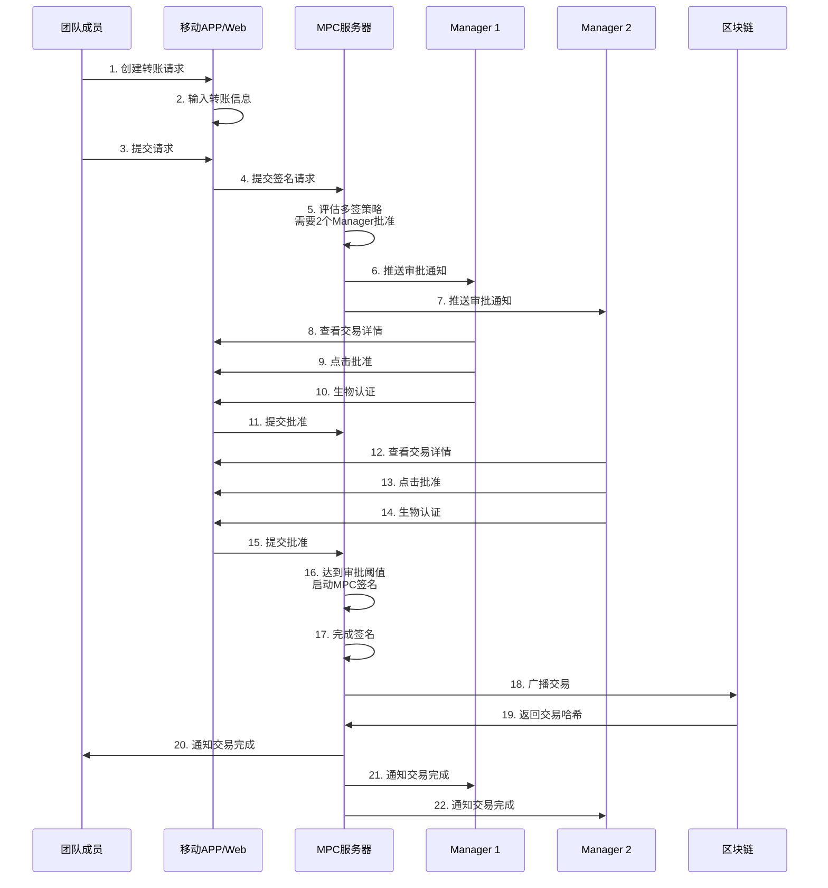

#### 4.2.2 详细步骤说明

**步骤 1-3：创建转账请求**
- 团队成员（Member或Manager）打开APP或Web控制台
- 选择团队钱包
- 点击"转账"
- 输入收款地址、金额、代币类型
- 可选：添加备注说明
- 提交请求

**步骤 4-7：系统评估和通知**
- 系统自动评估多签策略
- 根据交易金额和地址，确定需要的审批人数
- 自动推送通知给需要审批的Manager
- 通知包含：交易详情、需要审批的原因

**步骤 8-15：审批流程**
- Manager收到通知，打开APP
- 查看交易详情：
  - 发起人信息
  - 收款地址
  - 转账金额
  - 手续费
  - 交易时间
- 仔细核对信息
- 点击"批准"或"拒绝"
- 进行生物认证确认
- 提交审批结果

**步骤 16-22：执行交易**
- 当达到审批阈值时，系统自动启动MPC签名
- 后台完成签名（用户无需操作）
- 自动广播交易到区块链
- 所有相关人员收到交易完成通知
- 显示交易哈希，可追踪状态

#### 4.2.3 审批界面说明

**审批列表界面**：
- 显示所有待审批的交易
- 显示交易状态（待审批、已批准、已拒绝、已完成）
- 显示交易金额和类型
- 显示发起人信息
- 显示审批进度（已批准/需要批准）

**交易详情界面**：
- 完整的交易信息
- 审批历史记录
- 当前审批状态
- 预计完成时间

#### 4.2.4 用户体验要点

- **及时通知**：审批请求实时推送
- **清晰展示**：交易信息清晰易读
- **快速审批**：一键批准，生物认证确认
- **状态追踪**：实时显示审批进度和交易状态

### 4.3 场景三：批量操作

#### 4.3.1 批量转账流程

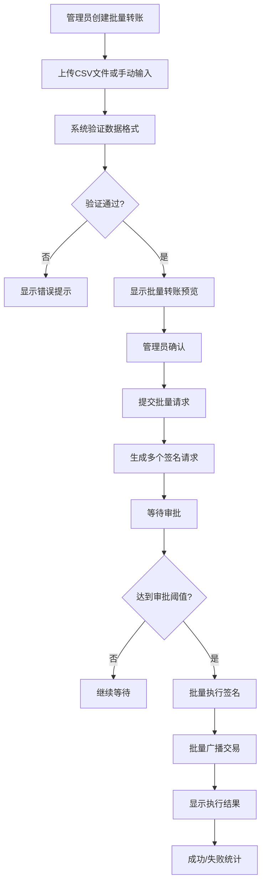

#### 4.3.2 使用场景

**场景一：工资发放**
- 企业每月发放员工工资
- 上传员工地址和金额列表
- 系统自动创建批量转账请求
- 管理员审批后批量执行

**场景二：空投活动**
- 项目方进行代币空投
- 上传用户地址列表
- 设置统一的空投金额
- 批量执行空投

**场景三：供应商付款**
- 定期向供应商付款
- 上传供应商地址和金额
- 设置付款时间
- 自动批量执行

#### 4.3.3 详细步骤说明

**步骤 1-3：准备数据**
- 管理员登录Web控制台
- 选择"批量转账"
- 上传CSV文件或手动输入：
  - 收款地址
  - 转账金额
  - 代币类型
  - 备注信息（可选）

**步骤 4-6：验证和预览**
- 系统自动验证数据格式
- 检查地址有效性
- 检查余额是否充足
- 显示批量转账预览：
  - 总笔数
  - 总金额
  - 手续费估算
  - 预计完成时间

**步骤 7-9：提交和审批**
- 管理员确认预览信息
- 提交批量转账请求
- 系统自动创建多个签名请求
- 根据多签策略，等待审批

**步骤 10-12：执行和结果**
- 达到审批阈值后，批量执行
- 系统自动处理每笔交易
- 显示执行结果：
  - 成功笔数
  - 失败笔数
  - 失败原因
  - 交易哈希列表

#### 4.3.4 批量操作优势

- **效率提升**：一次操作完成多笔转账
- **统一管理**：所有交易统一审批和执行
- **错误处理**：自动处理失败交易，提供详细报告
- **成本优化**：批量处理降低手续费

### 4.4 场景四：团队管理

#### 4.4.1 成员管理流程

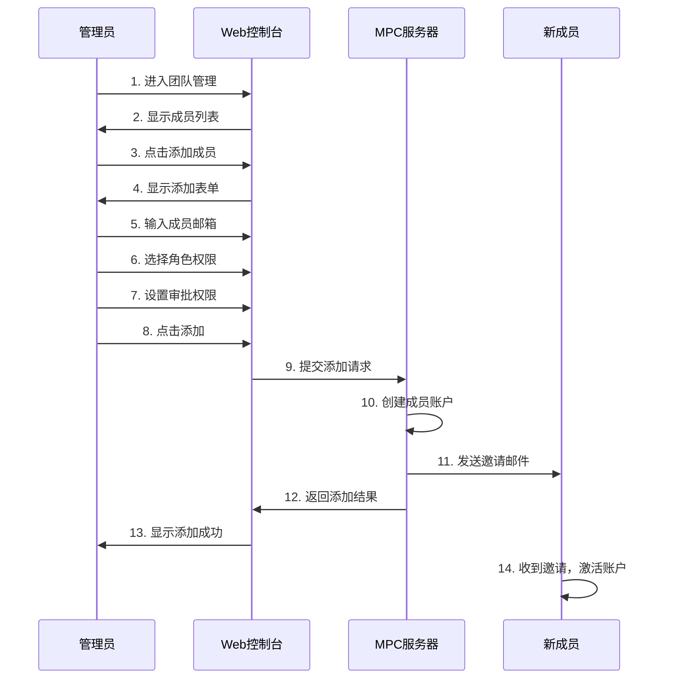

#### 4.4.2 角色权限说明

**Owner（所有者）**
- ✅ 完全控制权限
- ✅ 可以管理所有成员
- ✅ 可以修改多签策略
- ✅ 可以导出备份
- ✅ 可以删除钱包

**Manager（管理者）**
- ✅ 可以批准交易
- ✅ 可以管理部分成员（有限权限）
- ✅ 可以创建交易请求
- ❌ 不能修改多签策略
- ❌ 不能导出备份

**Member（成员）**
- ✅ 可以创建交易请求
- ❌ 不能批准交易
- ❌ 不能管理成员

#### 4.4.3 权限管理示例

**示例：财务部门权限设置**
```
- 财务总监（Owner）：完全控制
- 财务经理（Manager × 2）：可以批准交易
- 财务专员（Member × 3）：可以创建交易请求

审批策略：
- 小额交易（< 5,000 USDT）：1 个 Manager 批准
- 大额交易（≥ 5,000 USDT）：2 个 Manager 批准
```

### 4.5 场景五：审计与合规

#### 4.5.1 审计日志查看

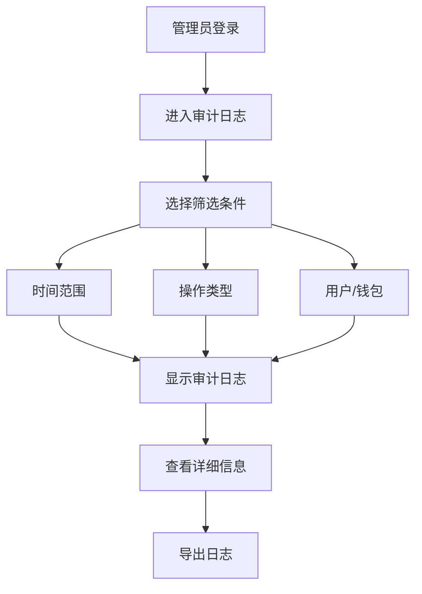

#### 4.5.2 审计日志内容

**记录的操作类型**：
- 钱包创建和删除
- 交易创建和审批
- 成员添加和删除
- 策略修改
- 备份导出
- 权限变更

**每条日志包含**：
- 操作时间
- 操作人员
- 操作类型
- 操作详情
- 操作结果（成功/失败）
- IP地址
- 设备信息

#### 4.5.3 合规报告

**自动生成报告**：
- 每日交易汇总
- 每周资产变动
- 每月合规报告
- 异常交易告警

**报告内容**：
- 交易统计（笔数、金额）
- 资产余额变化
- 审批流程记录
- 异常操作记录

---

## 5. 混合使用场景

### 5.1 场景一：个人钱包与团队钱包

#### 5.1.1 使用场景

用户同时拥有：
- **个人钱包**：用于个人资产管理和日常使用
- **团队钱包**：用于团队协作和企业资产管理

#### 5.1.2 跨钱包转账

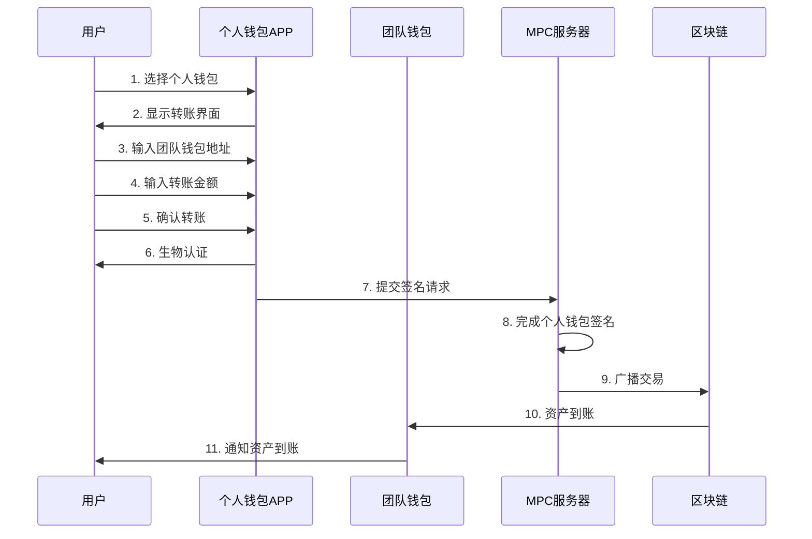

#### 5.1.3 统一管理界面

- **钱包列表**：显示所有钱包（个人+团队）
- **快速切换**：一键切换不同钱包
- **统一视图**：查看所有资产总览
- **分别管理**：每个钱包独立管理

### 5.2 场景二：权限继承

#### 5.2.1 使用场景

企业组织架构中，上级钱包可以控制下级钱包：
- 总公司钱包 → 分公司钱包
- 主账户钱包 → 子账户钱包

#### 5.2.2 权限继承流程

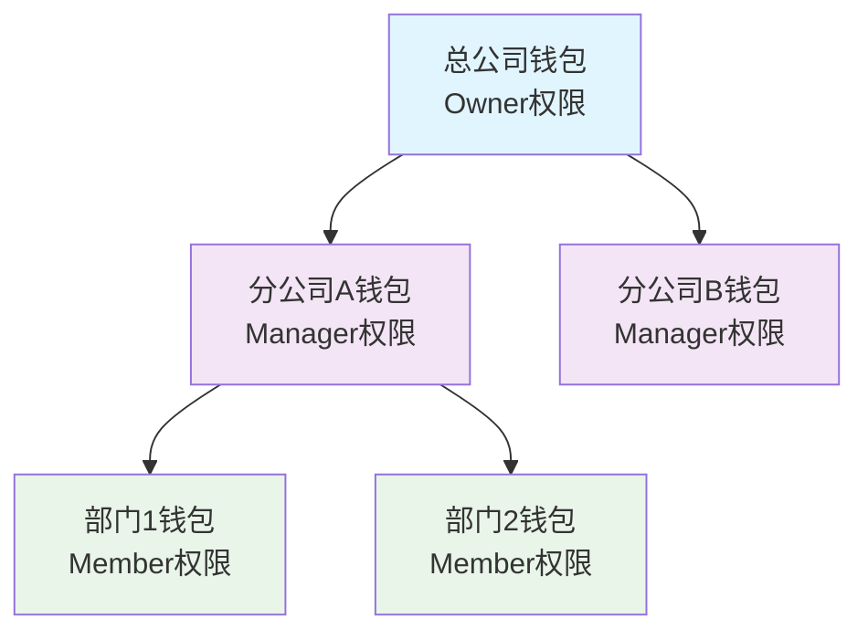

#### 5.2.3 权限控制规则

- **上级可以管理下级**：Owner可以管理所有下级钱包
- **下级独立运营**：每个钱包独立的多签策略
- **统一审计**：所有操作统一记录在审计日志中

---

## 6. 常见问题解答

### 6.1 安全性问题

**Q: 个人用户是否保留私钥分片？**
A: 是的。个人用户采用 3-of-3 模式，您的手机设备会持有 1 个密钥分片，存储在 Secure Enclave/TrustZone 中，通过生物认证保护。另外 2 个分片存储在云端安全环境中。只有三个分片同时参与才能完成签名，确保您对资产的控制权，同时保证安全性。

**Q: 如果我的手机丢失了，资产会丢失吗？**
A: 不会。MPC钱包的密钥分片存储在多个安全环境中：
- 您的手机持有 1 个分片（可通过备份恢复）
- 云端持有 2 个分片（仍然安全）
即使手机丢失，您可以通过备份恢复钱包，或者通过其他设备访问资产。即使攻击者获得了您的手机，也无法单独控制资产，因为还需要云端的分片。

**Q: 云端服务被攻击怎么办？**
A: MPC钱包采用零信任架构，即使某个环境被攻击，攻击者也无法获得完整的密钥。需要多个分片才能控制资产，大大降低了风险。

**Q: 生物认证安全吗？**
A: 生物认证只是用于本地设备解锁，真正的密钥分片存储在安全环境中。即使生物认证被绕过，攻击者也无法获得密钥分片。

### 6.2 使用问题

**Q: 转账需要多长时间？**
A: 通常转账在几秒到几分钟内完成，具体取决于：
- 区块链网络拥堵情况
- 手续费设置
- 多签审批时间（团队钱包）

**Q: 可以撤销交易吗？**
A: 区块链交易一旦确认就无法撤销。在提交交易前，请仔细核对交易信息。团队钱包可以通过多签审批机制，在交易确认前取消。

**Q: 支持哪些区块链？**
A: 支持主流区块链，包括：
- Bitcoin (BTC)
- Ethereum (ETH) 及所有ERC-20代币
- 其他主流区块链（根据配置）

### 6.3 团队管理问题

**Q: 团队成员需要都安装APP吗？**
A: 不是必须的。团队成员可以通过以下方式参与：
- 移动APP（推荐，便捷）
- Web控制台（适合桌面办公）
- API集成（适合自动化场景）

**Q: 如何设置多签策略？**
A: 在创建团队钱包时，可以选择：
- **简单模式**：统一审批要求
- **高级模式**：基于金额、地址、类型的策略

**Q: 可以修改多签策略吗？**
A: 可以。Owner或Manager可以修改多签策略，修改需要经过审批流程。

### 6.4 备份恢复问题

**Q: 如何备份钱包？**
A: 提供多种备份方式：
- 助记词备份（12或24个单词）
- 备份文件（加密文件）
- 云端同步（自动备份）

**Q: 备份文件丢失怎么办？**
A: 建议使用多种方式备份：
- 助记词写在安全位置
- 备份文件存储在多个位置
- 定期更新备份

**Q: 恢复钱包需要多长时间？**
A: 恢复过程通常在几分钟内完成，具体取决于：
- 备份方式（助记词最快）
- 网络状况
- 需要恢复的资产数量

---

## 7. 最佳实践

### 7.1 个人用户最佳实践

**安全建议**：
- ✅ 启用生物认证
- ✅ 定期更新APP
- ✅ 使用强密码保护APP
- ✅ 多重备份（助记词+备份文件）
- ✅ 不要分享助记词或备份文件

**使用建议**：
- ✅ 大额转账前先小额测试
- ✅ 仔细核对收款地址
- ✅ 定期检查资产余额
- ✅ 关注交易状态通知

### 7.2 团队用户最佳实践

**管理建议**：
- ✅ 合理设置多签策略
- ✅ 定期审查团队成员权限
- ✅ 设置合理的审批流程
- ✅ 启用审计日志

**安全建议**：
- ✅ 限制Owner数量（建议1-2个）
- ✅ Manager权限分离（不同部门）
- ✅ 定期轮换审批人员
- ✅ 设置异常交易告警

**操作建议**：
- ✅ 批量操作前先测试
- ✅ 大额交易多重确认
- ✅ 定期备份团队钱包
- ✅ 建立应急响应流程

### 7.3 混合使用最佳实践

**钱包分离**：
- ✅ 个人钱包和团队钱包分开管理
- ✅ 不同用途使用不同钱包
- ✅ 定期检查钱包权限

**权限管理**：
- ✅ 明确每个钱包的用途
- ✅ 避免权限交叉
- ✅ 定期审查权限设置

---

## 8. 总结

### 8.1 产品优势

**对于个人用户**：
- 🔐 企业级安全保护
- 📱 便捷的移动APP
- 🌐 多链统一管理
- 💰 资产完全掌控

**对于团队用户**：
- 👥 灵活的多签审批
- 📊 完整的审计追踪
- ⚡ 高效的批量操作
- 🏢 满足合规要求

### 8.2 适用场景

**个人用户适用**：
- 数字资产持有者
- DeFi协议用户
- NFT收藏者
- 多链资产管理

**团队用户适用**：
- 企业财务部门
- 数字资产交易所
- DeFi协议团队
- 投资机构

### 8.3 未来规划

**即将推出**：
- 🔜 更多区块链支持
- 🔜 高级DeFi功能
- 🔜 跨链桥接
- 🔜 智能合约管理

**持续优化**：
- 📈 性能优化
- 🛡️ 安全增强
- 🎨 用户体验改进
- 📚 文档完善

---

**文档版本**: v1.0  
**最后更新**: 2025-01-02  
**维护团队**: MPC 产品团队  
**反馈渠道**: 如有问题或建议，请联系产品团队

---

## 附录

### A. 术语表

- **MPC**: 多方安全计算（Multi-Party Computation）
- **多签**: 多重签名，需要多个签名才能执行交易
- **密钥分片**: 将私钥分成多个部分，分别存储
- **审批阈值**: 需要多少个审批才能执行交易
- **助记词**: 用于恢复钱包的12或24个单词
- **交易哈希**: 区块链上交易的唯一标识

### B. 支持渠道

- **官方网站**: [待补充]
- **用户手册**: [待补充]
- **技术支持**: [待补充]
- **社区论坛**: [待补充]

### C. 更新日志

**v1.0 (2025-01-02)**
- 初始版本发布
- 包含个人和团队使用场景
- 详细的流程图和说明
